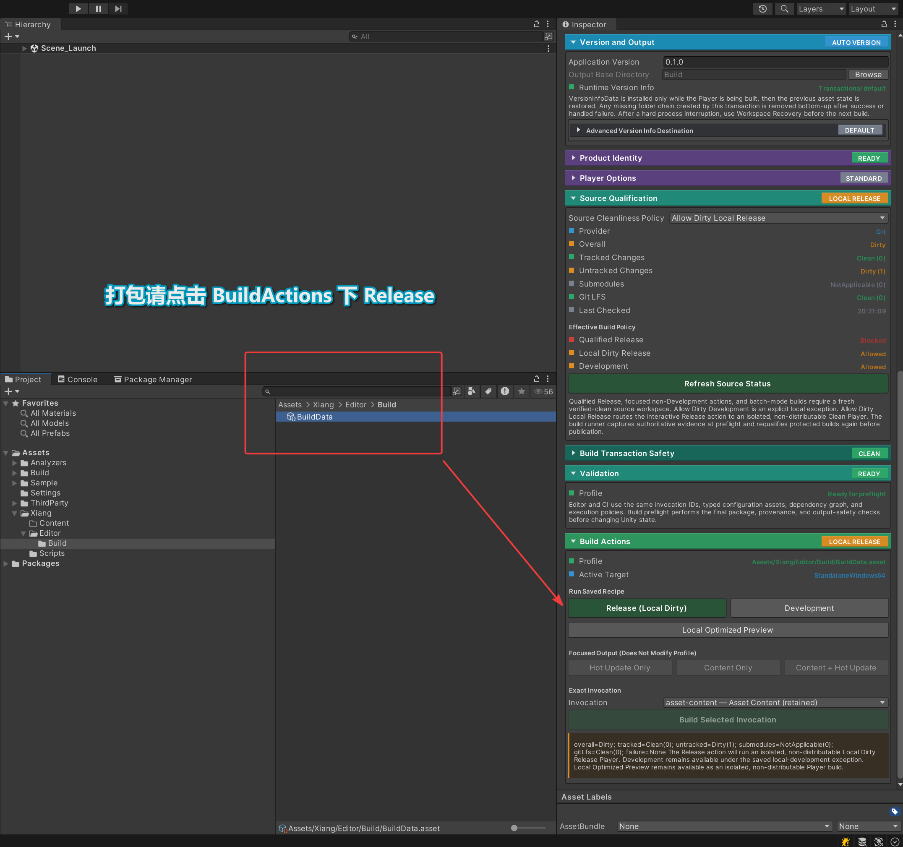

# Xiang

## 项目基础

- Unity 版本 
    - 2022.3.62f3
- 测试平台
    - Android

## 技术方案

通过题目大致了解了测试所需要的 Unity 相关编程技术以及所需模块设计。目前测试题中较多的技术模块均在本人的开源项目 [UnityStarter](https://github.com/MaiKuraki/UnityStarter) 中有所准备。

### 已有模块和设计
- 对象池
    - [Factory Module](https://github.com/MaiKuraki/UnityStarter/tree/main/UnityStarter/Assets/ThirdParty/CycloneGames/CycloneGames.Factory)
- 存档模块
    - [Persistence Module](https://github.com/MaiKuraki/UnityStarter/tree/main/UnityStarter/Assets/ThirdParty/CycloneGames/CycloneGames.Persistence) 版本号，向后兼容
    - [File IO Module](https://github.com/MaiKuraki/UnityStarter/tree/main/UnityStarter/Assets/ThirdParty/CycloneGames/CycloneGames.IO) 存档原子读写，路径沙箱
    - [Hash Module](https://github.com/MaiKuraki/UnityStarter/tree/main/UnityStarter/Assets/ThirdParty/CycloneGames/CycloneGames.Hash) 存档意外损坏检测
    - 试题中提到的 Json 方案须拓展实现
- UI 框架
    - [UIFramework](https://github.com/MaiKuraki/UnityStarter/tree/main/UnityStarter/Assets/ThirdParty/CycloneGames/CycloneGames.UIFramework) 支持 MVP 设计的 UI 框架
    - [Localization](https://github.com/MaiKuraki/UnityStarter/tree/main/UnityStarter/Assets/ThirdParty/CycloneGames/CycloneGames.Localization) 作为 UI 框架的依赖被引入。
- 资源管理封装
    - [AssetManagement](https://github.com/MaiKuraki/UnityStarter/tree/main/UnityStarter/Assets/ThirdParty/CycloneGames/CycloneGames.AssetManagement) Demo 中 UI 与资源所需
- Utility
    - [Utility](https://github.com/MaiKuraki/UnityStarter/tree/main/UnityStarter/Assets/ThirdParty/CycloneGames/CycloneGames.Utility) UI 安全区工具， FPS 工具，单例
- Logging
    - [Logging](https://github.com/MaiKuraki/UnityStarter/tree/main/UnityStarter/Assets/ThirdParty/CycloneGames/CycloneGames.Logging) Log 模块
- 触摸输入模块
    - [InputSystem](https://github.com/MaiKuraki/UnityStarter/tree/main/UnityStarter/Assets/ThirdParty/CycloneGames/CycloneGames.InputSystem) 可选 InputRx + NewInputSystem + UGUI(IPointer/IDrag) 实现触摸输入
    - [Yaml](https://github.com/hadashiA/VYaml) VYaml 作为 InputSystem 的依赖被引入
### 缺失模块及实现
- EventBus
    - EventBus 自己实现
- 美术工作流
    - Atlas 图集工具自己实现
- Shader
    - Dissolve Shader 自己实现

## Demo 玩法设计
我计划用试题标准制作一款 2D 移动端放置种田游戏「果园」。玩家在网格上种植不同尺寸的果树（1×1 与 2×2 占用格子），每棵树按自身周期自动结果；果实成熟后玩家点击收获，或在凌晨统一自动脱落。玩家还可使用类似《植物大战僵尸》的铲子工具铲除果树，铲除时果树以试题要求的 Dissolve 溶解材质动画渐隐消失，从而释放被占用的格子。游戏内置纯游戏内的昼夜循环系统：白天果实生长、夜间触发批量脱落，昼夜随游玩时间自然交替并推进天数。当应用进入后台或失去焦点时，系统自动存档并弹出暂停页面，避免移动端切换中断导致进度丢失；存档记录游戏内的天数和状态，重开游戏时从存档的天数继续，而不关联现实时间。该玩法串起网格放置、时间驱动状态机、对象池掉落、事件解耦、存档与生命周期处理、UI 与 Shader 视觉表现，完整覆盖试题全部考点

## Build 打包流程

打包请点选项目内 `Assets/Xiang/Editor/Build/BuildData.asset` 配置文件的 Build Actions 选项卡下 `Release(Local Dirty)`

