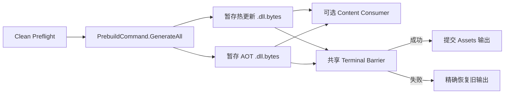

# HybridCLR 构建集成

HybridCLR Integration 实现通用 `hot-update` Provider Contract。它编译配置的热更新程序集，事务化发布 Runtime DLL 与 AOT Metadata 输入，并管理安全 Incremental Job 所需的 Release Baseline。

> **当前 checkout：** `Packages/manifest.json` 未安装 HybridCLR。Adapter 与配置通过反射边界保持可编译，但本 checkout 没有执行 HybridCLR 工具链或目标 Player。本地参考源码只属于静态 API 证据。

## 职责与边界

| 组件 | 职责 |
| --- | --- |
| `HybridCLRBuildConfig` | 程序集与 Build 独占输出目录的强类型 Authoring |
| `HybridCLRBuildAdapter` | Availability、Preflight、Output Claim、Execution 与 Player Consumer Compatibility |
| `HybridCLRBuilder` | 支持的 HybridCLR Editor Command 反射边界 |
| `HybridCLRGenerationTransaction` | 保护 Vendor Generation 输入和临时 Nested-Player 状态 |
| `HybridCLROutputTransaction` | 暂存并恢复 `Assets` 下 Runtime DLL/AOT 输出目录 |
| `HybridCLRReleaseBaselineTransaction` | 暂存、发布、恢复与修复持久 Release Baseline |

Integration 不负责安装 HybridCLR、初始化 Native Toolchain、自动选择项目程序集、上传输出或实现 Runtime DLL Loader。

Provider Catalog 要求 `HybridCLR.Editor.Commands.PrebuildCommand`。缺少该 API 时，Core Module 仍可编译，已有选中配置会在 Preflight 失败。

## 配置步骤

1. 安装并锁定兼容 HybridCLR 包。
2. 按当前 Unity 版本执行 Vendor Initialization 与 Platform Provisioning。
3. 将 Target 配置为 IL2CPP，并保存 HybridCLR Project Settings。
4. 通过 BuildData 或 Project 菜单创建 `CycloneGames/Build/Hot Update/HybridCLR`。
5. 把 `Assets/` 下至少一个项目自有 asmdef 拖入 `Hot Update Assemblies`。
6. 把 `Assets/` 下两个不同项目目录拖入 Hot Update DLL 与 AOT DLL Output 字段。
7. 将配置分配给 `hot-update` invocation，选择 Incrementality，并保存所有 Authoring Asset。
8. 调用 Provider 前运行 Workspace Health 与 Preflight。

Package asmdef 会被拒绝。两个输出目录必须不同且互不重叠。已有非空目录必须带合法 `.buildpipeline-owner.json` 证据；Build 不会假设任意文件都可删除。

## Clean 执行



Clean 暂存所选热更新程序集、`HotUpdate.bytes`、stripped AOT 程序集和 `AOT.bytes`。它会临时激活暂存的 `Assets` 目录，使显式依赖它的 Content invocation 可以打包。

Output Transaction 会保持 Pending，直到所有选中 Build Step 与 Deferred Publication 达到同一个 Terminal Commit Decision。后续 Content 或 Player 失败都会恢复旧输出目录。

## Release Baseline 资格

Clean 输出本身不是 Incremental Baseline。只有同时满足以下条件才暂存 Baseline：

1. 请求是 Release，不是 Development；
2. HybridCLR invocation 为 Clean；
3. 恰好一个选中 Player invocation 直接依赖它；
4. 整个 Pipeline 成功。

标准 Full Player Preset 提供 `hot-update -> player` 直接边。Hot Update Only、Content + Hot Update、Development Player 和仅传递依赖的 Player 都不发布 Baseline。

Baseline 路径为：

```text
<BuildRoot>/.buildpipeline/baselines/hybridclr/
  <BuildTarget>/<ScriptingBackend>/<release-key>/
    baseline.json
    AOT/
      *.dll
```

Release Key 由 Application Identifier、Application Version 与 Hot Update Invocation ID 派生。Manifest 还会绑定 Target/Backend、精确 Unity Version、HybridCLR Package Identity、Authoring 与 Vendor Settings Hash、AOT 相关 Player Settings、热更新程序集清单、Source Provenance 和精确 AOT DLL Inventory。

改变 Application Version 或 Invocation ID 会选择不同 Release Key。任何兼容性输入改变都会让旧 Baseline 不再适用于当前请求。

## Incremental 执行

Incremental 只允许 Release。流程如下：

1. 根据当前请求身份解析预期 Baseline；
2. 要求目录中恰好包含 `baseline.json` 与 `AOT` 目录；
3. 验证 Manifest Checksum、兼容性字段、Inventory 数量、可移植文件名、长度和 SHA-256；
4. 只对热更新 DLL 调用 `CompileDllCommand.CompileDll(target)`；
5. 使用已验证 Baseline 的 AOT Metadata 发布这些 Hot DLL 输出。

Adapter 绝不会把当前全局 stripped-AOT 目录当作 Incremental 替代。证据缺失、修改、不匹配或不完整都会 fail closed。

## Recipe 指南

| 目标 | 推荐 Recipe | Incrementality | Baseline 效果 |
| --- | --- | --- | --- |
| 生成 Release Player 与未来 Baseline | Full Player，Release | Clean | Terminal Success 后发布 Baseline |
| 使用新 HybridCLR 输入构建 Content，但不构建 Player | Content + Hot Update | Clean | 不发布 Baseline |
| 仅发布新 Hot Update 输出 | Hot Update Only | Clean | 不发布 Baseline |
| 基于已归档 Release 编译 Hot Update DLL | Hot Update Only 或 Focused/Exact Hot Invocation | Incremental | 消费已有 Baseline |
| Development Player | Full Player，Development | Clean | 不发布也不消费 Release Baseline |

Release 与后续 Incremental Job 必须保持 Invocation ID 稳定。

## Provider 限制

通用 Hot Update Step 允许多个 Provider，但当前 HybridCLR Editor API 只拥有一个进程全局 Generation Session 与 Output Set。选中的 Run 只要包含多个 HybridCLR-family invocation 就会被拒绝，包括 Standard HybridCLR 与 HybridCLR + Obfuz 的组合。

当前 API 无法接收 Player 每次构建的 invocation-local extra compiler defines，因而不能安全处理 `ENABLE_CHEAT`。HybridCLR + Player + Cheat Mode 会被拒绝，而不是修改全局 Scripting Define。Hot Update Only 不消费 Player Cheat 请求。

`HybridCLRObfuzBuildConfig` 是独立 Provider。它共享 Clean Output Transaction，但因经审计 Obfuz4HybridCLR API 无法消费显式验证 Baseline AOT 目录而拒绝 Incremental。参见[组合 Provider 手册](../HybridCLRObfuz/README.SCH.md)。

## CI Artifact 流程

Release Job：

1. Provision 精确 HybridCLR 包、Settings、Platform SDK 与 Generated Native Data；
2. 运行 Clean Release Full Player Build；
3. 归档 Player/Content 输出与完整匹配 Baseline 目录；
4. 归档终局 Pipeline Result Manifest。

Incremental Job：

1. 把完整 Baseline 恢复到同一个配置 Build Root；
2. 保持 Target/Backend/Release-Key 布局；
3. 重现 Application Version、Invocation ID、Unity Version、Package Identity、Settings 与 AOT 相关 Player Configuration；
4. 运行 Release Incremental Hot-Update-Only 或 Focused Invocation；
5. 归档已发布 Hot Update 输出与 Result Evidence。

不要手工合成 Baseline，不要移动到未配置的环境变量路径，也不要跨 Target 复用。Upload 与 Deployment 仍属于外部 CI Stage。

## 持久化与恢复

| 数据 | 位置 | 生命周期 |
| --- | --- | --- |
| Runtime Hot/AOT 输出 | 配置的 `Assets` 下 Build 独占目录 | 事务化暂存与恢复 |
| Release Baseline | `<BuildRoot>/.buildpipeline/baselines/hybridclr/...` | 持久 Release Artifact |
| Generation Journal | `.buildpipeline/transactions/hybridclr-generation/` | 持久中断证据 |
| Output Journal | `.buildpipeline/transactions/hybridclr/` | 持久中断证据 |
| Baseline Journal | `.buildpipeline/transactions/hybridclr-release-baseline/` | 持久中断证据 |

进程硬中断后，Workspace Health 会阻止下一次正常构建。Retry 或切换 Target 前必须显式 Recovery。不要手工删除 Journal 或 Ownership Marker。

删除已提交 Baseline 后可以通过新的合格 Clean Release Player Build 重建，但在成功前 Incremental Job 不可用。

## 验证边界

相关 EditMode Test 覆盖 Adapter Validation、Output Transaction、Generation Transaction 与 Baseline Compatibility Rule。它们不证明 IL2CPP、AOT Metadata 加载、Managed Stripping、Runtime 热更新执行、Platform SDK Integration 或 Clean-Agent Player Build。

Release Qualification 需要使用精确 Optional Package 集，并为每个支持 Target 执行：

1. Clean Release Full Player Build；
2. 在干净 CI Workspace 中恢复归档 Baseline；
3. Release Incremental Hot Update Build；
4. 负向检查，证明修改 DLL、Settings、Unity Version、Target、Backend 与 Build Configuration 都会被拒绝。

## 相关文档与源码

- [Build 构建底座](../../../../README.SCH.md)
- `HybridCLRBuildConfig.cs`
- `HybridCLRBuildAdapter.cs`
- `HybridCLRBuilder.cs`
- `HybridCLRGenerationTransaction.cs`
- `HybridCLROutputTransaction.cs`
- `HybridCLRReleaseBaseline.cs`
- `HybridCLRReleaseBaselineTransaction.cs`
