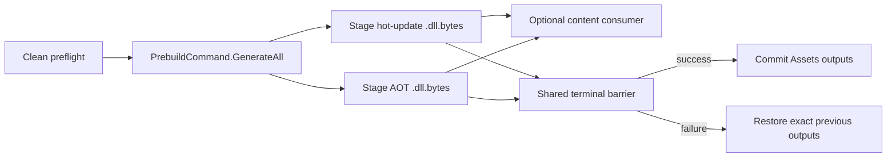

# HybridCLR Build Integration

The HybridCLR integration implements the generic `hot-update` provider contract. It compiles configured hot-update assemblies, publishes runtime DLL and AOT metadata inputs transactionally, and manages the Release baseline required by safe Incremental jobs.

> **Current checkout:** HybridCLR is not installed in `Packages/manifest.json`. The adapter and configuration compile through a reflection boundary, but no HybridCLR toolchain or target Player has been executed in this checkout. Local reference source is static API evidence only.

## Responsibilities and boundaries

| Component | Responsibility |
| --- | --- |
| `HybridCLRBuildConfig` | Typed authoring for assemblies and build-exclusive output folders |
| `HybridCLRBuildAdapter` | Availability, preflight, output claims, execution, and Player-consumer compatibility |
| `HybridCLRBuilder` | Reflection boundary around supported HybridCLR Editor commands |
| `HybridCLRGenerationTransaction` | Protects vendor generation inputs and temporary nested-Player state |
| `HybridCLROutputTransaction` | Stages and restores runtime DLL/AOT output folders below `Assets` |
| `HybridCLRReleaseBaselineTransaction` | Stages, publishes, restores, and recovers durable Release baselines |

The integration does not install HybridCLR, initialize its native toolchain, choose project assemblies automatically, upload outputs, or implement the runtime DLL loader.

The provider catalog requires `HybridCLR.Editor.Commands.PrebuildCommand`. If that API is absent, the core module still compiles and an existing selected configuration fails Preflight.

## Setup and authoring

1. Install and lock a compatible HybridCLR package.
2. Run the vendor initialization and platform provisioning appropriate to the current Unity version.
3. Configure the target for IL2CPP and save HybridCLR project settings.
4. Create `CycloneGames/Build/Hot Update/HybridCLR` through BuildData or the Project menu.
5. Drag at least one project-owned asmdef below `Assets/` into `Hot Update Assemblies`.
6. Drag two different project folders below `Assets/` into the Hot Update DLL and AOT DLL output fields.
7. Assign the configuration to the `hot-update` invocation, select incrementality, and save all authoring assets.
8. Run Workspace Health and Preflight before invoking the provider.

Package asmdefs are rejected. The two output folders must be different and non-overlapping. Any existing non-empty folder must carry valid `.buildpipeline-owner.json` evidence; Build never assumes that arbitrary files are disposable.

## Clean execution



Clean stages selected hot-update assemblies, `HotUpdate.bytes`, stripped AOT assemblies, and `AOT.bytes`. It temporarily activates the staged `Assets` folders so an explicitly dependent content invocation can package them.

The output transaction remains pending until every selected build step and deferred publication reaches the same terminal commit decision. A later content or Player failure restores the old output folders.

## Release baseline eligibility

Clean output alone is not an Incremental baseline. A baseline is staged only when all of these are true:

1. the request is Release, not Development;
2. the HybridCLR invocation is Clean;
3. exactly one selected Player invocation directly depends on it;
4. the complete pipeline succeeds.

The standard Full Player preset supplies the direct `hot-update -> player` edge. Hot Update Only, Content + Hot Update, Development Player, and transitive-only Player consumption do not publish a baseline.

Baselines use:

```text
<BuildRoot>/.buildpipeline/baselines/hybridclr/
  <BuildTarget>/<ScriptingBackend>/<release-key>/
    baseline.json
    AOT/
      *.dll
```

The release key derives from application identifier, application version, and hot-update invocation ID. The manifest additionally binds target/backend, exact Unity version, HybridCLR package identity, authoring and vendor-settings hashes, AOT-relevant Player settings, hot-update assembly inventory, source provenance, and the exact AOT DLL inventory.

Changing application version or invocation ID selects a different release key. Changing any compatibility input invalidates the prior baseline for the request.

## Incremental execution

Incremental is Release-only. It performs this sequence:

1. resolve the expected baseline from current request identity;
2. require exactly `baseline.json` and the `AOT` directory;
3. validate manifest checksum, compatibility fields, inventory count, portable file names, lengths, and SHA-256 hashes;
4. call `CompileDllCommand.CompileDll(target)` for hot-update DLLs only;
5. publish those hot DLL outputs with AOT metadata sourced from the validated baseline.

The adapter never consumes the current global stripped-AOT folder as an Incremental substitute. Missing, modified, mismatched, or incomplete evidence fails closed.

## Recipe guidance

| Goal | Recommended recipe | Incrementality | Baseline effect |
| --- | --- | --- | --- |
| Produce a release Player and future baseline | Full Player, Release | Clean | Publishes baseline after terminal success |
| Build new content with fresh HybridCLR inputs but no Player | Content + Hot Update | Clean | Does not publish baseline |
| Publish only fresh hot-update outputs | Hot Update Only | Clean | Does not publish baseline |
| Compile hot-update DLLs against an archived release | Hot Update Only or focused/exact hot invocation | Incremental | Consumes existing baseline |
| Development Player | Full Player, Development | Clean | Never publishes or consumes a Release baseline |

Keep the invocation ID stable across Release and later Incremental jobs.

## Provider limits

The generic hot-update step permits multiple providers, but current HybridCLR Editor APIs own one process-global generation session and output set. A selected run containing more than one HybridCLR-family invocation is rejected, including standard HybridCLR plus HybridCLR + Obfuz.

The current API cannot accept the Player's invocation-local extra compiler defines for per-build `ENABLE_CHEAT`. HybridCLR + Player + Cheat mode is rejected rather than modifying global scripting defines. A Hot Update Only run does not consume the Player Cheat request.

`HybridCLRObfuzBuildConfig` is a separate provider. It shares Clean output transactions but rejects Incremental because the audited Obfuz4HybridCLR API cannot consume an explicit validated baseline AOT directory. See the [combined-provider manual](../HybridCLRObfuz/README.md).

## CI artifact flow

Release job:

1. provision the exact HybridCLR package, settings, platform SDK, and generated native data;
2. run a Clean Release Full Player build;
3. archive Player/content outputs and the complete matching baseline directory;
4. archive the terminal pipeline result manifest.

Incremental job:

1. restore the complete baseline to the same configured Build Root;
2. preserve target/backend/release-key layout;
3. reproduce application version, invocation ID, Unity version, package identity, settings, and AOT-relevant Player configuration;
4. run a Release Incremental hot-update-only or focused invocation;
5. archive the published hot-update outputs and result evidence.

Do not synthesize a baseline, move it to an unconfigured environment-variable path, or reuse it across targets. Upload and deployment remain external CI stages.

## Persistence and recovery

| Data | Location | Lifecycle |
| --- | --- | --- |
| Runtime hot/AOT outputs | Configured build-exclusive folders below `Assets` | Transactionally staged and restored |
| Release baseline | `<BuildRoot>/.buildpipeline/baselines/hybridclr/...` | Durable release artifact |
| Generation journal | `.buildpipeline/transactions/hybridclr-generation/` | Durable interruption evidence |
| Output journal | `.buildpipeline/transactions/hybridclr/` | Durable interruption evidence |
| Baseline journal | `.buildpipeline/transactions/hybridclr-release-baseline/` | Durable interruption evidence |

After a hard interruption, Workspace Health blocks the next normal build. Run explicit recovery before retrying or switching target. Do not manually delete journals or ownership markers.

Deleting a committed baseline is recoverable by a new qualifying Clean Release Player build, but Incremental jobs remain unavailable until that build succeeds.

## Validation boundary

Relevant EditMode tests cover adapter validation, output transactions, generation transactions, and baseline compatibility rules. They do not prove IL2CPP, AOT metadata loading, managed stripping, runtime hot-update execution, platform SDK integration, or a clean-agent Player build.

Release qualification requires the exact optional package set and, for every supported target:

1. a Clean Release Full Player build;
2. archived baseline restoration in a clean CI workspace;
3. a Release Incremental hot-update build;
4. negative checks showing that modified DLLs, settings, Unity version, target, backend, and build configuration are rejected.

## Related documentation and source

- [Build Foundation](../../../../README.md)
- `HybridCLRBuildConfig.cs`
- `HybridCLRBuildAdapter.cs`
- `HybridCLRBuilder.cs`
- `HybridCLRGenerationTransaction.cs`
- `HybridCLROutputTransaction.cs`
- `HybridCLRReleaseBaseline.cs`
- `HybridCLRReleaseBaselineTransaction.cs`
