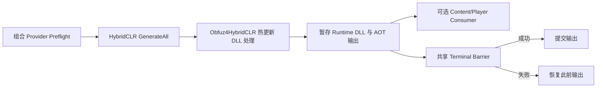

# HybridCLR + Obfuz 热更新 Provider

`HybridCLRObfuzBuildConfig` 选择显式组合热更新 Provider：HybridCLR 先执行完整 Generation，再由 Obfuz4HybridCLR 处理热更新 DLL。标准 `HybridCLRBuildConfig` 绝不会隐式启用该行为。

> **当前 checkout：** Unity Package Manifest 未安装 HybridCLR、Obfuz 或 Obfuz4HybridCLR。因此当前 Editor 状态下 Provider 不可用，也没有在此验证真实转换 DLL 或目标 Player。

## Provider 职责

| 包含 | 不包含 |
| --- | --- |
| HybridCLR Clean Generation | Package 安装或 HybridCLR 初始化 |
| Obfuz4HybridCLR 热更新 DLL Postprocessing | Obfuz Player Pipeline 选择 |
| 事务化 Hot Update 与 AOT Output Publication | Incremental Baseline 消费 |
| 共享 HybridCLR Recovery 与 Terminal Publication | Runtime 热更新加载或 Artifact Upload |

Player 混淆仍由独立 `ObfuzPlayerBuildExtensionConfiguration` 管理。YooAsset 资源加密与此无关。

## 所需 Capability

Provider Catalog 要求以下全部 Editor Type：

- `HybridCLR.Editor.Commands.PrebuildCommand`
- `Obfuz.Settings.ObfuzSettings`
- `Obfuz4HybridCLR.PrebuildCommandExt`

此外还需要已 Provision 并保存的 Obfuz 配置，以及生成的 `Obfuz.EncryptionVM.GeneratedEncryptionVirtualMachine`。缺少任一 Capability 都会使 Authoring 不可用或令 Preflight 失败。Provider 不会静默退化为标准 HybridCLR。

## 配置步骤

1. 安装并 Provision 兼容 HybridCLR。
2. 安装 Base Obfuz，并保存 `ProjectSettings/Obfuz.asset`。
3. 安装兼容 Obfuz4HybridCLR。
4. 在 CI/Bootstrap Provisioning 中编译 Obfuz Encryption VM。
5. 创建 `CycloneGames/Build/Hot Update/HybridCLR + Obfuz`。
6. 分配 `Assets/` 下的项目 asmdef 资产和两个分离的 Build 独占输出目录。
7. 将配置分配给一个 `hot-update` invocation，并选择 `Clean`。
8. 保存 Authoring Asset，确认 Source Qualification 为 `Verified Clean`、Build Transaction Safety 为 `Clean`，再运行 Preflight。

配置继承标准 HybridCLR 字段和目录安全规则。已有非空输出目录必须带合法 Build Ownership Evidence。

## 执行与发布



Provider 使用 HybridCLR Generation、Output 与 Recovery Transaction。热更新 DLL 在进入暂存 Runtime Output 前由 Obfuz4HybridCLR 处理；AOT Metadata Output 遵守标准 HybridCLR Ownership Contract。

Provider 只支持 Clean。经审计的 Obfuz4HybridCLR API 读取隐式 stripped-AOT 位置，无法接收已验证 HybridCLR Release Baseline 的显式 AOT 目录。因此系统拒绝 Incremental，而不是信任可变全局输出。

由于只有一个进程全局 HybridCLR Generation Session，选中的 Run 不能同时包含本 Provider 与另一个 HybridCLR-family invocation。

## Player 混淆相互独立

如果还要混淆 Player：

1. 创建 `PlayerBuildConfiguration`；
2. 创建 `ObfuzPlayerBuildExtensionConfiguration`；
3. 把 Extension 加入 Player Configuration；
4. 将其分配给 Player invocation；
5. 启用并保存持久 Obfuz Player Pipeline Setting。

| 组合 Hot Provider | Obfuz Player Extension | 结果 |
| --- | --- | --- |
| 已选择 | 未选择，持久 Player Setting 关闭 | 仅热更新 DLL |
| 已选择 | 已选择，持久 Player Setting 启用 | 热更新 DLL 与 Player |

安装 Base Obfuz 后，Player Environment Guard 要求持久 Setting 与 Extension Selection 精确匹配。Build 不会切换该持久 Vendor Setting。

## Recipe 与 Release 行为

| Recipe | 支持情况 | 说明 |
| --- | --- | --- |
| Hot Update Only，Clean | 支持 | 发布转换后的 Hot Update Output；没有 Player Baseline |
| Content + Hot Update，Clean | 支持 | 让依赖的 Content Provider 打包转换后输出 |
| Full Player，Clean | 支持 | Player 混淆仍取决于独立 Extension |
| 任意 Incremental invocation | 不支持 | Provider Preflight 显式拒绝 |

不要把 HybridCLR + Obfuz Release Baseline 描述为可用于 Incremental。Clean Full Player 可以参与共享 Release Evidence，但当前已审计 API 下，组合 Provider 无法安全消费 Baseline。

## 失败与恢复

组合 Provider 使用 HybridCLR Transaction Evidence：

```text
<UnityProject>/.buildpipeline/transactions/hybridclr-generation/
<UnityProject>/.buildpipeline/transactions/hybridclr/
<UnityProject>/.buildpipeline/transactions/hybridclr-release-baseline/
```

中断后应先通过 Workspace Health 显式 Recovery，再 Retry、切换 Target 或改变 Package。Recovery Pending 时不要删除 Journal、Ownership Marker、Generated Encryption VM Code 或 Vendor Settings。

## CI 检查表

- Build Run 前 Provision 精确的三包工具链。
- Preflight 前编译 Encryption VM，并保持 Generated Code 与已保存 Obfuz Settings 一致。
- 串行运行本 Provider；它拥有进程全局 HybridCLR State。
- 使用 Clean，并归档完整 Runtime DLL/AOT Output 与 Terminal Result Evidence。
- Code Signing、Upload、Deployment、Key Management 和 Rollback 属于外部 Release Stage。

## 故障排查与验证边界

| 问题 | 操作 |
| --- | --- |
| Provider 不可用 | 检查三个必需 Editor API 与 Package 安装 |
| Encryption VM 验证失败 | 在 BuildData Preflight 前重新运行 Obfuz Provisioning |
| Incremental 被拒绝 | 使用 Clean；不要绕过显式 Baseline Directory 限制 |
| Player 仍未混淆 | 配置独立 Obfuz Player Extension 与匹配持久 Setting |
| 多 HybridCLR invocation 被拒绝 | 拆分为不同 Unity Build Run |
| Workspace 要求恢复 | 改变 Target 或 Package Set 前先恢复 |

当前证据是源码检查与不依赖 Package 的 Validation Logic。它不证明 Obfuz 转换正确性、Runtime 行为、IL2CPP/AOT、Stripping、目标平台 Player Output 或 CI Reproducibility。必须使用精确安装包集执行真实 Clean Build。

## 相关文档与源码

- [Build 构建底座](../../../../README.SCH.md)
- [HybridCLR 集成](../HybridCLR/README.SCH.md)
- `HybridCLRObfuzBuildConfig.cs`
- `HybridCLRObfuzBuildAdapter.cs`
- `../Obfuz/ObfuzIntegrator.cs`
- `../Obfuz/ObfuzPlayerBuildExtension.cs`
