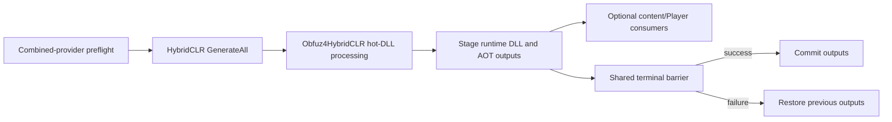

# HybridCLR + Obfuz Hot-Update Provider

`HybridCLRObfuzBuildConfig` selects the explicit combined hot-update provider: HybridCLR performs a full generation, then Obfuz4HybridCLR processes the hot-update DLLs. Standard `HybridCLRBuildConfig` never enables this behavior implicitly.

> **Current checkout:** HybridCLR, Obfuz, and Obfuz4HybridCLR are not installed in the Unity package manifest. The provider is therefore unavailable in the current Editor state, and no real transformed DLL or target Player has been validated here.

## What this provider does

| Included | Not included |
| --- | --- |
| HybridCLR Clean generation | Package installation or HybridCLR initialization |
| Obfuz4HybridCLR postprocessing of hot-update DLLs | Obfuz Player pipeline selection |
| Transactional hot-update and AOT output publication | Incremental baseline consumption |
| Shared HybridCLR recovery and terminal publication | Runtime hot-update loading or artifact upload |

Player obfuscation remains an independent `ObfuzPlayerBuildExtensionConfiguration`. YooAsset resource cryptography is unrelated.

## Required capabilities

The provider catalog requires all of these Editor types:

- `HybridCLR.Editor.Commands.PrebuildCommand`
- `Obfuz.Settings.ObfuzSettings`
- `Obfuz4HybridCLR.PrebuildCommandExt`

It also requires a provisioned and saved Obfuz configuration and the generated `Obfuz.EncryptionVM.GeneratedEncryptionVirtualMachine`. Missing any capability makes authoring unavailable or fails Preflight. The provider does not silently degrade to standard HybridCLR.

## Setup

1. Install and provision compatible HybridCLR.
2. Install base Obfuz and save `ProjectSettings/Obfuz.asset`.
3. Install compatible Obfuz4HybridCLR.
4. Compile the Obfuz Encryption VM during CI/bootstrap provisioning.
5. Create `CycloneGames/Build/Hot Update/HybridCLR + Obfuz`.
6. Assign project asmdef assets below `Assets/` and two separate build-exclusive output folders below `Assets/`.
7. Assign the configuration to one `hot-update` invocation and select `Clean`.
8. Save authoring assets, confirm Source Qualification is `Verified Clean` and Build Transaction Safety is `Clean`, then run Preflight.

The configuration inherits the standard HybridCLR fields and directory safety rules. Existing non-empty output folders must carry valid Build ownership evidence.

## Execution and publication



The provider uses HybridCLR generation, output, and recovery transactions. Hot-update DLLs are processed by Obfuz4HybridCLR before they enter the staged runtime output. AOT metadata outputs follow the standard HybridCLR ownership contract.

The provider supports Clean only. The audited Obfuz4HybridCLR API reads an implicit stripped-AOT location and cannot accept the explicit AOT directory from a validated HybridCLR Release baseline. Incremental is rejected instead of trusting mutable global output.

Because one process-global HybridCLR generation session exists, a selected run cannot contain this provider together with another HybridCLR-family invocation.

## Player obfuscation is independent

To obfuscate the Player as well:

1. create a `PlayerBuildConfiguration`;
2. create an `ObfuzPlayerBuildExtensionConfiguration`;
3. add the extension to the Player configuration;
4. assign it to the Player invocation;
5. enable and save the durable Obfuz Player pipeline setting.

| Combined hot provider | Obfuz Player extension | Result |
| --- | --- | --- |
| Selected | Not selected, durable Player setting disabled | Hot-update DLLs only |
| Selected | Selected, durable Player setting enabled | Hot-update DLLs and Player |

If base Obfuz is installed, the Player environment guard requires the durable setting to match extension selection exactly. Build never toggles that persistent vendor setting.

## Recipes and release behavior

| Recipe | Supported | Notes |
| --- | --- | --- |
| Hot Update Only, Clean | Yes | Publishes transformed hot-update outputs; no Player baseline |
| Content + Hot Update, Clean | Yes | Lets the dependent content provider package transformed outputs |
| Full Player, Clean | Yes | Player obfuscation still depends on the separate extension |
| Any Incremental invocation | No | Explicitly rejected by provider preflight |

Do not document a HybridCLR + Obfuz Release baseline as usable for Incremental. A Clean Full Player may participate in shared release evidence, but the combined provider cannot safely consume the baseline with the currently audited API.

## Failure and recovery

The combined provider uses the HybridCLR transaction evidence:

```text
<UnityProject>/.buildpipeline/transactions/hybridclr-generation/
<UnityProject>/.buildpipeline/transactions/hybridclr/
<UnityProject>/.buildpipeline/transactions/hybridclr-release-baseline/
```

After interruption, use Workspace Health and explicit recovery before retrying, switching target, or changing packages. Do not delete journals, ownership markers, generated Encryption VM code, or vendor settings while recovery is pending.

## CI checklist

- Provision the exact three-package toolchain before the Build run.
- Compile the Encryption VM before Preflight and keep generated code consistent with saved Obfuz settings.
- Run this provider serially; it owns process-global HybridCLR state.
- Use Clean and archive complete runtime DLL/AOT outputs plus terminal result evidence.
- Treat code signing, upload, deployment, key management, and rollback as external release stages.

## Troubleshooting and validation boundary

| Problem | Action |
| --- | --- |
| Provider is unavailable | Verify all three required Editor APIs and package installation |
| Encryption VM validation fails | Re-run Obfuz provisioning before BuildData Preflight |
| Incremental is rejected | Use Clean; do not bypass the explicit baseline-directory limitation |
| Player remains unobfuscated | Configure the independent Obfuz Player extension and matching durable setting |
| Multiple HybridCLR invocations are rejected | Split them into separate Unity build runs |
| Workspace requires recovery | Recover before changing target or package set |

Current evidence is source inspection and package-independent validation logic. It does not prove Obfuz transformation correctness, runtime behavior, IL2CPP/AOT, stripping, target-platform Player output, or CI reproducibility. Qualify the exact installed package set with real Clean builds.

## Related documentation and source

- [Build Foundation](../../../../README.md)
- [HybridCLR integration](../HybridCLR/README.md)
- `HybridCLRObfuzBuildConfig.cs`
- `HybridCLRObfuzBuildAdapter.cs`
- `../Obfuz/ObfuzIntegrator.cs`
- `../Obfuz/ObfuzPlayerBuildExtension.cs`
