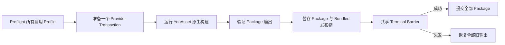

# YooAsset 3 构建集成

本 Integration 把通用 `asset-content` invocation 转换为一次事务化 YooAsset 构建，其中包含一个或多个显式 Package Profile。它是可选 Editor Adapter；缺少 YooAsset 时 Build Core 不受编译依赖影响。

> **当前 checkout：** `Packages/manifest.json` 未安装 YooAsset。Integration 源码存在，但受门控程序集及其测试未激活。下文描述源码契约，Release 前必须使用实际安装包完成资格验证。

## 程序集边界与可用性

`Build.Pipeline.Integrations.YooAsset3.Editor.asmdef` 引用 `Build.Pipeline.Editor`、`YooAsset` 和 `YooAsset.Editor`。只有 `com.tuyoogame.yooasset` 满足 `[3.0.5,4.0.0)` 并产生 `BUILD_PIPELINE_HAS_YOOASSET_3` 时，该程序集才启用。

该边界带来三个结果：

- 卸载 YooAsset 不会破坏 Build Core Assembly；
- `YooAssetBuildConfig` 仍是可序列化 authoring type，但选中的 invocation 会因没有注册 Adapter 而在 Preflight 失败；
- YooAsset Recovery Participant 也会在 package gate 不满足时消失，因此卸载或升级包前必须完成 Workspace Recovery。

不要在 PlayerSettings 中手工添加 `BUILD_PIPELINE_HAS_YOOASSET_3`。Capability 应由 Package Presence 和 Version 管理。

## 配置步骤

1. 安装并锁定支持范围内的 `com.tuyoogame.yooasset`。
2. 创建并保存恰好一个有效的 YooAsset Bundle Collector Settings 资产；经过验证的 Collector Catalog 上限为 1024 个 Package。
3. 确认 BuildData 使用的每个 Package 都存在于 Collector Catalog。
4. 在 BuildData 中选择包含 Asset Content 的 Recipe。
5. 通过 Content 卡片或 Project 菜单创建 `CycloneGames/Build/YooAsset Build Config`。
6. 配置 Root 与 Package Profile，保存两个资产，再运行 Preflight。

Adapter 不负责安装 YooAsset、创建 Collector Settings、从 `EditorPrefs` 选择 Package 或上传产物。

## Authoring 模型

`YooAssetBuildConfig` 保存一个 Build Root、一个可选 Built-in File Root，以及最多 128 个显式 Package Profile。

| 字段 | 契约 |
| --- | --- |
| `Build Output Root` | 项目相对的原生 Package 输出根目录；默认 `Bundles` |
| `Bundled File Root` | 项目相对的内置文件根目录；为空时委托 YooAsset 的 StreamingAssets Root |
| `Packages` | 至少一个启用的 Package Profile |

每个 `YooAssetPackageProfile` 配置：

- 精确 Package Name 和启用状态；
- `Scriptable`、`RawFile` 或 `ArchiveFile` Build Pipeline；
- 确定性的 Package Note；
- Scriptable Compression：`Uncompressed`、`LZMA` 或 `LZ4`；
- File Name Style：`HashName`、`BundleName` 或 `BundleNameAndHash`；
- 可选强类型 Cryptography Configuration；
- Bundled Copy Mode 和分号分隔 Tag；
- Asset Dependency Database、Shared Pack 和 Build Result Verification 选项；
- Exact-Version Collision Policy。

Package 与 Version Token 必须可移植：长度 1–128，只允许 ASCII 字母、数字、点、连字符或下划线；首尾是字母或数字；不允许连续点；不允许 Windows 保留设备名。

## 构建与发布流程



预期原生 Package 输出位于：

```text
<BuildOutputRoot>/<BuildTarget>/<Package>/<PackageVersion>/
<BundledFileRoot>/<Package>/
```

每个受 Build 所有的发布物都携带 `.yoo-pub.json`，记录 Package/Version、Transaction/Content Identity，以及可选 Cryptography Adapter/Runtime Decrypt Contract Identity。所有启用 Profile 共用一个延迟发布事务；任一失败都会阻止本 Invocation 的所有 Package 提交。

`FailIfVersionExists` 是适合 Release 的默认策略。`ReplaceExactVersion` 只能替换带有效 Build 所有权证据的精确输出。正常 CI 应发布新 Package Version，把替换保留给受控 Retry。

## Bundled Copy 与 Player 消费

| 模式 | 内置发布语义 |
| --- | --- |
| `None` | 不向下游 Player 提供内置 Package 输入 |
| `ClearAndCopyAll` | 构建完整替换快照 |
| `ClearAndCopyByTags` | 构建按 Tag 过滤的替换快照 |
| `OnlyCopyAll` | 以现有 Build-Owned 快照为种子，再覆盖所有选中文件 |
| `OnlyCopyByTags` | 以现有 Build-Owned 快照为种子，再覆盖 Tag 文件 |

只有至少一个启用 Profile 使用 Bundled Copy 时，Content invocation 才开启临时 Player Session。Session 会为依赖它的 Player 激活暂存 Package 数据，并在失败时精确恢复此前内置状态。

如果 Invocation ID、Package Path、Bundled Path 与 Output Claim 不重叠，可以使用多个 YooAsset invocation。契约层允许 Addressables 与 YooAsset 同时供一个 Player 使用，但当前 checkout 没有真实多 Provider Player 构建证据。

## Clean 与 Incremental

两种 Incrementality 都保留 YooAsset 原生 Build Cache。Adapter 即使在 Clean 下也刻意拒绝 `ClearBuildCacheFiles`，因为 YooAsset 3.0.5 API 会移除历史版本。

Clean 与 Incremental 当前使用相同的原生 Package Build Parameter 形状。因此 Incremental 表示 Pipeline 允许 Provider Cache Reuse，不承诺只输出变化 Bundle、生成 Patch Manifest 或缩短构建时间。这些特性必须结合安装的 YooAsset 版本和真实 Collector Rule 测量与验证。

## Cryptography 扩展契约

Integration 不附带加密算法、密钥或 Runtime Decryptor。产品扩展必须提供：

1. 强类型 `YooAssetCryptographyConfiguration` 资产；
2. 带稳定 Adapter ID 与 Runtime Contract ID 的 `YooAssetCryptographyAdapterRegistration`；
3. 位于可引用 YooAsset 程序集内的 `IYooAsset3CryptographyAdapter` 实现；
4. 非空 Bundle Encryptor、Manifest Encryptor 和 Manifest Decryptor；
5. 与记录 Contract 匹配的 Player Runtime Decryptor。

Secret 获取与轮换属于产品 Adapter 和 CI Secret Store。不要把 Secret 序列化到 BuildData 或 Cryptography Asset，不要从 `EditorPrefs` 读取，也不要写入日志。`.yoo-pub.json` 只记录身份，不能证明 Runtime Decryptor 已交付。

## CI 工作流

正常 Package 发布步骤：

1. Bootstrap 兼容包与 Collector Settings；
2. 使用稳定 Invocation ID 和唯一 Package Version；
3. 仅当 `OnlyCopy...` 模式确实需要旧状态时恢复此前 Built-in Snapshot；
4. 与恢复的 Snapshot 一起保留 `.yoo-pub.json`；
5. 按 Consumer 需求运行 Content Only、Player + Content 或 Full Player；
6. 归档完整 Package-Version 与 Bundled-Package 目录及 Pipeline Result Manifest。

Upload、Signing、CDN Promotion、Retention 与 Rollback 属于外部 Release Stage。

## 持久化与恢复

YooAsset Transaction Evidence 位于：

```text
<UnityProject>/.buildpipeline/transactions/yooasset3/<invocation-id>/
```

Crash 后应先通过 Workspace Health 执行显式 Recovery，再 Retry 或切换 Target。不要删除 Journal，也不要在 Recovery Pending 时移除 Package。Recovery Participant 属于受门控 Integration Assembly；如果它在恢复前被移除，需要重新安装兼容 YooAsset 包。

## 故障排查与验证边界

| 问题 | 操作 |
| --- | --- |
| BuildData 不提供 Provider | 安装支持版本并让 Unity 编译受门控 Integration Assembly |
| 已有 YooAsset 配置可用性失败 | 恢复兼容包，或从选中 Recipe 移除 invocation |
| Package Version 已存在 | 使用新版本，或只对 Build-Owned 精确输出选择受保护的 `ReplaceExactVersion` |
| Built-in `OnlyCopy` 拒绝 Seed | 恢复包含 `.yoo-pub.json` 的完整旧 Owned Snapshot |
| Player 无法加载或解密内容 | 检查独立 Runtime Provider 与 Runtime Decrypt Contract 实现 |
| Workspace 要求恢复 | 更改 Target、Package Version 或 Output Root 前先恢复 |

已知测试问题：`Tests/YooAsset3PublicationTransactionTests.cs` 中有一次请求构造未传入现在必需的 Invocation ID。当前包缺失使该测试程序集未激活。在修复该调用点，并使用受支持 YooAsset 包编译和运行受门控测试前，不得宣称 YooAsset Integration Test 已通过。

静态源码检查与不依赖 Package 的 Transaction Test 不证明目标 Player、Runtime 加载、Cryptography、CDN 发布、Package Upgrade Compatibility、IL2CPP 或平台行为。

## 相关文档与源码

- [Build 构建底座](../../../../README.SCH.md)
- `Build.Pipeline.Integrations.YooAsset3.Editor.asmdef`
- `../../Authoring/Content/YooAssetBuildConfig.cs`
- `../../Authoring/Content/YooAssetCryptographyConfiguration.cs`
- `YooAsset3BuildAdapter.cs`
- `YooAsset3BuildPlan.cs`
- `YooAsset3Cryptography.cs`
- `YooAsset3PublicationTransaction.cs`
- `YooAsset3RecoveryParticipant.cs`
