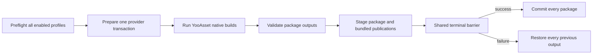

# YooAsset 3 Build Integration

This integration translates a generic `asset-content` invocation into one transactional YooAsset build containing one or more explicit package profiles. It is an optional Editor adapter; the Build core does not require YooAsset to compile.

> **Current checkout:** YooAsset is not installed in `Packages/manifest.json`. The integration source is present but its gated assembly and tests are not active. The statements below describe the source contract and require qualification with the installed package before release.

## Assembly boundary and availability

`Build.Pipeline.Integrations.YooAsset3.Editor.asmdef` references `Build.Pipeline.Editor`, `YooAsset`, and `YooAsset.Editor`. It is enabled only when `com.tuyoogame.yooasset` satisfies `[3.0.5,4.0.0)` and produces `BUILD_PIPELINE_HAS_YOOASSET_3`.

This boundary has three consequences:

- uninstalling YooAsset does not break the core Build assembly;
- `YooAssetBuildConfig` remains a serializable authoring type, but a selected invocation fails preflight because no adapter is registered;
- the YooAsset recovery participant is also absent while the package gate is unsatisfied, so complete Workspace Recovery before uninstalling or upgrading the package.

Do not add `BUILD_PIPELINE_HAS_YOOASSET_3` manually to PlayerSettings. Package presence and version own the capability.

## Setup

1. Install and lock `com.tuyoogame.yooasset` in the supported range.
2. Create and save exactly one valid YooAsset Bundle Collector settings asset; the validated collector catalog is bounded to 1024 packages.
3. Verify that every package intended for BuildData exists in the collector catalog.
4. In BuildData, choose a recipe containing Asset Content.
5. Create `CycloneGames/Build/YooAsset Build Config` through the Content card or Project menu.
6. Configure roots and package profiles, save both assets, then run Preflight.

The adapter does not install YooAsset, create collector settings, choose packages from `EditorPrefs`, or upload artifacts.

## Authoring model

`YooAssetBuildConfig` owns a build root, an optional built-in-file root, and up to 128 explicit package profiles.

| Field | Contract |
| --- | --- |
| `Build Output Root` | Project-relative native package output root; default `Bundles` |
| `Bundled File Root` | Project-relative built-in root; empty delegates to YooAsset's configured StreamingAssets root |
| `Packages` | At least one enabled package profile |

Each `YooAssetPackageProfile` configures:

- exact package name and enable state;
- `Scriptable`, `RawFile`, or `ArchiveFile` build pipeline;
- deterministic package note;
- Scriptable compression: `Uncompressed`, `LZMA`, or `LZ4`;
- file name style: `HashName`, `BundleName`, or `BundleNameAndHash`;
- optional typed cryptography configuration;
- bundled copy mode and semicolon-separated tags;
- asset dependency database, shared-pack, and build-result verification options;
- exact-version collision policy.

Package and version tokens must be portable: 1-128 ASCII letters, digits, dot, hyphen, or underscore; alphanumeric first and last characters; no consecutive dots; no Windows reserved device names.

## Build and publication flow



Native package output is expected under:

```text
<BuildOutputRoot>/<BuildTarget>/<Package>/<PackageVersion>/
<BundledFileRoot>/<Package>/
```

Each owned publication carries `.yoo-pub.json`. It records package/version identity, transaction/content identity, and any cryptography adapter/runtime-decrypt contract identity. All enabled profiles share one deferred publication transaction; one failure prevents every package in that invocation from committing.

`FailIfVersionExists` is the release-safe default. `ReplaceExactVersion` can replace only the exact output carrying valid Build ownership evidence. Normal CI should issue a new package version and reserve replacement for a controlled retry.

## Bundled copy and Player consumption

| Mode | Built-in publication semantics |
| --- | --- |
| `None` | Does not provide built-in package input to a downstream Player |
| `ClearAndCopyAll` | Builds a complete replacement snapshot |
| `ClearAndCopyByTags` | Builds a replacement snapshot filtered by tags |
| `OnlyCopyAll` | Seeds from the current build-owned snapshot, then overlays all selected files |
| `OnlyCopyByTags` | Seeds from the current build-owned snapshot, then overlays tagged files |

A content invocation opens a temporary Player session only when at least one enabled profile uses bundled copy. The session activates staged package data for the dependent Player and restores the exact previous built-in state on failure.

Multiple YooAsset invocations are permitted if invocation IDs, package paths, bundled paths, and output claims do not overlap. Addressables and YooAsset may both feed one Player at the contract level, but this checkout has no real multi-provider Player-build evidence.

## Clean and Incremental

Both incrementality values preserve YooAsset's native build cache. The adapter deliberately refuses `ClearBuildCacheFiles`, including for Clean, because the YooAsset 3.0.5 API removes historical versions.

Clean and Incremental currently use the same native package build parameter shapes. Therefore Incremental means that the pipeline permits provider cache reuse; it is not a promise of changed-bundle-only output, a patch manifest, or reduced build time. Measure and qualify those properties with the installed YooAsset version and real collector rules.

## Cryptography extension contract

The integration ships no encryption algorithm, key, or runtime decryptor. A product extension must provide all of the following:

1. a typed `YooAssetCryptographyConfiguration` asset;
2. a `YooAssetCryptographyAdapterRegistration` with stable adapter and runtime-contract IDs;
3. an `IYooAsset3CryptographyAdapter` implementation in an assembly that references YooAsset;
4. non-null bundle encryptor, manifest encryptor, and manifest decryptor objects;
5. a Player-side runtime decryptor matching the recorded contract.

Secret acquisition and rotation belong to the product adapter and CI secret store. Do not serialize secrets into BuildData or cryptography assets, read them from `EditorPrefs`, or write them to logs. `.yoo-pub.json` records identity only; it does not prove that the runtime decryptor shipped.

## CI workflow

For a normal package publication:

1. bootstrap the compatible package and collector settings;
2. use a stable invocation ID and a unique package version;
3. restore prior built-in snapshots only when an `OnlyCopy...` mode intentionally needs them;
4. preserve `.yoo-pub.json` with any restored snapshot;
5. run Content Only, Player + Content, or Full Player according to the required consumers;
6. archive the complete package-version and bundled-package directories plus the pipeline result manifest.

Uploading, signing, CDN promotion, retention, and rollback are external release stages.

## Persistence and recovery

YooAsset transaction evidence lives under:

```text
<UnityProject>/.buildpipeline/transactions/yooasset3/<invocation-id>/
```

After a crash, use Workspace Health and explicit recovery before retrying or switching target. Do not delete journals or remove the package while recovery is pending. Because the recovery participant belongs to the gated integration assembly, reinstall a compatible YooAsset package if the assembly was removed before recovery completed.

## Troubleshooting and validation boundary

| Problem | Action |
| --- | --- |
| Provider is not offered in BuildData | Install a supported package version and let Unity compile the gated integration assembly |
| Existing YooAsset configuration fails availability | Restore a compatible package or remove the invocation from the selected recipe |
| Package version already exists | Use a new version, or select guarded `ReplaceExactVersion` only for a build-owned exact output |
| Built-in `OnlyCopy` mode rejects its seed | Restore the complete prior owned snapshot including `.yoo-pub.json` |
| Player cannot load or decrypt content | Verify the separate runtime provider and runtime decrypt-contract implementation |
| Workspace requires recovery | Recover before changing target, package version, or output roots |

Known test issue: one request construction in `Tests/YooAsset3PublicationTransactionTests.cs` omits the now-required invocation ID. The currently absent package keeps this test assembly inactive. Do not claim that the YooAsset integration tests pass until that call site is repaired and the gated test assembly is compiled and run with a supported YooAsset package.

Static source inspection and package-independent transaction tests do not prove a target Player, runtime loading, cryptography, CDN publication, package-upgrade compatibility, IL2CPP, or platform behavior.

## Related documentation and source

- [Build Foundation](../../../../README.md)
- `Build.Pipeline.Integrations.YooAsset3.Editor.asmdef`
- `../../Authoring/Content/YooAssetBuildConfig.cs`
- `../../Authoring/Content/YooAssetCryptographyConfiguration.cs`
- `YooAsset3BuildAdapter.cs`
- `YooAsset3BuildPlan.cs`
- `YooAsset3Cryptography.cs`
- `YooAsset3PublicationTransaction.cs`
- `YooAsset3RecoveryParticipant.cs`
