# Build 构建底座

[English](README.md)

**Assets/Build** 是一套面向 Unity Player、资源内容和热更新产物的可复用构建底座。设计师在 **BuildData** Inspector 中通过资源引用完成日常配置；开发者通过强类型配置资产和依赖图扩展流程；CI 使用同一份已保存 Profile 和同一个执行入口，因此本地构建与 TeamCity、Jenkins 等自动化环境不会维护两套规则。

本文件是 Build 模块的完整中文说明。核心教程、设计约束、配置参考、组合方式、独立步骤、CI、事务恢复、证据、扩展与排错均集中在此处，不要求读者跳转到额外的章节文件夹。

## 目录

- [1. 定位与支持工作流](#1-定位与支持工作流)
- [2. 快速开始](#2-快速开始)
- [3. 架构与执行模型](#3-架构与执行模型)
- [4. Recipe 与组合](#4-recipe-与组合)
- [5. 资源内容 Provider](#5-资源内容-provider)
- [6. 热更新与混淆](#6-热更新与混淆)
- [7. CI/CD](#7-cicd)
- [8. 安全、恢复与证据](#8-安全恢复与证据)
- [9. 扩展构建管线](#9-扩展构建管线)
- [10. 参考手册](#10-参考手册)
- [11. 故障排查](#11-故障排查)
- [12. 复制与发布验证](#12-复制与发布验证)

## 1. 定位与支持工作流

**能够构建什么**

| 工作流 | 典型用途 | 结果 |
| --- | --- | --- |
| Player Only | 不需要资源或热更新预处理的原生应用 | Unity Player |
| Player + Content | Player 消费 Addressables 或 YooAsset 内容 | Content，然后 Player |
| Full Player | 同时包含热更新、内容与 Player 的完整发布 | Hot Update、Content、Player |
| Content Only | CDN 更新、DLC 或可下载资源包 | 仅 Content |
| Content + Hot Update | 不重打 Player 的在线更新 | Hot Update，然后 Content |
| Hot Update Only | 仅生成热更新程序集与 AOT 元数据 | Hot Update/AOT metadata |
| Exact Invocation | 单独构建某个 DLC、语言包或自定义 Provider 实例 | 目标 invocation 及其 Required 闭包 |

这些工作流是同一条 Pipeline 的不同 Selection，不存在独立的资源 Runner、热更新 Runner 或 CI Runner。

**核心保证**

- **BuildData** 是唯一的持久化 authoring source；Inspector 与 CI 编译同一份 Recipe。
- Invocation ID、Step Type、强类型配置、Incrementality 和 Dependency 共同定义构建意图。
- Preflight 在改变 Unity 全局状态或写入产物前验证包能力、路径、依赖、所有权、Provenance 和容量。
- 同一 Workspace 同时只允许一个 mutating build；进程中断后必须根据持久化证据显式恢复。
- Player、内容、热更新和扩展步骤共享同一 Publication 决策：全部 Prepare 后统一 Commit，失败时统一 Rollback。
- 每次运行都写入 started marker、事件日志和终态 manifest，CI 可据此区分构建失败、证据失败和 Workspace 占用。
- 可选包通过独立 integration assembly 隔离；缺少可选包不会破坏核心程序集编译。
- 默认输出必须位于受控项目目录。显式允许外部输出时仍会执行路径重定向、所有权和删除边界检查。

**从配置到产物**

**BuildData Profile → Selection → BuildRequest → Preflight → Execution Plan → Transactional Steps → Publication Decision → Terminal Evidence**

**推荐阅读顺序**

1. 第一次接入项目：阅读[快速开始](#2-快速开始)。
2. 需要理解职责边界：阅读[架构与执行模型](#3-架构与执行模型)。
3. 需要组合步骤或单独出包：阅读[Recipe 与组合](#4-recipe-与组合)。
4. 接入 Addressables、YooAsset、HybridCLR 或 Obfuz：阅读[资源内容 Provider](#5-资源内容-provider)与[热更新与混淆](#6-热更新与混淆)。
5. 配置 TeamCity、Jenkins 或构建矩阵：阅读[CI/CD](#7-cicd)。
6. 构建失败、强制中断或切换平台：先阅读[安全、恢复与证据](#8-安全恢复与证据)，再查阅[故障排查](#11-故障排查)。
7. 编写新 Step、Provider 或 Player Extension：阅读[扩展构建管线](#9-扩展构建管线)。

**当前验证边界**

当前 checkout 的 Package Manifest 未安装 Addressables、YooAsset、HybridCLR 或 Obfuz。仓库中的 integration 源码和第三方源码副本只能用于静态 API 核对，不能证明真实 Vendor 构建、目标 Player、IL2CPP/AOT 或发布链路已经通过。特别是 YooAsset 可选测试程序集仍有一个待随当前 **AssetContentBuildRequest** 构造签名更新的 version-gated publication test；安装 YooAsset 后必须先保证该程序集编译，再运行测试和真实 Package Build。

核心 EditMode 测试与静态审查能够证明 authoring、图编译、事务、所有权和证据契约，但每个消费项目仍必须在自己的包版本、目标平台、构建 Agent 和签名环境中完成 Clean、Incremental、恢复与发布验证。

## 2. 快速开始

本教程会创建一份可复现的构建 Profile，先在 Unity Inspector 中运行，再让 batch mode 运行同一份已保存 Recipe。它适合开发者、技术美术、构建工程师和 CI 维护者作为 Build 模块的第一入口。

**这个模块构建什么**

一份已保存的 `BuildData` 资产是一次构建的事实来源。它同时描述产品身份、Scene、版本、输出所有权，以及由强类型 invocation 组成的依赖图。

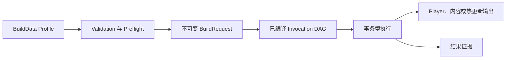

Inspector、Editor 菜单、TeamCity、Jenkins 和其他 batch-mode runner 共享同一个 composition root。CI 不维护第二套 Recipe 格式。

### 前置条件

开始配置 Profile 前：

1. 使用 `ProjectSettings/ProjectVersion.txt` 记录的 Unity 版本打开项目。
2. 只安装目标 Recipe 实际需要的可选 integration。
3. Interactive build 前先让 Unity 完成目标平台切换。
4. 将项目放在构建 Agent 可以检查的版本控制工作区中，或者准备显式 CI identity 参数。
5. 使用 `Assets/` 下项目相对、可纳入版本控制的配置资产。

缺少某个可选 provider 包时，核心模块仍应编译。只有真正选择了依赖该 provider 的 invocation，Validation 才会用明确的 availability error 阻止构建。

### 创建 Profile

在 Project 窗口选择：

```text
Assets/Create/CycloneGames/Build/Build Profile
```

将资产放在项目拥有的配置目录，例如：

```text
Assets/Settings/Build/WindowsRelease.asset
```

不要把 Build 配置放入 `Packages/`，不要使用 sub-asset，也不要只在内存中创建。CI override 只能确定地引用 `Assets/` 下持久化的 main `.asset`。

### 配置 Profile

自定义 Inspector 按职责组织 authoring 字段。

| Inspector 字段 | 用途 | 重要规则 |
| --- | --- | --- |
| `Launch Scene` | Player 构建的第一个 Scene | 只有当前 Recipe 生成 Player 时必需 |
| `Additional Scenes` | 接在 Launch Scene 后的 Scene | 保留 authoring 顺序；重复 asset path 会被去重 |
| `Application Version` | 跨平台 native marketing version | 必须恰好为三个无符号整数分量，例如 `1.2.3`，不允许前导零 |
| `Output Base Directory` | 项目相对 Build Root | 必须是 Unity 项目内部的 portable directory |
| `Company Name` | Player 和热更新 Validation 使用的 company identity | 配置稳定的非空值 |
| `Product Name` | 产品名与默认 artifact 名称 | 包括 content-only Profile 在内都应配置 portable 文件名 |
| `Application Identifier` | Android 与 Apple 通用 application identity | 至少两个以 `.` 分隔的 ASCII identifier segment |
| `Runtime Version Info` | 临时 runtime `VersionInfoData` 目标 | 只用于 Player，并由 transaction 管理 |
| `Source Cleanliness Policy` | 版本控制工作区资格判定 | `Require Clean` 是安全默认值；本地例外永远不会放宽 batch mode 或 Qualified Release request |
| `Cheat Build Mode` | 每次构建独立的 `ENABLE_CHEAT` 请求 | 在所选 Target 上事务化应用并于构建后恢复；与 HybridCLR 解耦 |

Qualified Release 和 batch-mode request 无论保存的策略为何都必须验证源码工作区为干净。`Allow Dirty Development` 只允许本地交互式 Development request 在 Dirty 或 Unknown 状态继续。`Allow Dirty Local Release` 还允许本地 Development，并在 Qualified Release 被阻止时让 Inspector 的 **Release** 操作路由到下文所述的隔离 Local Release Player；它不会放宽 CI 或直接入口使用的正式 Release request。Enum 数值为 `Require Clean = 0`、`Allow Dirty Development = 1`、`Allow Dirty Local Release = 2`；未包含该字段的 Profile 仍保持安全默认行为。

Inspector 还提供 **Local Optimized Preview**，用于 checkout 正在变化时验证 Release-like Player 优化、裁剪和运行表现。`Allow Dirty Local Release` 会让 **Release (Local Dirty)** 操作复用同一个受保护 purpose：只运行一个 `Clean` Player invocation，保持 `DebugBuild = false`，把输出强制隔离到 `<BuildRoot>/LocalPreview`，完整记录 Dirty 或 Unknown 源码证据，并明确标记为不可分发。它不能通过 batch mode 或命令行运行，不能导出 Android Project、使用外部输出、包含 Content/Hot Update/Custom invocation、发布 HybridCLR Release Baseline，或复用正式 Release Player 输出。需要 Content、Hot Update、Custom step 或 Incremental Player 输出的 Recipe 在工作区干净前仍保持阻止状态。

资格判定覆盖包含 Unity 项目的整个版本控制 worktree，而不只检查 `Assets/`。因此同仓库中的 `Tools/`、`Docs/` 等兄弟区域发生变更时，Qualified Release 默认也会被阻止。只有建立机器可读、能完整声明所有构建输入的 scope 后，才适合安全缩小范围。

`Runtime Version Info` 的默认路径是：

```text
Assets/Build/Runtime/Resources/VersionInfoData.asset
```

Player transaction 只在构建期间创建缺失目录链，之后恢复此前的资产状态，并删除本次 transaction 创建的空目录。Content-only 和 Hot-update-only Recipe 不会创建该资产或额外的 `Resources` 目录。

### 选择 Recipe

常见输出组合应使用 **Quick Setup**。

| Preset | 有效输出 | 编译后顺序 |
| --- | --- | --- |
| `Player Only` | Player | Player |
| `Player + Content` | Content 与 Player | Content，然后 Player |
| `Full Player` | Hot Update、Content、Player | Hot Update、Content、Player |
| `Content Only` | Content | Content |
| `Content + Hot Update` | Hot Update 与 Content | Hot Update，然后 Content |
| `Hot Update Only` | Hot Update 与 AOT metadata | Hot Update |

Preset 是 authoring helper，不是另一套 runner。它会写入 Saved Recipe 图，尽量保留兼容的 config 与 incrementality，把未使用的 invocation 保留为 disabled，支持 Undo，并让 Profile 进入 dirty 状态。

只有在需要多个内容 provider、多个 hot-update invocation、自定义 Step Type 或非标准 routing 时才展开 **Advanced DAG & CI**。执行顺序由 dependency edge 决定，而不是 Inspector 列表顺序。

`Required` 与 `IfSelected` 的完整语义见[Recipe 与组合](#4-recipe-与组合)。

### 分配强类型配置资产

标准 Player、Asset Content、Hot Update 卡片都支持拖拽引用和 **Create** 操作。

| 内置 Step | Configuration | Multiplicity |
| --- | --- | --- |
| `player` | 可选 `PlayerBuildConfiguration`；空引用表示构建未扩展 Player | Single |
| `asset-content` | 必需的 provider-specific `AssetContentBuildConfiguration` | Multiple |
| `hot-update` | 必需的 provider-specific `HotUpdateBuildConfiguration` | Multiple |

当基础配置类型是 abstract 时，**Create** 会列出当前 Editor Registry 中的具体 provider。没有安装兼容 provider 时，菜单会保持不可用，而不是创建无法运行的资产。

配置创建操作拒绝覆盖已有路径。Build 前必须保存新配置资产和被修改的 Profile。

### 读取 Readiness 并保存 Authoring

Inspector 以状态为中心：

- **Build Readiness** 分别汇总 Source Qualification、Build Transaction Safety、Recipe Validation、未保存 authoring 和 Active Target。
- **Compiled Summary** 显示识别出的 Preset、预期输出和拓扑编译后的执行计划。
- **Source Qualification** 异步预览 tracked、untracked、submodule 和 Git LFS evidence，不会在 IMGUI 中运行 VCS 命令，并分别显示 Release、Development 与 Local Optimized Preview decision。
- **Build Transaction Safety** 根据 durable transaction 与 lease evidence 显示 `Clean`、`Busy`、`Recovery Required` 或 `Blocked`。
- **Validation** 解释缺失 Scene、非法 identity、不可用 Step/provider、错误 config 类型、dependency 和 output path 问题。

Release、Android Export 和 focused non-Development action 会在缓存预览不是 verified-clean 时禁用；只有显式本地 Development 例外可以继续，符合条件的 Local Optimized Preview 则因 Player-only 输出隔离且不可分发而保持可用。若自定义 Provider 没有实现可选的 thread-safe preview capability，Inspector 会显示 `RUNNER CHECK`，不会错误禁用按钮。预览不是授权证据：Runner 会在 Preflight 捕获新的权威 source snapshot，并在任何 deferred publication 提交前再次验证受保护构建。

**第六步：显式保存 Authoring**

Build 前点击 **Save Build Authoring Assets**。它只保存当前 Profile 和 Saved Recipe 引用的 dirty config，不会静默保存整个项目。

Focused build 可以选择 retained invocation。如果 retained config 是 dirty 且不属于 Saved Recipe，该 config 不一定出现在这个专用按钮的保存集合中；请先用 Unity 常规资产保存命令显式保存它。

将 Profile 和所有引用的配置资产一起提交到版本控制，确保 Editor 与 CI 消费相同的图。

### 从 Inspector 运行

按目标 membership 选择操作：

- **Run Saved Recipe** 执行所有 enabled invocation。
- **Release** 创建 Qualified Release；选择 `Allow Dirty Local Release` 且源码不干净时，Inspector 会明确显示 **Release (Local Dirty)** 并改为运行隔离的本地 Player。
- **Local Optimized Preview** 只运行一个 Clean Player invocation，使用 Release-like 优化并写入隔离的不可分发输出。
- **Development** 创建 Development request。
- **Focused Output** 不修改 Profile，只运行一个标准非 Player 子集。
- **Exact Invocation** 运行一个非 Player invocation 及其传递 `Required` dependency。

Focused 与 Exact 不会沿 `IfSelected` edge 自动加入节点，但仍会验证有效 selection、provider availability、配置资产、Workspace 和 output safety。

### 在 Batch Mode 运行同一 Profile

唯一规范入口是：

```text
Build.Pipeline.Editor.BuildEntryPoints.RunCommandLine
```

Windows 最小示例：

```bat
"<Unity.exe>" ^
  -batchmode ^
  -nographics ^
  -projectPath "<Repository>\UnityStarter" ^
  -executeMethod Build.Pipeline.Editor.BuildEntryPoints.RunCommandLine ^
  -buildTarget Win64 ^
  -pipelineProfile Assets/Settings/Build/WindowsRelease.asset ^
  -pipelineScriptingBackend IL2CPP ^
  -pipelineBuildNumber 1001 ^
  -pipelineCiProvider LocalCI ^
  -pipelineCiRunId run-1001 ^
  -logFile "<Repository>\artifacts\unity-editor.log"
```

`-buildTarget` 同时是 Unity 的启动 target selector 和 pipeline 必需参数。Entry point 负责 batch 进程退出码，因此无需 `-quit`。Pipeline 不会在 transaction 内同步切换平台，因为 Unity 可能编译脚本并 reload domain。

如果 checkout 中存在可检测的 Git 或 Perforce metadata，应省略显式 source identity group，让 pipeline 自己捕获。将 TeamCity/Jenkins revision 变量映射为参数前请先阅读 [CI/CD](#7-cicd)。

### 输出与首次运行证据

未指定显式 Player output 时，默认结构为：

```text
<BuildRoot>/<Platform>/<Release|Development>/<Artifact>
```

Local Optimized Preview 始终忽略外部输出覆盖，并使用：

```text
<BuildRoot>/LocalPreview/<Platform>/Release/<Artifact>
```

每次命令行调用都会先在 Unity 项目根目录建立：

```text
.buildpipeline/results/<run-id>.started.json
.buildpipeline/results/<run-id>.log
.buildpipeline/results/<run-id>.json
```

应将 terminal manifest 与 provider-owned publication metadata 随输出一起归档。Result evidence 是诊断历史；durable transaction journal 才是 Recovery 的事实来源。

**常见首次构建失败**

| 信息或状态 | 处理方式 |
| --- | --- |
| `SAVE REQUIRED` | 保存 Profile 和本次运行选中的全部配置资产 |
| `Build Transaction Safety must report Clean` | 打开 Workspace Health；只有 durable evidence 明确允许时才执行 Recovery |
| Active target 与 requested target 不一致 | 等待 Editor 平台切换完成，或用匹配的 `-buildTarget` 启动 batch mode |
| Configuration is required | 创建并分配 provider-specific config |
| Provider adapter is unavailable | 安装兼容可选包/integration，或从 selection 移除该 invocation |
| Required dependency 未选择 | 启用或显式选择 dependency；只有确实可选时才改为 `IfSelected` |
| 找到多份 `BuildData` | 显式传入 `-pipelineProfile Assets/...asset` |

**验证边界**

Inspector 和聚焦 EditMode 测试验证 authoring contract、dependency compilation、命令行解析、request composition、path policy、result evidence 与 recovery 行为。它们不能证明目标 Player、IL2CPP、AOT、stripping、provider toolchain、签名或 clean-agent CI build 已通过。Release 前必须使用真实可选包、目标平台和归档布局逐一验证。

## 3. 架构与执行模型

本文说明 Build 模块如何把编辑器中配置的 Recipe 转换为经过验证、可恢复且具有完整证据的构建。这里仅描述当前 Checkout 中的实现与契约。

### 分层与所有权

模块将配置、编排、Provider 集成、事务、恢复和结果证据分离。一个构建 recipe 可以生成 Player、资源内容、热更新代码，或生成这些输出的依赖感知组合。可选包通过窄 Adapter 接入，因此核心步骤契约不会暴露 Addressables、YooAsset、HybridCLR 或 Obfuz 类型。

编排器刻意保持串行。它编译确定性的 DAG，并在 Unity Editor 线程上逐个执行 invocation。Unity 和具体 Provider 可以在内部并行，但管线不会并发调度互相独立的 DAG 节点。

**架构分层**

| 分层 | 职责 | 代表类型 |
| --- | --- | --- |
| Authoring | 人类可读的 profile、强类型配置资产、preset 和聚焦构建控件 | `BuildData`、`BuildRecipeInvocation`、`BuildRecipePresetCatalog`、`BuildDataEditor` |
| Request | 对目标、路径、身份、场景、选项和已选 invocation 建立不可变快照 | `BuildRequest`、`BuildRequestFactory`、`BuildCommandLineOptions` |
| Discovery 与 Planning | 发现注册能力、验证配置契约、编译并验证 DAG | `BuildPipelineRegistry`、`BuildPlanCompiler`、`CompiledBuildStep` |
| Execution | 持有运行上下文、调用步骤、汇总结果、恢复状态并协调发布 | `BuildPipelineRunner`、`BuildExecutionContext`、`IBuildStep` |
| Integrations | 将 Provider 无关请求翻译成具体包操作 | `IAssetContentBuildAdapter`、`IHotUpdateBuildAdapter`、Player extensions |
| Transactions | 暂存输出和临时 Unity 状态，随后提交或回滚 | `GlobalBuildStateTransaction`、`VersionInfoAssetScope`、`PlayerOutputTransaction` |
| Recovery | 检查持久 journal，并按所有权显式恢复 | `BuildWorkspaceService`、`IBuildRecoveryParticipant` |
| Evidence | 从命令行解析开始记录直到终态结果 | `BuildResultEvidenceSession`、`BuildResultManifestWriter` |

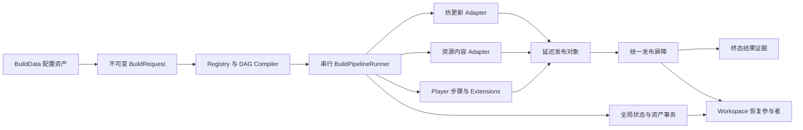

### 从 Profile 到终态结果

`BuildData` 保存有序的配置集合，但执行顺序由依赖边决定，不由列表位置决定。每个 `BuildRecipeInvocation` 包含：

- 唯一 `InvocationId`，供 Editor、CI、依赖、证据和诊断共同使用；
- 已注册的 `StepTypeId`，例如 `hot-update`、`asset-content` 或 `player`；
- 按步骤注册契约决定可选或必需的强类型 `ScriptableObject` 配置；
- `Clean` 或 `Incremental` 策略；
- 零个或多个依赖声明。

两种依赖模式具有不同的成员选择语义：

| 模式 | 聚焦选择 | 编译后的 Plan |
| --- | --- | --- |
| `Required` | 将传递依赖加入选择集合 | 缺失或不可应用的依赖会报错 |
| `IfSelected` | 不增加成员 | 只有双方都被选择时才建立边 |

Compiler 只计算一次 applicability，验证 multiplicity 和配置类型，拒绝非法边与环，然后进行拓扑排序。同一批 ready 节点按 `InvocationId` 不区分大小写排序，因此执行计划确定且与配置列表顺序无关。所有 applicable 步骤的 validator 都会执行并汇总错误，随后才允许改变 Unity 状态。

**标准 Recipe 拓扑**

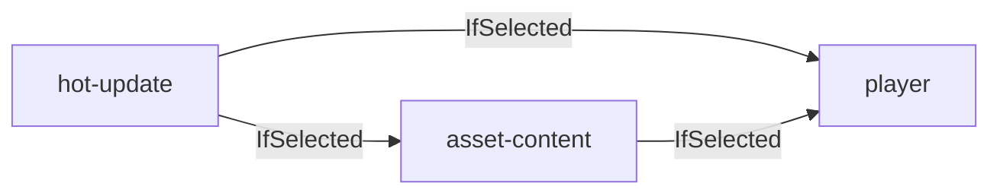

标准 preset 选择此拓扑的不同子集。`IfSelected` 使 `Hot Update Only`、`Content Only` 和 `Player Only` 不会暗中拉入其他输出。精确 invocation 构建仍会包含其传递 `Required` 依赖。

依赖还定义数据可见性。Player 步骤会检查自己的传递依赖闭包，并据此开启热更新验证器和资源内容 Player session。只在 Inspector 中把 invocation 放在更前面，并不能使其输出成为 Player 输入。

### 动态运行要求

applicable 步骤可以实现 `IBuildStepRequirementsProvider`。Runner 合并这些标志，为本次构建建立最小安全运行环境：

| Requirement | 作用 |
| --- | --- |
| `UnityGlobalState` | 启用带 journal 的 PlayerSettings 与 EditorBuildSettings 事务 |
| `VersionInfoAsset` | 在 `Resources` 目录下事务性安装 `VersionInfoData.asset` |
| `PlayerOutput` | 启用 Player 输出形态、身份、场景和发布验证 |

Player 声明全部三个 requirement。资源内容核心步骤不声明 requirement，由 Provider 增加所需行为。HybridCLR 热更新声明 `UnityGlobalState`。因此一个不需要这些能力的自定义步骤可以在没有 Player 场景、产品身份或 VersionInfo 目标时运行。

### 规范 Runner 生命周期

规范 CI 入口在解析参数和解析 profile 之前就开始记录证据。建立 `BuildRequest` 后，Runner 按以下顺序执行：

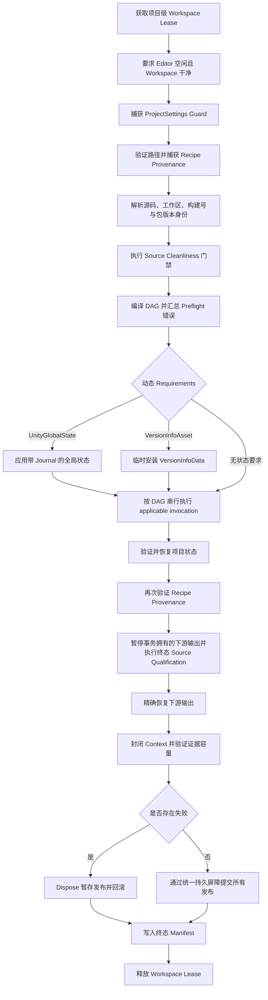

首个 applicable 步骤失败后 Runner 停止后续执行。non-applicable invocation 记录为 `Skipped`。恢复、provenance、publication 和 evidence 失败都会合并进终态失败，而不会覆盖或隐藏原始错误。

### 临时状态与延迟发布

`IBuildStep` 是 Command 边界：`IsApplicable`、`Validate` 与 `Execute`。注册信息声明稳定 type ID、配置类型、配置是否必需，以及 `Single` 或 `Multiple` multiplicity。

内置步骤刻意保持轻量：

- `PlayerBuildStep` 负责 Player 验证、环境/session 组合、Unity `BuildPipeline.BuildPlayer` 以及事务性 Player 输出。
- `AssetContentBuildStep` 解析 `IAssetContentBuildAdapter`、验证独占输出 claim、记录 package 结果，并把 Provider publication 所有权转交 Runner。
- `HotUpdateBuildStep` 解析 `IHotUpdateBuildAdapter`；Adapter 负责 requirement 和精确的 Clean/Incremental 行为。

可选能力保留在 integration assembly 和反射隔离 Registry 之后。只有选择相应 invocation 时，缺失 Adapter 才产生聚焦 preflight 错误；核心架构不要求安装所有 Provider 包。

**状态与发布所有权**

管线包含两个不同事务阶段：

1. **临时构建状态。** Unity 全局设置和 `VersionInfoData` 只在所需步骤执行时存在，并在输出发布前恢复。
2. **延迟输出。** Player、资源内容和热更新输出先构建在 Provider 所有的 staging 位置，只能通过 `BuildPublicationBarrier` 成为终态可见输出。

某些 publication 实现 `IBuildDownstreamInputPublication`。它们可以把 staged 数据可逆地暴露给后续 invocation，例如供资源构建消费的 HybridCLR DLL，或构建 Player 时使用的 YooAsset bundled 文件。这不等于提前提交输出。

Additive source-qualification capability 可以在终态 VCS snapshot 捕获期间，把这些事务拥有的输入暂时恢复到精确的 pre-run 状态，再在 Context 封闭与发布前恢复 staged 新输出。Suspension 是同步、带 journal、经过 identity 校验的事务过程，不会通过路径或 change-count 白名单从源码证据中扣除变更。

HybridCLR 会把该能力组合到最终输出事务和生成事务：先暂停输出、再暂停生成输入；恢复时先恢复生成输入、再恢复输出。精确的文件/目录树 identity 与可移植的路径重叠检查可防止任一事务隐藏或接管不相关的 checkout 变更。

Publication barrier 先写入一个持久 `Prepared` decision，发布所有参与者，再记录持久 `Committed` decision。提交前失败会回滚全部参与者。提交后恢复只会完成所有参与者，不会尝试相互矛盾的回滚。

### Provenance 与确定性证据

Preflight 捕获选中图及配置 provenance：invocation 身份、类型、incrementality、依赖、配置资产路径/GUID/file ID/type、资产摘要和依赖对象摘要。它会在状态修改前、每个 invocation 前以及 publication 前检查。脏资产或已变化的配置会 fail closed。

Full Result Manifest 记录编译顺序、步骤结果、有效版本身份、build purpose、Release Baseline Policy 资格、Provider 结果、警告、规范化失败和脱敏的源码工作区快照。

所有 Build 自有 JSON 只存在一份当前文档契约。每个文档都以精确的 `documentType` 开始，并拒绝重复或未知 member、注释、错误 token 类型、超深嵌套与尾随内容；恢复或删除授权需要时，还必须绑定 ownership checksum 或完整 tree identity。管线不包含历史 reader、数字 wire version、自动迁移或兼容 DTO。任何不符合当前契约的制品都会在零修改状态下被拒绝。

该策略只适用于 Build 自有且可重建的状态：result、journal、ownership marker、publication manifest 与 release baseline。它不会替代应用版本、package 版本、source revision、provider compatibility identity 或 Unity 强制要求的 `.meta` 文件格式。升级 Build 模块前，Workspace Health 必须为 `Clean`；待恢复事务和过期的可重建输出必须由创建它们的 checkout 及 ownership-aware 工具完成恢复或清理。升级后若仍残留旧证据，当前管线只会零修改地拒绝它；应回到原 checkout 恢复或清理，或者在明确完成人工 ownership 审查后将其隔离，再执行一次 Clean build。不得原地解释或接管旧制品。

### 当前架构限制

- 普通构建不会隐式恢复或删除持久事务证据。
- 管线不会切换 active build target。Editor 必须已经处于请求目标；CI 应用匹配的 `-buildTarget` 启动 Unity。
- 当前没有协作式 cancellation token，也没有并行 DAG scheduler。进程中断依赖下一次显式 workspace recovery。
- 终态 manifest 必须持久化成功。即使输出已提交，manifest 失败仍使 invocation 失败。
- `.buildpipeline/results` 下的结果历史当前没有自动 retention 策略。
- `Clean` 和 `Incremental` 是 invocation 策略，不是统一算法；Player 与各 Provider 分别定义自己的兼容规则。

安全预算包括最多 256 个 invocation、4096 条依赖边、512 个 deferred publication 和 4096 个独占输出 claim。证据与路径策略还设置了数量、大小、portable path 和禁止重定向等边界。

**验证边界**

仓库包含针对图编译、request 创建、lease、恢复、状态还原、publication、Player 输出所有权、provenance 和 evidence 的聚焦 EditMode 测试。这些测试描述预期行为，但不能证明所有 Unity 版本、IL2CPP 工具链、Provider 版本或目标平台已经成功出包。发布流程仍必须在预期构建代理上执行目标 batchmode 命令，并至少完成一个代表性的 Player、资源内容和热更新构建。

继续阅读：[安全、恢复与证据](#8-安全恢复与证据) 与 [参考手册](#10-参考手册)。

## 4. Recipe 与组合

本指南说明 Build Profile 如何变成确定性的执行计划、标准 Preset 如何组合 Player、内容与热更新任务，以及如何在不修改 Profile 的情况下只运行大型图的一部分。

### 术语与 Invocation 契约

模块明确区分四个概念：

| 概念 | 含义 |
| --- | --- |
| **Step Type** | 已注册的实现，例如 `player`、`asset-content`、`hot-update` |
| **Invocation** | Step Type 的一次具体配置，由稳定 `Invocation ID` 标识 |
| **Recipe** | 本次选中的 invocation 集合及其 dependency declaration |
| **Execution Plan** | 针对一次运行完成 Validation 和拓扑排序后的不可变计划 |

Step Type 与 Invocation 必须分离。Asset Content 和 Hot Update 允许多个 invocation，因此同一 Profile 可以通过相同实现类型构建 base package、多个 DLC 和多个热更新通道。

**Invocation Authoring Contract**

每个 invocation 自己拥有：

| 字段 | 契约 |
| --- | --- |
| `Enabled` | 是否属于 Saved Recipe |
| `Invocation ID` | dependency、CI override、日志、provider state 和 manifest 使用的稳定身份 |
| `Step Type` | 当前 invocation 选择的 Registry-backed 实现 |
| `Configuration` | `Assets/` 下可选或必需的强类型 main asset |
| `Incrementality` | 仅属于该 invocation 的 `Clean` 或 `Incremental` |
| `Dependencies` | 从 producer invocation 指向当前 consumer 的有向边 |

Invocation ID 按不区分大小写的方式保证唯一，最长 64 字符，以小写 ASCII 字母或数字开头，其他字符只允许小写 ASCII 字母、数字、`.`、`_`、`-`。

内置 multiplicity 与 configuration 规则：

| Step Type | Multiplicity | Configuration |
| --- | --- | --- |
| `player` | Single | 可选 `PlayerBuildConfiguration` |
| `asset-content` | Multiple | 必需的 provider-specific `AssetContentBuildConfiguration` |
| `hot-update` | Multiple | 必需的 provider-specific `HotUpdateBuildConfiguration` |

### 为什么仍然需要依赖关系

序列化 invocation 数组只是 authoring 容器，不是执行顺序契约。调整 YAML 数组、增加 provider 或只选择一个输出，都不应悄悄改变构建正确性。

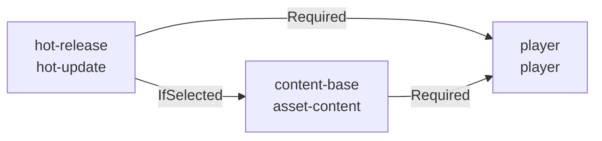

Dependencies 是唯一的 sequencing contract。Compiler 执行稳定拓扑排序；相互独立的 ready invocation 按 `Invocation ID` 排序。实际执行保持串行，因为 Unity global state、`AssetDatabase`、PlayerSettings、provider settings 与 publication decision 具有 main-thread affinity 或 process-global 所有权。

**Required 与 IfSelected**

当两个节点都参与运行时，两种模式都会建立顺序；它们对 membership 的影响不同。

| 模式 | Focused Membership | Saved 或显式 Membership | Dependency 不存在时 |
| --- | --- | --- | --- |
| `Required` | 递归加入 dependency 及其传递 Required closure | Dependency 必须已选中 | Validation 失败 |
| `IfSelected` | 永远不会自动加入节点 | 只有两个节点本来都选中时才排序 | 忽略该 edge |

Consumer 没有某个 producer 就绝对不能得到合法结果时，使用 `Required`。Consumer 可以独立运行，但两份输出同时请求时必须后执行，则使用 `IfSelected`。

例如：

- 某个 DLC content 必须内嵌指定 hot-update 输出时，通常应 `Required` 那个 exact hot-update invocation。
- 通用 Player 既可以单独构建，也可以使用刚刚生成的 Content，可使用 `IfSelected` 保持 Player-only focused run。
- Invocation 不能依赖自身、未知 ID，或者重复声明同一目标。

执行前，Compiler 会拒绝缺失 Required 节点、重复 ID、重复 edge、cycle、错误 config 类型、不可用实现和 Step Type multiplicity 冲突。

**标准 Preset**

Quick Setup 写入 canonical invocation ID 和标准 `IfSelected` routing。

| Preset | 选中 Invocation | Dependency Declaration | 输出 |
| --- | --- | --- | --- |
| `Player Only` | `player` | 无 | Player |
| `Player + Content` | `asset-content`, `player` | `player IfSelected asset-content` | Content、Player |
| `Full Player` | `hot-update`, `asset-content`, `player` | Content 在 Hot 后；Player 在 Hot 与 Content 后 | Hot Update、Content、Player |
| `Content Only` | `asset-content` | 无 | Content |
| `Content + Hot Update` | `hot-update`, `asset-content` | Content 在 Hot 后 | Hot Update、Content |
| `Hot Update Only` | `hot-update` | 无 | Hot Update/AOT metadata |

Quick Setup 会在能够唯一解析时保留兼容的 config 与 incrementality。Preset 外的 invocation 会变为 retained，而不是被删除，因此设计师可以在完整和聚焦 authoring 之间切换，不必重建配置资产。

Canonical ID 重复，或者 canonical ID 缺失且同一 Step Type 有多个候选时，Preset 会禁用，直到 Advanced DAG 消除歧义。

### Saved、Focused 与 Exact Selection

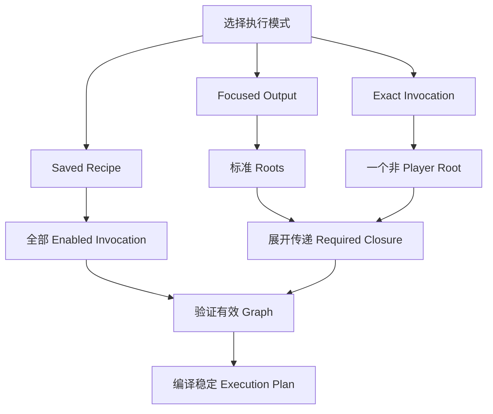

**Saved Recipe**

Saved Recipe membership 就是 Profile 中保存的 `Enabled` 状态。一个 `Required` dependency 也必须 enabled；`IfSelected` 不改变 membership。

正常、经过评审的产品构建应使用 Saved Recipe。CI 只传 Profile，且不传 `-pipelineSelect` 或 `-pipelineRecipe`，就会得到相同行为。

**Focused Output**

Inspector 提供 `Hot Update Only`、`Content Only`、`Content + Hot Update` 三个非破坏性聚焦操作。

针对每个标准 Step Type，Resolver 会：

1. 优先使用 canonical invocation ID。
2. Canonical ID 不存在时，只接受唯一的该 Step Type invocation。
3. 存在歧义时拒绝执行并要求使用 Exact Invocation。
4. 展开传递 `Required` closure。
5. 除非某个 `IfSelected` dependency 本身也是请求的 root，否则不把它加入 membership。

这些操作不会切换 `Enabled` 或保存 Profile，并创建非 Development request。

**Exact Invocation**

Inspector 会列出已配置的非 Player invocation，包括 retained 项。该操作只选择一个 root 加它的传递 `Required` closure，适合大型 Profile 中的单个 DLC、单个 content provider 或单个 hot-update 通道。

命令行等价写法：

```text
-pipelineProfile Assets/Settings/Build/Release.asset
-pipelineSelect content-dlc
```

CLI selection 还可以直接选择 Player invocation。

### 组合示例

**只构建一个 Retained 内容包**

假设 `content-dlc` 为 retained 且已分配 provider config：

```text
-pipelineProfile Assets/Settings/Build/Release.asset
-pipelineSelect content-dlc
```

如果 `content-dlc` 声明 `Required:hot-dlc`，会自动加入 `hot-dlc`；如果声明 `IfSelected:hot-dlc`，本次只选择 Content。

**不构建 Player，只构建 Content 与 Hot Update**

标准 Preset 使用 `IfSelected` edge，因此必须把两个 root 都选中：

```text
-pipelineProfile Assets/Settings/Build/Release.asset
-pipelineSelect hot-update
-pipelineSelect asset-content
```

Compiler 随后把 `hot-update` 排在 `asset-content` 前面。

**多个 Content Provider 加一个 Player**

Advanced Profile 可以包含：

| Invocation ID | Step Type | Dependency |
| --- | --- | --- |
| `hot-release` | `hot-update` | 无 |
| `content-base` | `asset-content` | `Required:hot-release` |
| `content-dlc` | `asset-content` | `Required:hot-release` |
| `player` | `player` | `Required:content-base`、`Required:content-dlc` |

四个节点全部 enabled 时，稳定计划为 `hot-release`、两个按 ID 排序的 Content、最后 `player`。只选择 `content-dlc` 时，计划为 `hot-release`、`content-dlc`。

配置和 provider publication root 必须保持不重叠，除非 integration 明确声明可安全共享。组合是否合法由 preflight 和 publication ownership check 决定，而不是命名约定。

### 高级 Authoring 工作流

1. 展开 **Advanced DAG & CI**。
2. 从 Registry-backed 菜单添加 Step Type。
3. 在其他资产或 CI job 引用前确定稳定 Invocation ID。
4. 分配或创建强类型 config。
5. 为该 invocation 选择 `Clean` 或 `Incremental`。
6. 从当前 consumer 添加指向 producer 的 dependency edge。
7. 检查 **Compiled Execution Plan** 与 **Expected Outputs**。
8. 保存 Profile 和当前 selection 的 config 资产。
9. 建立 release baseline 前先运行 preflight。

通过 Inspector 重命名 invocation 会原子更新 dependency reference。移除被引用 invocation 需要确认，并清除 Profile 中对应 edge。版本控制评审仍应把 identity 变化视为 CI contract 变化。

### 命令行 Recipe 替换

正常 CI 应把图保存在 `BuildData`，只在需要子集时使用 `-pipelineSelect`。`-pipelineRecipe` 是逐 invocation 展开的高级替换接口。

```text
-pipelineRecipe hot-release=hot-update
-pipelineRecipe content-base=asset-content
-pipelineRecipe player=player
-pipelineStepConfig hot-release=Assets/Settings/Build/HotRelease.asset
-pipelineStepConfig content-base=Assets/Settings/Build/ContentBase.asset
-pipelineStepDependency content-base=Required:hot-release
-pipelineStepDependency player=Required:content-base
```

显式 Recipe 的每个节点初始都没有 config，使用 `Clean`，并且没有 dependency。它不会继承 Profile 中同名 invocation 的 authoring state。每个 keyed override 都必须指向 effective selection。

`-pipelineSelect` 与 `-pipelineRecipe` 互斥。Profile selection 会在 dependency override 应用前展开 authored `Required` dependency，因此新提供的 CLI `Required` edge 不会自动加入目标，必须同时显式选择它。

### Incrementality 与规模

`Clean` 与 `Incremental` 不是统一的 Release/Patch 别名。每个 Step 和 provider 都自行定义复用旧输出所需的证据，例如 Player ownership marker、Addressables content-state baseline、YooAsset exact-version publication 或 HybridCLR release baseline。

只有阅读所选 integration 的 contract 并恢复全部 ownership metadata 后才能使用 `Incremental`。证据缺失、不兼容或被修改时必须 fail closed，而不是静默退化为 Clean。

**规模与执行策略**

Core graph 的安全预算是 256 个 invocation 和 4,096 条 dependency edge。这不是建议的命令行长度。大型图应保存在受版本控制的 Profile 中，因为操作系统和 CI launcher 的 command-length 限制远小于 graph budget。

平台和 Profile matrix 应在隔离的 checkout、Unity process、Library 和 output root 之间并行。不要在同一 checkout 同时运行两个 mutating pipeline；workspace lease 会拒绝这种拓扑。

**验证边界**

静态 authoring 与 EditMode 测试覆盖 Preset 应用、Focused selection、Required closure、dependency validation、稳定计划编译、multiplicity、configuration typing、命令行 override 和序列化 contract。真实 provider output compatibility、Clean/Incremental publication、Player hook、IL2CPP/AOT 与平台打包仍需要 integration 和目标 Player build 验证。

## 5. 资源内容 Provider

本教程介绍通用 `asset-content` Step 如何选择可选 Provider，如何配置 Addressables 与 YooAsset 3，以及它们的输出如何参与 Player 构建或独立内容 CI Job。

> **当前 checkout：** `Packages/manifest.json` 没有安装 Addressables 或 YooAsset。缺少它们时，Build 核心程序集仍然可以编译；如果选中的配置依赖不可用 Provider，Preflight 必须失败，不能回退到其他 Provider，也不能静默跳过内容构建。

### Provider 中立模型与可用性

`BuildData` 保存的是强类型配置资产，而不是 vendor 包名或开发者手写的 Provider 字符串。Registry 根据配置类型匹配唯一 Adapter，再由 Adapter 把不可变 Pipeline 请求转换为第三方 API 调用。

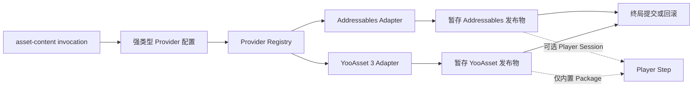

核心契约负责选择、依赖验证、输出声明、结果证据和终局发布；Provider 负责原生构建调用与 Provider 专属产物验证。

**可用性与包隔离**

| Provider | 配置类型 | 包隔离方式 | 缺包行为 |
| --- | --- | --- | --- |
| Addressables | `AddressablesBuildConfig` | `Build.Pipeline.Editor` 中基于反射的 Adapter | Core 仍可编译；已有 Addressables invocation 会在可用性或 API 形状验证中失败；Player-only 隔离器成为空操作 |
| YooAsset 3 | `YooAssetBuildConfig` | 独立的 `Build.Pipeline.Integrations.YooAsset3.Editor` 程序集 | Core 与 authoring 配置仍可编译，但 Adapter 不存在，选中的 YooAsset invocation 在 Preflight 失败 |

YooAsset 程序集使用 `[3.0.5,4.0.0)` 的 package `versionDefines` 表达式和 `BUILD_PIPELINE_HAS_YOOASSET_3` assembly constraint。Addressables 没有声明精确兼容版本区间，而是检查其使用的官方 API 形状。因此每次包升级都必须重新进行真实 integration 编译和目标平台资格构建。

Runtime 加载是另一项职责。内容构建成功不代表 Player 已包含匹配的 CycloneGames AssetManagement Provider，也不代表 Runtime 解密实现已经存在。

### 配置 Invocation

1. 在打开 Release workspace 前安装并锁定选定 Provider 包。
2. 打开已保存的 `BuildData` Profile，选择包含 Asset Content 的 Recipe。
3. 在 Asset Content 卡片中使用 **Create** 创建已注册 Provider 配置，或拖入已有配置资产。
4. 保持 invocation ID 稳定。它参与默认输出路径、事务证据、来源信息和 CI 归档身份。
5. 按下文 Provider 语义选择 `Clean` 或 `Incremental`。
6. 保存 Profile 和配置资产。
7. 确认 Source Qualification 为 `Verified Clean`、Build Transaction Safety 为 `Clean`，且 Preflight 没有包、依赖、路径或所有权错误。
8. 运行 Saved Recipe、Focused Content 构建或精确的非 Player invocation。

独立发布内容时使用 **Content Only**；Player 必须消费本 invocation 准备的数据时使用 **Player + Content**。**Full Player** 还会加入[热更新与混淆](#6-热更新与混淆)所述的热更新依赖图。

### Addressables

**前置条件**

开始配置前：

- 安装兼容的 Addressables 包，并按正常流程创建其 Settings 资产；
- 选择并保存有效的 Active Profile 与 Data Builder；
- 确认每个经 Profile 求值后的构建源路径都有明确所有者且可审查；
- 决定本 Job 是创建 Clean Player 基线，还是发布 Content Update。

Adapter 会在 Preflight 检查预期的官方 Editor 类型和方法。它不会安装 Addressables，也不会创建项目的 Addressables Settings。

**配置字段**

创建 `CycloneGames/Build/Addressables Build Config`，或使用 BuildData 的 **Create** 菜单。

| 字段 | 含义 | 规则 |
| --- | --- | --- |
| `Build Remote Catalog` | 通过 Addressables 构建远端 Catalog | 本 Pipeline 的 Incremental 模式要求开启 |
| `Copy/Publish To Output` | 把已验证产物复制到 Pipeline 所有的发布目录 | 持久 CI 产物和 Incremental 都要求开启 |
| `Publication Root` | 项目相对发布根目录 | 为空时解析为 `Build/AddressablesContent/<invocation-id>` |
| `Content Update Baseline Asset` | 拖入上一版官方 `addressables_content_state.bin` | 与路径字段二选一，不能同时设置 |
| `Content Update Baseline Path` | CI 恢复的项目相对路径 | 必须指向之前 Pipeline 发布物中的基线 |
| `Allow External Profile Publication Sources` | 允许 Unity 项目外的 Profile 源目录 | 除非 CI 显式拥有并保护这些目录，否则保持关闭 |
| `Additional Publication Roots` | 额外项目相对源目录与一个安全目标文件夹 | 目标名称不能与保留发布项冲突 |

Baseline 路径必须位于项目内并以 `.bin` 结尾，且不能位于 `.git`、`Library`、`Logs`、`Packages`、`ProjectSettings`、`Temp` 或 `UserSettings` 中。

**Clean Addressables 构建**

`Clean` 调用官方 `AddressableAssetSettings.BuildPlayerContent` 路径。事务期间，Adapter 临时应用请求中的 Remote Catalog 与 Player Version 设置，按需清理 Active Data Builder cache，并在结束后精确恢复原状态。

发布物先写入暂存区。正常结果类似：

```text
Build/AddressablesContent/<invocation-id>/<BuildTarget>/
  PlayerData/
  RemoteContent/                 # 启用远端输出时
  BuildMetadata/                 # 包含官方 content-state 数据
  <AdditionalDestination>/       # 可选
  AddressablesArtifacts.json
  .buildpipeline-owner.json
```

`AddressablesArtifacts.json` 记录 target、incrementality、Unity 与 Addressables player version、Profile 身份、Remote Catalog 信息，以及 size/SHA-256 清单。这些 hash 用于事务完整性和来源追踪，不是数字签名。

Clean Addressables invocation 可以直接作为 Player 上游依赖。Player Session 会验证版本证据，并阻止包的 build-with-player Hook 在 Pipeline 之外再次构建内容。

**Incremental Addressables 构建**

`Incremental` 调用 `ContentUpdateScript.BuildContentUpdate`，契约更严格：

1. 将上一版完整 Addressables Pipeline 发布物恢复到 workspace。
2. 保留其中的 `AddressablesArtifacts.json` 和相对 `BuildMetadata` 布局。
3. 只在一个 baseline 字段中指向发布物内的官方 `addressables_content_state.bin`。
4. 开启 Remote Catalog 与 publication。
5. 使用 `Incremental` 运行 **Content Only** 或精确/Focused content invocation。
6. 归档完整新发布物，而不是只归档变化的 Bundle。

Preflight 会检查 target、Active Profile ID、精确 Unity 版本、Addressables player version、Remote Catalog load path、文件大小和 SHA-256 证据。不匹配表示需要新的 Clean baseline，不能绕过验证。

Incremental Addressables invocation 不能向 Player 提供依赖。内容更新应运行 content-only Job；创建新 Player baseline 时应改用 Clean。

**Player-only 行为**

安装 Addressables 但 Recipe 是 **Player Only** 时，Build Pipeline 会在该 Player 事务期间抑制 Addressables 自动内容 Hook，从而保证 Player Only 的语义确实只构建 Player。Addressables Player Session 是进程全局资源，因此一个 Player 不能依赖多个 Addressables invocation。

### YooAsset 3

**前置条件与包门控**

安装受支持 `[3.0.5,4.0.0)` 范围内的 `com.tuyoogame.yooasset`。独立 YooAsset integration assembly 引用 `YooAsset` 和 `YooAsset.Editor`，只有 package version define 满足时才存在。

构建前：

- 创建并保存恰好一个有效的 Bundle Collector Settings 资产；经过验证的 Collector Catalog 上限为 1024 个 Package；
- 确保每个启用的 Package Name 都存在于 Collector Settings；
- 为构建请求选择明确的 Package Version；
- 决定每个 Package 是仅远端发布，还是复制到 Player 内置 Package Root；
- 预留互不重叠的 Build Root 和 Bundled Root。

**配置字段**

创建 `CycloneGames/Build/YooAsset Build Config`，或使用 BuildData 的 **Create** 菜单。

| 字段 | 含义 | 规则 |
| --- | --- | --- |
| `Build Output Root` | YooAsset 原生发布根目录 | 默认 `Bundles` |
| `Bundled File Root` | Player 内置 Package 文件根目录 | 为空时委托 YooAsset 配置的 StreamingAssets Root |
| `Packages` | 显式 Package Profile | 至少一个启用项；最多 128 个 |

每个启用的 Package Profile 包含：

| 字段 | 值或行为 |
| --- | --- |
| `Package Name` | Collector 中的精确 Package Name |
| `Build Pipeline` | `Scriptable`、`RawFile` 或 `ArchiveFile` |
| `Package Note` | 确定性的 Manifest 说明 |
| `Compression` | `Uncompressed`、`LZMA` 或 `LZ4`；用于 Scriptable Pipeline |
| `File Name Style` | `HashName`、`BundleName` 或 `BundleNameAndHash` |
| `Cryptography` | 可选的强类型加密配置 |
| `Bundled Copy Option` | `None`、`ClearAndCopyAll`、`ClearAndCopyByTags`、`OnlyCopyAll` 或 `OnlyCopyByTags` |
| `Bundled Copy Tags` | Tag 模式使用的分号分隔 Tag |
| 依赖、共享与验证选项 | 仅在选定原生 Pipeline 支持时传递 |
| `Version Collision Policy` | 默认 `FailIfVersionExists`；有意执行受保护替换时使用 `ReplaceExactVersion` |

Package 与 Version Token 是可移植标识：长度 1–128，只允许 ASCII 字母、数字、点、连字符和下划线；首尾必须是字母或数字，拒绝连续点，并拒绝 Windows 保留设备名。

**发布与内置数据**

原生 Package 发布路径为：

```text
<BuildOutputRoot>/<BuildTarget>/<Package>/<PackageVersion>/
<BundledFileRoot>/<Package>/
```

Adapter 写入 `.yoo-pub.json` 所有权证据，其中包含 Package/Version 身份、内容身份，以及可选的 cryptography adapter/runtime contract 身份。所有启用 Package 作为同一个事务暂存；任意 Package 失败都会阻止整个 Provider invocation 提交。

Bundled Copy 模式具有明确的 Player 语义：

- `None` 不向下游 Player 发布内置 Package 输入。
- `ClearAndCopyAll` 与 `ClearAndCopyByTags` 创建替换型内置快照。
- `OnlyCopyAll` 与 `OnlyCopyByTags` 以现有、受 Build 所有权保护的快照为种子，再覆盖选中内容。

只有启用了 Bundled Copy 的配置会开启临时 Player Session。失败时会恢复此前的内置 Package 状态。

`ReplaceExactVersion` 只能替换带有效 Build 所有权证据的精确 Package-Version 目录。正常 Release CI 应使用新版本；替换只应用于有意的 retry 或 republication。

**Clean 与 Incremental 语义**

两种模式都保留 YooAsset 原生 Build Cache。Integration 刻意不调用 YooAsset 3.0.5 的 `ClearBuildCacheFiles`，因为该 API 会删除所有历史 Package Version。

当前 Clean 与 Incremental 传入相同的原生 Package Build 参数。因此 Incremental 是 Pipeline Policy 和 Cache Reuse 请求，不是“YooAsset 保证只输出变化 Bundle”或“原生 Patch Set”的文档承诺。实际输出行为必须结合已安装包和项目 Collector 规则进行资格验证。

**加密扩展**

Build 模块提供扩展契约，不提供加密算法或密钥存储。产品扩展必须：

1. 从 `YooAssetCryptographyConfiguration` 派生强类型资产；
2. 使用稳定的 Adapter ID 与 Runtime Decrypt Contract ID 注册 `YooAssetCryptographyAdapterRegistration`；
3. 在可引用 YooAsset 的程序集中实现 `IYooAsset3CryptographyAdapter`；
4. 提供 Bundle Encryptor、Manifest Encryptor 与 Manifest Decryptor；
5. 在 Player 中交付与所记录 Runtime Contract 匹配的解密器。

不要把 Secret 放入 `EditorPrefs`、类名字符串、BuildData、日志或提交到仓库的配置资产。Secret 解析、轮换、访问控制和 CI 注入属于产品 Adapter 与 CI Secret Store 的职责。

### 混合 Provider 与恢复

通用 Step 允许多个 Content invocation。当一个 Recipe 包含多个 Provider 时，应使用 Advanced DAG 和唯一 invocation ID。

| 组合 | 静态支持情况 | 重要约束 |
| --- | --- | --- |
| 多个 YooAsset invocation | 允许 | Publication Root 与 output claim 不能重叠 |
| Addressables 与 YooAsset 同时供一个 Player 使用 | 契约允许 | 必须执行真实项目资格构建；当前没有端到端证据 |
| 多个 Addressables invocation 供一个 Player 使用 | 拒绝 | Addressables 独占一个全局 Player Session |
| Content-only 多 Provider 发布 | 允许 | 每个 Provider 仍只在共享 Terminal Barrier 后提交 |

列表顺序不是依赖。如果 Player 必须消费某个 Content invocation 的临时内置数据，应从该 Content invocation 到 Player 绘制显式依赖边。

**失败、恢复与安全切换平台**

Provider 发布物先进入暂存区，只有整个 Pipeline 达到终局提交决定后才发布。相关事务证据包括：

```text
<UnityProject>/.buildpipeline/transactions/addressables-settings/
<UnityProject>/.buildpipeline/transactions/addressables/<invocation-id>/
<UnityProject>/.buildpipeline/transactions/yooasset3/<invocation-id>/
```

发生 Crash 或进程硬终止后，不要手工删除 JSON Journal、切换包或直接开始另一平台构建。打开 Workspace Health 并执行显式 Recovery。Addressables Recovery 可以在未安装 Addressables 时读取其持久证据；YooAsset Recovery 代码位于版本门控程序集内，因此完成恢复前应保留或重新安装兼容 YooAsset 包。

平台发布物和 Baseline 都是 target-specific。不要因为文件名看起来兼容，就在切换 Target 后复用。

**CI 所有权检查表**

- Optional Package 安装与原生 Settings provisioning 属于 CI image/bootstrap 阶段；一次 Build Run 不负责安装包。
- 只恢复所选 incrementality 所需的 Provider Artifact 或 Baseline。
- 保留 `.buildpipeline-owner.json`、`.yoo-pub.json`、Provider Manifest 及其相对目录布局。
- 为 Cache、Release Artifact 和 Transaction Evidence 分别配置保留策略。
- 将 Pipeline 终局 Result Manifest 与 Provider 发布物一起归档。
- CDN 上传、Manifest 签名、Secret 管理和部署是外部 Release Stage，不属于 Asset Content Step。

**故障排查与验证边界**

| 现象 | 处理方式 |
| --- | --- |
| Provider 不可用 | 安装兼容包或移除该 invocation；不要手工添加全局 Scripting Define |
| Addressables Incremental 拒绝 Player 依赖 | 运行 Content Only，或改用 Clean 创建 Player baseline |
| Addressables baseline 被拒绝 | 恢复上一版完整 Pipeline 发布物，并检查 target/profile/version 身份 |
| YooAsset 精确版本已存在 | 使用新 Package Version，或只对 Build 所有的输出显式选择 `ReplaceExactVersion` |
| Workspace 要求恢复 | 切换平台或卸载 Integration 包前先恢复 |
| Runtime 无法加载或解密产物 | 检查独立 Runtime Provider 与 Decrypt Contract 实现 |

当前 checkout 不会编译或执行可选 Addressables 与 YooAsset 包。本地第三方源码检查只属于静态 API 证据。现有事务测试主要验证文件所有权和回滚行为，不证明 CDN 发布、Runtime 加载、解密、IL2CPP 或目标平台 Player。

`YooAsset3PublicationTransactionTests` 还存在一个已知源码级测试问题：其中一次 `AssetContentBuildRequest` 构造仍未传入现在必需的 invocation ID。由于 YooAsset 测试程序集受版本门控且当前未激活，在修复该调用点并安装受支持包运行测试前，文档不能宣称 YooAsset Integration Test Assembly 已通过。

**源码索引**

- `Editor/BuildPipeline/Core/Contracts/AssetContentBuildContracts.cs`
- `Editor/BuildPipeline/Core/Discovery/BuildPipelineRegistry.cs`
- `Editor/BuildPipeline/Authoring/Content/AddressablesBuildConfig.cs`
- `Editor/BuildPipeline/Integrations/Addressables/AddressablesContentBuildAdapter.cs`
- `Editor/BuildPipeline/Integrations/Addressables/AddressablesBuilder.cs`
- `Editor/BuildPipeline/Authoring/Content/YooAssetBuildConfig.cs`
- `Editor/BuildPipeline/Authoring/Content/YooAssetCryptographyConfiguration.cs`
- `Editor/BuildPipeline/Integrations/YooAsset3/YooAsset3BuildAdapter.cs`
- `Editor/BuildPipeline/Integrations/YooAsset3/YooAsset3PublicationTransaction.cs`
- `Editor/BuildPipeline/Steps/Player/PlayerBuildStep.Dependencies.cs`

## 6. 热更新与混淆

本教程介绍通用 `hot-update` Step、标准 HybridCLR Provider、显式 HybridCLR + Obfuz Provider，以及独立的 Obfuz Player Extension，并说明安全 Incremental 热更新 Job 所需的 Clean Release Baseline。

> **当前 checkout：** Unity Package Manifest 没有安装 HybridCLR、Obfuz 或 Obfuz4HybridCLR。它们的 Adapter 使用反射，因此 Build Core 仍可编译；如果选择了缺少所需 Editor API 的 Provider，Preflight 必须失败。本地第三方源码副本只用于参考，不是已安装包或 Player 构建证据。

### 独立能力

Build 模块刻意把以下职责相互独立：

| 能力 | 配置 | 效果 |
| --- | --- | --- |
| HybridCLR 热更新 | `hot-update` invocation 上的 `HybridCLRBuildConfig` | 生成热更新 DLL 与 AOT Metadata 输入 |
| Obfuz4HybridCLR 热更 DLL 处理 | `hot-update` invocation 上的 `HybridCLRObfuzBuildConfig` | 先运行 HybridCLR Generation，再通过 Obfuz4HybridCLR 转换热更新 DLL |
| Obfuz Player Pipeline | `PlayerBuildConfiguration` 内的 `ObfuzPlayerBuildExtensionConfiguration` | 要求并验证 Player 构建使用持久 Obfuz Player Pipeline |

选择 HybridCLR + Obfuz 不会混淆 Player；选择 Player Extension 也不会混淆热更新 DLL。YooAsset 内容加密是第四种完全独立的能力。

**执行模型**

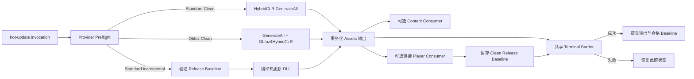

依赖图是运行数据。Full Player Recipe 中除了 `hot-update -> content -> player` 外，还包含 `hot-update -> player` 直接边；发布所有权明确的 HybridCLR Release Baseline 必须依赖这条直接边。

### Provisioning

Build Pipeline 不负责安装或初始化第三方工具链。运行 Recipe 前应准备每个 Editor 或 CI Image：

1. 安装并锁定兼容 HybridCLR 包。
2. 按目标 Unity 版本和平台执行第三方初始化与 Provisioning。
3. 配置 HybridCLR Project Settings，并把 Target 设置为 IL2CPP。
4. 如果使用任一 Obfuz 能力，安装并配置 Base Obfuz。
5. 如果使用组合热更新 Provider，还需安装 Obfuz4HybridCLR。
6. 在 Provisioning 阶段编译 `Obfuz.EncryptionVM.GeneratedEncryptionVirtualMachine`。
7. 在 Preflight 前保存所有第三方 Settings 资产。

Provider Catalog 会检查所需 Editor Type。标准 HybridCLR 需要 `HybridCLR.Editor.Commands.PrebuildCommand`；组合 Provider 还需要 `Obfuz.Settings.ObfuzSettings` 与 `Obfuz4HybridCLR.PrebuildCommandExt`。

### 标准 HybridCLR 配置与 Clean

创建 `CycloneGames/Build/Hot Update/HybridCLR`，或使用 BuildData 的 **Create** 菜单，再将资产分配给 Hot Update 卡片。

| 字段 | 含义 | 规则 |
| --- | --- | --- |
| `Hot Update Assemblies` | 作为热更新程序集编译的项目 asmdef 资产 | 至少一个；必须是 `Assets/` 下的 Main Asset，不能是 Package asmdef |
| `Hot Update DLL Output Directory` | Build 独占的 Runtime 热更新输出目录 | 拖入 `Assets/` 下的目录 |
| `AOT DLL Output Directory` | Build 独占的补充 Metadata 输出目录 | 拖入另一个 `Assets/` 下目录 |

两个输出目录必须不同且互不重叠。已有非空目录必须包含合法 `.buildpipeline-owner.json`；否则事务会 fail closed，而不是覆盖 author data。

Target 必须使用 IL2CPP；Pipeline 修改 Unity 状态前，Active Editor Target 必须与请求一致。

**Clean 模式**

Standard Clean 通过反射边界调用 `HybridCLR.Editor.Commands.PrebuildCommand.GenerateAll`。事务会暂存：

- 每个热更新程序集对应的 `<assembly>.dll.bytes` 与 `HotUpdate.bytes`；
- stripped AOT 程序集的 `.dll.bytes` 与 `AOT.bytes`；
- 两个 Build 独占 `Assets` 目录的所有权证据。

这些目录会临时激活，使下游 Asset Content invocation 能够打包。只有共享 Terminal Barrier 成功时才会提交；任何后续 Step 失败都会恢复此前状态。

Clean invocation 不会自动创建 Incremental Baseline。Baseline 发布还要求成功的 Release 请求，以及恰好一个直接依赖该 Hot Update invocation 的 Player invocation。

### Release Baseline 与 Incremental

Incremental HybridCLR 通过 `CompileDllCommand.CompileDll(target)` 只编译热更新 DLL。其 AOT 输入完全来自先前由 Pipeline 管理的 Release Baseline，绝不会读取当前 HybridCLR stripped-AOT 输出目录中偶然存在的文件。

Baseline 位于配置的 Build Root 下：

```text
<BuildRoot>/.buildpipeline/baselines/hybridclr/
  <BuildTarget>/<ScriptingBackend>/<release-key>/
    baseline.json
    AOT/
      *.dll
```

Release Key 包含 Application Identifier、Application Version 与 Hot Update Invocation ID。Manifest 还将 Baseline 绑定到 Target、Named Target、Backend、精确 Unity Version、HybridCLR Package Identity、Authoring Configuration Hash、HybridCLR Settings Hash、AOT 相关 Player Settings、热更新程序集清单、Source Provenance，以及 DLL 长度和 SHA-256。

**创建 Baseline**

1. 对 HybridCLR invocation 使用 `Clean`。
2. 运行 Release，而不是 Development 请求。
3. 选择恰好一个直接依赖该 Hot Update invocation 的 Player；标准 **Full Player** Preset 会提供这条边。
4. 等待整个 Pipeline 与所有延迟发布成功。
5. 将生成的 Baseline 与匹配的 Player/Content Release Artifact 一起归档。

Hot Update Only、Content + Hot Update、Development Player，以及仅传递依赖的 Player，都不会发布或替换 Baseline。

**在 CI 中消费 Baseline**

1. 将完整 Baseline 恢复到同一个配置 Build Root。
2. 保持精确的 Target/Backend/Release-Key 目录结构。
3. 保持 Application Identifier、Application Version、Invocation ID、Unity Version、Package Identity、Assembly Inventory、HybridCLR Settings 与 Player AOT Settings 不变。
4. 使用 `Incremental` 和 Release 配置运行 Hot Update Only、Focused Hot Update 或精确 invocation。
5. 归档事务化发布的 Hot Update Output 与终局 Result Manifest。

Baseline 证据缺失、损坏、不完整、被修改或不兼容都会使 Preflight 失败。不要手工合成 `baseline.json`，也不要只复制一部分 AOT DLL。

### HybridCLR + Obfuz 与 Player Obfuz

热更新 DLL 必须经过 Obfuz4HybridCLR 时，创建 `CycloneGames/Build/Hot Update/HybridCLR + Obfuz`。它继承标准 HybridCLR 的程序集与输出目录配置、输出所有权、Recovery Journal 和 Terminal Publication Barrier。

该 Provider 只支持 Clean。经审计的 Obfuz4HybridCLR Integration 使用隐式 stripped-AOT 位置，无法接收 Pipeline 显式验证的 Release-Baseline AOT 目录。因此系统拒绝 Incremental，而不是使用未经验证的全局文件。

Provider 要求：

- 兼容 HybridCLR Editor API；
- Base Obfuz Settings；
- Obfuz4HybridCLR Editor API；
- 已编译的 Obfuz Encryption VM。

缺少任一前置条件都会使 Provider 不可用或令 Preflight 失败。Pipeline 不会自动退化为标准 HybridCLR。

**Obfuz Player Extension**

Player 混淆通过独立 `PlayerBuildConfiguration` 选择：

1. 创建 `CycloneGames/Build/Player Build Configuration`。
2. 创建 `CycloneGames/Build/Player Extensions/Obfuz`。
3. 把 Obfuz Extension 资产加入有序 Extension List。
4. 将 Player Configuration 分配给 BuildData 的 Player 卡片。
5. 在 `ProjectSettings/Obfuz.asset` 中启用并保存持久 Obfuz Player Pipeline。
6. 在 Preflight 前编译 Obfuz Encryption VM。

Build Pipeline 刻意不切换持久 Obfuz 设置。Environment Guard 要求严格一致：

- 选择 Extension：持久 Obfuz Player Pipeline 必须启用；
- 未选择 Extension：如果安装了 Obfuz，持久 Pipeline 必须关闭。

该 fail-closed 规则可以防止仅因为开发者机器的全局第三方设置不同，就意外混淆 Player。

### Provider 约束与 Performance Testing

| Hot Update 配置 | Player Extension | 热更新 DLL | Player |
| --- | --- | --- | --- |
| Standard HybridCLR | None | 不经 Obfuz 处理 | 不经 Obfuz 处理 |
| Standard HybridCLR | Obfuz | 不经 Obfuz 处理 | 启用 Obfuz |
| HybridCLR + Obfuz | None | 启用 Obfuz4HybridCLR | 不经 Obfuz 处理 |
| HybridCLR + Obfuz | Obfuz | 启用 Obfuz4HybridCLR | 启用 Obfuz |

Hot Update Only 没有 Player，因此不会运行 Obfuz Player Environment Guard。

**Provider 约束**

Core Hot Update Step 允许多个 invocation，但当前 HybridCLR Editor API 操作单一进程全局 Generation State 和 Output Set。Preflight 会拒绝同一次选中 Run 中的多个 HybridCLR-family invocation，包括 Standard 与 Obfuz Variant 的组合。这是 Provider 限制，不是通用 DAG 限制。

当前 HybridCLR API 也无法消费 Player 每次构建独立的 `ENABLE_CHEAT` 请求所需的 invocation-local extra compiler defines。因此 HybridCLR、Player 与 Cheat Mode 的 Recipe 会被拒绝。Hot Update Only 不消费 Player Cheat 请求。

**失败与恢复**

相关持久证据包括：

```text
<UnityProject>/.buildpipeline/transactions/hybridclr-generation/
<UnityProject>/.buildpipeline/transactions/hybridclr/
<UnityProject>/.buildpipeline/transactions/hybridclr-release-baseline/
```

进程硬中断后，Workspace Health 会阻止正常构建。Retry 或切换 Target 前应执行显式 Recovery。Recovery 遵循共享 Terminal Decision：只有 Terminal Barrier 选择 Commit 时才提交合格 Baseline，否则精确恢复此前 Baseline 与输出目录。

不要手工删除 Journal、移除 Ownership Marker，或把当前 `Assets` 输出目录视作 Baseline。删除有效 Release Baseline 的数据本身可重建，但在新的合格 Clean Release Player 成功前，Incremental 构建都会失败。

**Performance Testing Player Guard**

Unity Performance Testing Integration 是自动 BuildPlayer Processor，不是 Recipe invocation。当前 checkout 安装了 `com.unity.test-framework.performance` 3.5.0，Guard 刻意只识别已审计的 3.5.x 契约。缺包时为空操作；如果安装非 3.5.x 版本，则 Player Build 会被阻止，直到 Guard 完成重新审计或包回到已审计版本。

早期和晚期 Player Callback 会事务化保护：

```text
Assets/Resources/PerformanceTestRunInfo.json
Assets/Resources/PerformanceTestRunSettings.json
Assets/Resources.meta
```

对应 `.meta` 文件与 package-owned `PT_ResourcesCleanup` Editor Preference 也会精确恢复。如果 `Assets/Resources` 原本不存在，事务会在构建后删除自己创建的临时目录。Content-only 与 Hot-update-only Job 不触发此 Guard。

**CI 与 Release 检查表**

- 调用 BuildData 前先 Provision Optional Package、Vendor Settings、Generated Code 和平台 SDK。
- 保持 Invocation ID 稳定，并归档完整且匹配的 Release Baseline。
- 不得跨 Target、Backend、Application Version、Unity Version 或配置变化复用 HybridCLR Baseline。
- 同一时间只运行一个 Unity Build Transaction；Integration 不承诺在一个 Editor 进程中并行执行 HybridCLR 或 Obfuz Generation。
- 更改平台或包安装前先恢复 Dirty Workspace。
- Code Signing、Artifact Upload、CDN Deployment、Secret Storage 与 Rollback Orchestration 属于外部 Release Stage。

**故障排查与验证边界**

| 现象 | 处理方式 |
| --- | --- |
| HybridCLR Provider 不可用 | 安装并 Provision 兼容 HybridCLR 包；不要添加手工全局 Define |
| Incremental Baseline 缺失或不兼容 | 恢复精确 Release Artifact，或运行新的合格 Clean Release Full Player Build |
| HybridCLR + Obfuz 拒绝 Incremental | 使用 Clean；已审计 Vendor API 不能安全消费验证后的 Baseline 目录 |
| Obfuz Player Setting 与 Extension 不一致 | 让 `ProjectSettings/Obfuz.asset` 与显式 Player Extension 选择一致并保存 |
| Encryption VM 缺失 | 在 Preflight 前执行 Obfuz Provisioning |
| 多 HybridCLR Provider 被拒绝 | 拆成多个 Build Run；它们共享进程全局 Vendor State |
| Workspace 要求恢复 | Retry、切换 Target 或改变 Optional Package 前先恢复 |

当前证据是静态源码检查，以及不依赖可选包的 Transaction 和 Adapter Test。它不证明目标 Player、IL2CPP/AOT 行为、Managed Stripping、Runtime 热更新加载、Obfuz 转换正确性、签名或 Clean-Agent CI。这些结论需要使用精确 Optional Package 集，对每个支持 Target 进行真实构建。

**源码索引**

- `Editor/BuildPipeline/Core/Contracts/HotUpdateBuildContracts.cs`
- `Editor/BuildPipeline/Core/Contracts/PlayerBuildExtensionContracts.cs`
- `Editor/BuildPipeline/Integrations/HybridCLR/HybridCLRBuildConfig.cs`
- `Editor/BuildPipeline/Integrations/HybridCLR/HybridCLRBuildAdapter.cs`
- `Editor/BuildPipeline/Integrations/HybridCLR/HybridCLRBuilder.cs`
- `Editor/BuildPipeline/Integrations/HybridCLR/HybridCLRReleaseBaseline.cs`
- `Editor/BuildPipeline/Integrations/HybridCLRObfuz/HybridCLRObfuzBuildConfig.cs`
- `Editor/BuildPipeline/Integrations/Obfuz/ObfuzPlayerBuildExtension.cs`
- `Editor/BuildPipeline/Authoring/Player/PlayerBuildConfiguration.cs`
- `Editor/BuildPipeline/Integrations/PerformanceTesting/PerformanceTestingBuildAssetTransaction.cs`

## 7. CI/CD

本教程介绍如何把已保存的 `BuildData` 资产转换为确定性的 batchmode 构建，覆盖命令契约、Profile 与 Recipe 优先级、Git 身份、聚焦输出、进程退出码、结果证据、恢复以及 CI 工作区隔离。

### 交付模型与前置条件

构建管线负责生成和发布本地制品，但不会把制品上传到应用商店、CDN、对象存储或部署环境。外部发布应作为独立 CI 阶段，并且只消费成功的终态 Manifest。

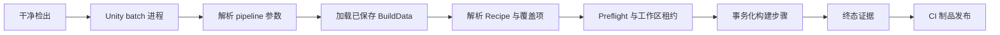

一个 Unity 项目工作区同一时间只允许一个 pipeline 租约。不同平台或环境并行构建必须使用独立 checkout 或独立 Unity 工作区。

**CI 前置条件**

调用 Unity 前：

1. 安装 `ProjectSettings/ProjectVersion.txt` 记录的 Editor 版本和目标平台模块。
2. 为 Agent 配置有效的 Unity 许可证。
3. 使用干净检出。生成输出可以是可丢弃的，但受版本控制的 Profile 与配置资产必须和提交一致。
4. 提交前把 `BuildData` 及其引用的全部配置资产保存到磁盘。
5. 确认 package lock 与所选 Invocation 需要的可选 Integration 包均存在。
6. 为每个矩阵 Job 分配独立 checkout、输出根目录和制品命名空间。

命令行入口只读取磁盘上的序列化资产，不会调用 Inspector 的 dirty authoring guard，也不会保存另一个已打开 Editor 的内存状态。CI 不得依赖未保存的配置。

简单的构建前 Git 守卫如下：

```powershell
if (git status --porcelain) {
    throw "The CI checkout contains uncommitted or untracked files."
}
```

请在 Unity 创建构建证据或输出前执行守卫，或者直接使用新创建的干净 checkout。该 shell 检查只是提前反馈，不是 Release 门禁本身。Pipeline 会使用有界、非交互命令捕获 tracked、untracked、submodule 与 Git LFS 状态；要求干净时，只要状态为 Dirty 或无法确认就会 fail closed。

### 规范调用与优先级

所有 CI 系统调用同一个 public 入口：

```text
Build.Pipeline.Editor.BuildEntryPoints.RunCommandLine
```

Windows 示例：

```bat
"%UNITY_EDITOR%" ^
  -batchmode -nographics ^
  -projectPath "<repo-root>\UnityStarter" ^
  -executeMethod Build.Pipeline.Editor.BuildEntryPoints.RunCommandLine ^
  -buildTarget Win64 ^
  -pipelineProfile "Assets/UnityStarter/Editor/Build/BuildData.asset" ^
  -pipelineBuildNumber 1204 ^
  -pipelineCiProvider GenericCI ^
  -pipelineCiRunId run-1204 ^
  -logFile -
```

普通构建必须提供 `-buildTarget`，可用值为 `Win64`、`OSXUniversal`、`Linux64`、`Android`、`iOS` 和 `WebGL`。强烈建议始终指定 `-pipelineProfile`；使用 `-pipelineSelect` 时该参数是必需的。

**解析与优先级**

Profile 是 authoring 基线，CLI 按以下顺序覆盖：

| 阶段 | 含义 |
| --- | --- |
| 1. Profile | 从已保存资产加载身份默认值、输出默认值、场景、Invocation 图、配置引用、依赖和增量策略。 |
| 2. 成员选择 | 重复的 `-pipelineRecipe id=type` 替换整个 authoring 图；否则，重复的 `-pipelineSelect id` 从 Profile 选根节点并加入其传递 `Required` 闭包；二者都没有时选择 Profile 中全部已启用 Invocation。 |
| 3. Invocation 覆盖 | `-pipelineStepConfig`、`-pipelineStepIncrementality` 和 `-pipelineStepDependency` 替换目标 Invocation 的对应值。 |
| 4. 标量覆盖 | 目标平台、Development 模式、输出、版本、Scripting Backend、Cheat 模式和身份参数覆盖 Profile 派生值。 |
| 5. Preflight | 在修改 Unity 构建状态前验证最终图、包、路径、身份、来源和工作区状态。 |

`-pipelineSelect` 与 `-pipelineRecipe` 互斥。Recipe 替换创建的每个 Invocation 默认没有配置、使用 `Clean` 且没有依赖；即使 ID 相同也不会继承 Profile authoring。必须显式提供全部必需配置和依赖边。

选择闭包先于 CLI 依赖替换计算。如果 `-pipelineStepDependency` 新增了 `Required` 目标，还必须显式选择该目标。覆盖项若指向最终选择之外的 Invocation，Preflight 会失败。

### 聚焦 CI Job

假设已保存 Profile 包含 `player`、`asset-content` 与 `hot-update` Invocation。

运行已保存 Recipe：

```text
-pipelineProfile Assets/UnityStarter/Editor/Build/BuildData.asset
```

只构建资源内容：

```text
-pipelineProfile Assets/UnityStarter/Editor/Build/BuildData.asset
-pipelineSelect asset-content
```

只构建热更新输出：

```text
-pipelineProfile Assets/UnityStarter/Editor/Build/BuildData.asset
-pipelineSelect hot-update
```

构建资源内容和热更新输出：

```text
-pipelineProfile Assets/UnityStarter/Editor/Build/BuildData.asset
-pipelineSelect asset-content
-pipelineSelect hot-update
```

选中的根节点会自动包含传递 `Required` 依赖；`IfSelected` 只为已经在选择集中的节点排序。聚焦运行不会修改 Profile 资产。

覆盖被保留的 authoring：

```text
-pipelineSelect asset-content
-pipelineStepConfig asset-content=Assets/Settings/Build/YooAssetContent.asset
-pipelineStepIncrementality asset-content=Incremental
```

配置路径必须指向 `Assets/` 下的持久化主 `.asset` 文件。Sub-asset、临时对象和 `Packages/` 下的资产会被拒绝。

### 输出路径

未提供 `-pipelineOutput` 时，Player 制品派生在：

```text
<output-root>/<platform>/<Release|Development>/<product artifact>
```

`-pipelineOutputRoot` 覆盖 Profile 输出根目录。相对 `-pipelineOutput` 从 Unity 项目根解析，并且必须位于解析后的输出根目录内。例如：

```text
-pipelineOutputRoot Build
-pipelineOutput Build/CI/Win64/UnityStarter.exe
```

外部输出必须显式增加 `-pipelineAllowExternalOutput` 安全开关。优先将输出留在工作区，再由 CI Agent 发布。

### 构建身份与 Git

Release 和 batchmode 构建必须具有权威源码身份与正构建号。普通 Git checkout 应省略源码覆盖组，让内置 Provider 捕获一致快照：

- Provider：`Git`；
- Revision：`HEAD` 的前 12 个字符；只有哈希本身更短时才少于 12 个字符；
- Branch：符号分支名；detached HEAD 使用 `detached-<short-hash>`；
- 默认 Build Number：至少为 1，基于提交计数。

CI 通常只覆盖 Build Number 与完整的 CI 来源对：

```text
-pipelineBuildNumber 1204
-pipelineCiProvider TeamCity
-pipelineCiRunId 98122
```

源码覆盖组必须全有或全无：`-pipelineSourceProvider`、`-pipelineSourceRevision`、`-pipelineSourceBranch` 必须一起出现；CI 组同样必须成对出现。可检测 Git 时，显式源码身份必须等于检测快照。若外部脚本确需传入，应使用 `git rev-parse --short=12 HEAD` 计算 Revision，不能传完整 commit hash。

Git Provider 会围绕身份解析捕获两次必须一致的 porcelain-v2 快照，递归检查 submodule，并直接查询有界的 `git lfs status --json`，不会枚举 LFS tracked path。命令超时、缺少 `git`/`git-lfs`、输出超预算、输出格式非法、命令非零退出或快照变化，都会产生稳定 `failureCode` 与 `Unknown` 状态。Required-clean request 会同时拒绝 `Dirty` 与 `Unknown`。

Perforce Provider 会比较两次有界、只读的 `p4 -ztag status` 快照；该命令同时覆盖 opened file 与 reconcile candidate，再按受支持 action 区分 tracked/untracked。Submodule 与 Git LFS 为 `NotApplicable`。任何非零退出、快照变化、error record、非空但无法识别的 tagged schema、超时或命令缺失都会返回 `Unknown`，绝不会假定干净。Perforce 安装与 Server 版本必须先在 Release Agent 上完成验证。

显式源码身份不会绕过工作区验证。无 VCS 导出只能用于显式放宽的本地 Development request；Release 必须使用能够证明工作区干净的受支持 Provider。若只是为 Development 导出保留身份，可使用完整源码组：

```text
-pipelineDevelopment
-pipelineBuildNumber 1204
-pipelineSourceProvider ExportArchive
-pipelineSourceRevision release-2026.08.09
-pipelineSourceBranch release
-pipelineCiProvider GenericCI
-pipelineCiRunId run-1204
```

Application Version 必须是恰好三个无符号整数段且不能有前导零，例如 `1.8.0`；Package Version 在其后追加 Build Number。Android 还要求 Build Number 不超过 `2100000000`。

### TeamCity 示例

在 checkout 和验证后创建 Windows Command Line Build Step，并将 `env.UNITY_EDITOR` 定义为 Editor 可执行文件的绝对路径。下面是普通 Git checkout 示例，因此刻意不传源码覆盖：

```bat
"%env.UNITY_EDITOR%" ^
  -batchmode -nographics ^
  -projectPath "%teamcity.build.checkoutDir%\UnityStarter" ^
  -executeMethod Build.Pipeline.Editor.BuildEntryPoints.RunCommandLine ^
  -buildTarget Win64 ^
  -pipelineProfile "Assets/UnityStarter/Editor/Build/BuildData.asset" ^
  -pipelineBuildNumber "%build.counter%" ^
  -pipelineCiProvider TeamCity ^
  -pipelineCiRunId "%teamcity.build.id%" ^
  -logFile -
```

任何非零进程退出都应令 Step 失败。不要使用在必需参数为空时会静默跳过 Unity 的条件包裹调用。将配置的构建根目录与 `UnityStarter/.buildpipeline/results/**` 发布为制品。不要让两个平台配置复用同一个 checkout 目录。

### Jenkins 示例

为 Agent 提供 `UNITY_EDITOR` 环境变量和干净工作区。Declarative Pipeline 可使用：

```groovy
stage('Build Win64') {
    steps {
        bat '''
        "%UNITY_EDITOR%" ^
          -batchmode -nographics ^
          -projectPath "%WORKSPACE%\UnityStarter" ^
          -executeMethod Build.Pipeline.Editor.BuildEntryPoints.RunCommandLine ^
          -buildTarget Win64 ^
          -pipelineProfile "Assets/UnityStarter/Editor/Build/BuildData.asset" ^
          -pipelineBuildNumber "%BUILD_NUMBER%" ^
          -pipelineCiProvider Jenkins ^
          -pipelineCiRunId "%BUILD_TAG%" ^
          -logFile -
        '''
    }
    post {
        always {
            archiveArtifacts artifacts: 'UnityStarter/.buildpipeline/results/**',
                             allowEmptyArchive: true
        }
        success {
            archiveArtifacts artifacts: 'UnityStarter/Build/**',
                             fingerprint: true
        }
    }
}
```

`bat` 收到非零退出码时 Jenkins 会停止 Stage。失败时也要保存结果证据；只有成功后才发布可交付制品。

### 退出码、证据与仅恢复模式

| 退出码 | 含义 | CI 动作 |
| ---: | --- | --- |
| `0` | 构建或恢复成功。 | 解析并归档终态证据，然后发布制品。 |
| `1` | 参数解析、Profile、验证、构建、回滚或恢复失败。 | Job 失败；检查终态 Manifest 和日志。 |
| `2` | 无法建立、验证或完成结果证据。 | Fail closed，不发布制品；保留工作区诊断。 |
| `3` | 其他进程持有工作区租约。 | 失败或换独立 checkout 重试；禁止盲目删除活动租约。 |

每次调用都会尝试在解析构建参数前建立证据：

```text
UnityStarter/.buildpipeline/results/<run-id>.started.json
UnityStarter/.buildpipeline/results/<run-id>.log
UnityStarter/.buildpipeline/results/<run-id>.json
```

终态 Manifest 记录最终阶段、成功状态、进程退出码、解析后的请求、Recipe 来源、步骤结果、输出与制品证据以及失败详情。参数或 Profile 很早失败时仍会尝试写终态证据。即使进程看似成功，没有有效终态证据的构建也不得发布。

**仅恢复模式**

Editor 或 Agent 被强制中断后，在下一次构建前运行恢复：

```bat
"%UNITY_EDITOR%" ^
  -batchmode -nographics ^
  -projectPath "<repo-root>\UnityStarter" ^
  -executeMethod Build.Pipeline.Editor.BuildEntryPoints.RunCommandLine ^
  -pipelineRecoverOnly ^
  -logFile -
```

`-pipelineRecoverOnly` 只能与可选 `-buildTarget` 组合；Profile、Recipe、输出、身份及其他构建参数都会被拒绝。干净工作区是成功 no-op；存在可恢复事务证据时会执行恢复；Busy、Blocked、Unavailable 或恢复失败均返回非零。

不要为了让构建启动而手动删除事务 Journal。应保留证据、停止持有者进程、运行恢复，并调查仍然阻塞的状态。

**矩阵与晋级设计**

大型项目建议：

- 当图或配置资产实质不同，为每个产品/环境维护独立、受版本控制的 Profile；
- 使用 `-pipelineSelect` 执行同一 authoring 图的可重复子集；
- 只有当 CI 完整拥有整张图时才使用显式 Recipe 替换；
- 按 checkout 与输出根隔离平台 Job；
- 将 content-only、hot-update-only 与 Player 发布分离；
- 部署阶段使用终态 Manifest 和校验值晋级不可变制品，不要重新构建；
- 保留 Manifest、证据日志、Unity 日志、包清单和 CI 元数据用于审计。

**验证边界**

以上命令描述当前 Parser、Request Factory、Git Provider、Executor、Evidence Session 与 Recovery Service。退出码 `0` 只证明该 Agent 环境中已选择目标与 Recipe 成功；不能证明未运行平台、商店签名、CDN 上传、运行时补丁兼容或生产部署。应在独立 Job 中验证这些事项并保留各自证据。

接下来阅读[配方与组合](#4-recipe-与组合)，或查看 `Editor/BuildPipeline/Integrations/` 下各 Provider 的专用指南。

## 8. 安全、恢复与证据

Build 模块把 Unity 设置、生成资产、Provider 输出和 CI 结果视为具有显式所有权的可恢复状态。本文说明成功、可处理失败、进程硬中断和重试时的操作契约。

### 安全边界

四个机制共同工作：

1. **修改前 Preflight** 验证 request、图、可选能力、路径、输出 claim、配置 provenance 与 Provider 配置。
2. **项目级 Lease** 防止同一 checkout 中的构建与恢复重叠。
3. **Write-ahead 事务** 保留足够的所有权证据，以便中断后恢复临时状态或完成输出发布。
4. **必需的结果证据** 为 CI 提供持久终态记录；无法持久化证据本身就是构建失败。

设计遵循 fail closed。遇到歧义时保留状态供检查，而不是猜测哪些文件可以删除。

### Preflight 闸门

改变任何 Unity 构建状态前，Runner 会验证：

- request 属于当前 Editor 进程已加载的项目；
- build root 与输出路径满足 portable path、禁止重定向、删除边界、输出形态和路径长度策略；
- Editor 没有在编译或更新资产；
- workspace 不存在待处理事务证据；
- 已选配置资产及其依赖是持久、已保存、有界且未变化的；
- recipe 的 ID、配置类型、multiplicity、依赖成员、applicability 合法且不存在环；
- 已选 invocation 所需的可选 Provider API 可用；
- 独占输出 claim 不重叠；
- target、scripting backend、源码身份、场景和 Player 选项满足动态运行 requirement。

所有 applicable step 的验证消息会聚合。Preflight 失败会生成证据，但不会应用 Unity 全局状态事务。

### Workspace Lease 与状态

`BuildWorkspaceLease` 使用操作系统 byte-range lock 串行化构建与恢复：

| 路径 | 用途 |
| --- | --- |
| `Temp/BuildPipeline/Workspace/lease.lock` | 权威且可复用的锁文件 |
| `Temp/BuildPipeline/Workspace/lease.json` | 诊断性的 owner 元数据 |

锁采用 fail-fast：竞争 invocation 会得到 workspace busy 结果，而不是等待。PID 与元数据只用于诊断，OS lock 才是权威。已解锁的 stale 文件会在下次获取时复用并覆盖。操作人员不得通过删除文件抢占仍然存活的锁。

**Workspace 检查**

持久事务状态位于 `.buildpipeline/transactions`。`BuildWorkspaceService.Inspect` 是零写入操作，返回：

| 状态 | 含义 | 是否允许普通构建 | 是否允许自动恢复 |
| --- | --- | --- | --- |
| `Clean` | 没有待处理持久事务 | 是 | 无需处理 |
| `RecoveryRequired` | 已知 participant 拥有可恢复状态 | 否 | `CanRecover` 为 true 时允许 |
| `Blocked` | 证据非法、有歧义、不安全或 owner participant 不可用 | 否 | 否 |
| `Busy` | Unity 或另一个 workspace 操作正在运行 | 否 | 否 |

Snapshot 包含根据已检查状态计算的 optimistic token。普通构建只调用 `EnsureReady`，绝不会隐式恢复或删除证据。这能防止一个平台失败后静默污染下一个平台构建：后一次 invocation 会在修改状态前停止，直到先前事务经过检查与恢复。

未知文件或目录、重叠 participant claim、reparse point、损坏 journal 或缺失可选 integration 都会产生 `Blocked`。`.buildpipeline/results` 位于事务根之外，不会被 recovery 删除。

### 显式恢复

使用 Workspace Health 窗口，或用 `-pipelineRecoverOnly` 调用规范命令行入口。

1. 检查 workspace 并保留显示的 token。
2. 确认状态为 `RecoveryRequired` 且 `CanRecover`。
3. 使用完全相同的 token 开始恢复。
4. Recovery 获取自己的 workspace lease，并确认 Editor 空闲。
5. 所有待处理普通 participant 按确定性的 priority/ID 顺序运行。
6. Recovery coordinator 在其子参与者之后运行。
7. 如果恢复触碰资产，则同步刷新 AssetDatabase。
8. Service 再次检查，并要求最终状态为 `Clean`。

如果检查与恢复之间状态发生变化，token 不再匹配，恢复立即停止。任一 participant 失败时会聚合全部错误，并保留剩余证据。

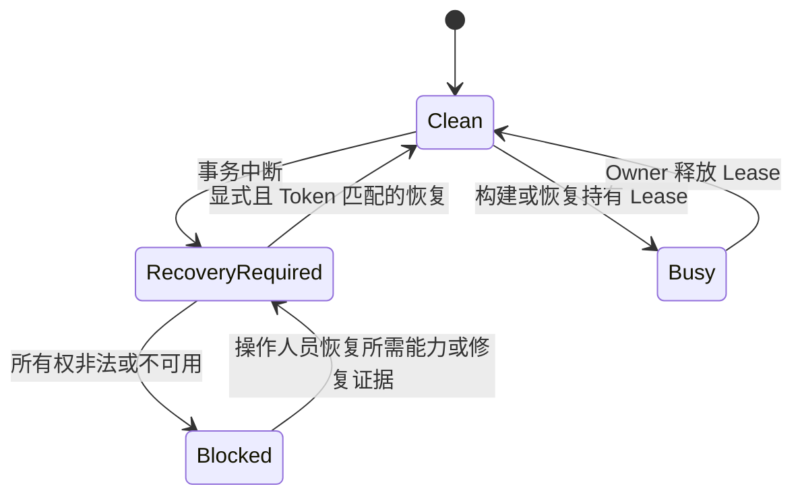

### Unity 全局状态与 VersionInfo

`GlobalBuildStateTransaction` 捕获并恢复目标/backend 相关 PlayerSettings、产品身份和原生版本号、构建 flag、EditorBuildSettings 场景、Splash/License 状态以及 preloaded assets。它还保留相关 ProjectSettings 文件的精确内容和 dirty-state 预期。

事务先持久写入所有权再修改状态。`ProjectSettingsStateGuard` 只允许管线作用域内的写入，并在发布前与恢复后验证文件。无关或未保存的外部修改会 fail closed 并保留证据。

管线不会切换 active build target。request 与 `EditorUserBuildSettings.activeBuildTarget` 不匹配时会在修改前失败。每个 CI Unity 进程都应使用匹配的 Unity `-buildTarget` 启动。

**事务性 VersionInfoData**

当已选步骤需要 `VersionInfoAsset` 时，Runner 会在精确 `Resources` 目录下安装 `VersionInfoData.asset`。默认位置为：

`Assets/Build/Runtime/Resources/VersionInfoData.asset`

该资产是临时 Player 输入，不是必须持久保存的配置资产：

- 已存在且干净的 `VersionInfoData` asset 与 meta 会逐字节恢复；
- 缺失资产通过 staging asset 创建，并在成功或可处理失败后删除；
- 缺失父目录及其 meta 会带所有权记录创建，并在仍为空且未变化时从下向上删除；
- 未知内容、meta 身份变化或竞争修改会停止清理并保留 recovery 证据。

VersionInfo scope 会在终态输出发布前 dispose。Content-only 和 requirements-free 构建不会创建它，除非 Adapter 显式请求该能力。

### Publication Barrier

Step 生成并验证 staged 输出后注册 `IBuildDeferredPublication`。Runner 会先恢复 Unity 状态、再次验证 provenance、封闭 execution context、冻结 manifest snapshot 并检查证据容量。完成这些操作后，`BuildPublicationBarrier` 才能暴露输出。

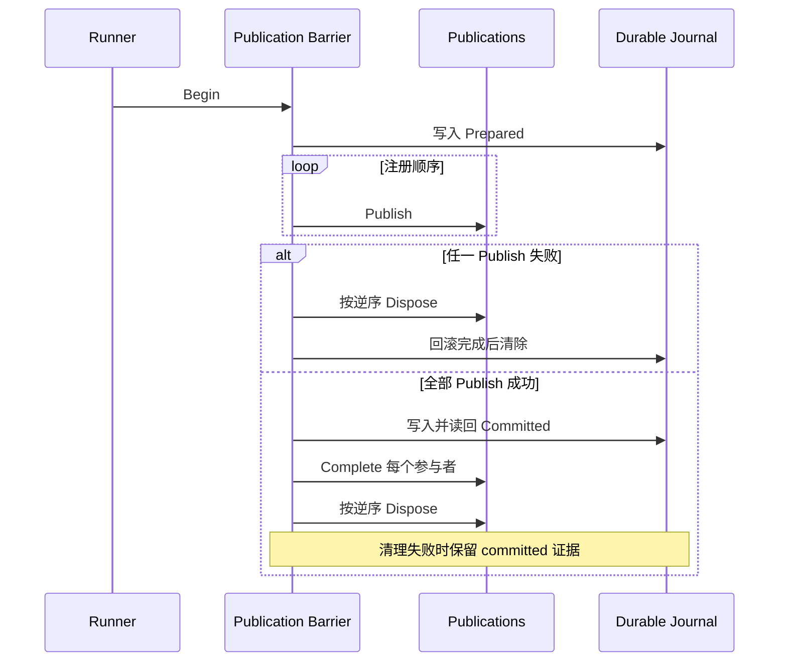

`Prepared` decision 表示 recovery 应回滚。持久 `Committed` decision 表示 recovery 应完成新输出。Recovery 不会只根据 child state 猜测是否提交。

`IBuildDownstreamInputPublication` 允许 staged 输出可逆地激活给后续步骤。这使热更新文件或 bundled content 可以在同一次运行中被消费，而不用提前终态提交。

### Player 输出保护

`PlayerOutputTransaction` 在隔离的相邻 staging 目录中构建：

- **Clean** 从空 stage 开始，并添加 Unity `CleanBuildCache`。
- **Incremental** 要求此前已发布、由管线所有且 compatibility identity 匹配的输出；它先复制到 stage，再在副本上构建。
- 最后一次有效 Player 在 publication 提交前保持不变；
- 非空且不归管线所有的目标会被拒绝；
- 空的无 owner 目录可以被接管；
- ownership sidecar 与持久 journal 支持回滚或 committed completion。

Compatibility 包含自动派生的 pipeline implementation fingerprint、build purpose、Unity 版本、target/backend、artifact 形态与名称、产品身份、Android export、debug 选项、Cheat 状态和 Player-extension fingerprint。任一不匹配都要求使用 Clean。当前 ownership document 会把该 identity 与完整输出树及 checksum 绑定。Ownership-aware full-clean 工具只接受这份精确的当前文档，并拒绝 duplicate、unknown、malformed 或 stale evidence。

Content 与 hot-update Provider 对各自输出根实现等价的 staging 和 recovery 契约。Provider 特定的 Clean/Incremental 语义必须另行说明。

### 必需结果证据

规范 CI 方法是 `Build.Pipeline.Editor.BuildEntryPoints.RunCommandLine`。Evidence 在命令行解析、profile 查找和 request 创建之前开始。

| Artifact | 生命周期 |
| --- | --- |
| `.buildpipeline/results/<runId>.started.json` | invocation 开始时创建；进程硬中断后保留 |
| `.buildpipeline/results/<runId>.log` | 有界的结构化事件日志 |
| `.buildpipeline/results/<runId>.json` | 必需终态 manifest；早期失败为 partial，完成 Runner 调用后为 full |

Started marker 只有在终态 manifest 持久写入、反序列化、契约验证且日志 flush 后才删除。Full terminal manifest 记录 request 身份、target/backend、版本和 CI 身份、已选 recipe 与配置 provenance、编译后步骤结果、Provider package 结果、警告、输出路径、规范化失败及源码工作区快照。

Full result document 包含 `buildPurpose`、`releaseBaselinePolicyEligible` 与 `sourceWorkspace` envelope。Baseline eligibility 只表示 request purpose 与 source policy 是否允许参与正式 Release baseline，不表示已经请求、生成或耐久发布 HybridCLR baseline；实际 baseline 必须以 provider-specific publication evidence 为准。`sourceWorkspace` 包含 `policy`、`required`、`overallStatus`、`failureCode`，以及 `trackedChanges`、`untrackedChanges`、`submodules`、`gitLfs` 四个 component。每个 component 记录稳定的 `status`，并用 `hasChangeCount` 与 `changeCount` 表达可选汇总数量。Manifest 刻意不记录变更路径、文件内容、命令行、环境变量或 stderr，避免形成源码或凭据泄露通道。

Full manifest 会与 Runner 使用的冻结快照比对。在 request 或 source capture 之前创建的 `partial = true` early terminal manifest 会省略 `sourceWorkspace`，因为此时 `policy` 与 `required` 尚不可知；消费方必须把字段缺失视为 `Unknown` 并 fail closed。Request 已存在但工作区捕获不可用时，Runner terminal manifest 会记录 `Unknown/MetadataUnavailable`。自动化决策只接受当前 `build-result` 文档契约。

退出码：

| 代码 | 含义 |
| ---: | --- |
| `0` | 成功 |
| `1` | 构建或恢复失败 |
| `2` | 必需结果证据失败 |
| `3` | Workspace lease 正忙 |

Evidence failure 具有更高优先级。即使 artifact 已提交，终态 manifest 写入失败仍使 invocation 失败；重试前必须检查 manifest、log、事务根和 ownership sidecar。

### 失败处理手册

1. 无论退出码为何，都保留 Unity log 和 `.buildpipeline/results` artifact。
2. 如果 `.started.json` 仍存在，应把 invocation 视为已中断，直到终态 manifest 或人工诊断证明其他结论。
3. 在同一 checkout 启动另一个平台构建前，先检查 workspace health。
4. 只在 `RecoveryRequired` 且 token 已复核时运行 `-pipelineRecoverOnly`。
5. 不要手工删除 `.buildpipeline/transactions`、staging 目录或 ownership sidecar 来强行通过构建。
6. 如果状态为 `Blocked`，恢复缺失 integration，或调查引用的 journal 和路径所有权；不要自动执行破坏性清理。
7. Recovery 报告 `Clean` 后，再使用正确 active target 重试。增量 compatibility 消息要求时使用 Clean。

**预算与验证边界**

代表性的硬预算包括 256 个 invocation、4096 条依赖边、512 个 deferred publication、4096 个独占输出 claim、4096 个事务根条目、每个 participant 16 个 recovery claim、64 MiB 结果 JSON，以及每个 evidence event 32 KiB。Provider、文件树条目、文件大小、路径长度和 provenance 还有额外预算。

仓库包含可处理失败和中断状态恢复测试。本文不声称当前环境已经验证每个文件系统指令处的断电、每个 Provider 版本或每种目标 Player 构建。Release readiness 仍要求在真实 CI agent 上运行 batchmode 验证与代表性构建。

另见[架构与执行模型](#3-架构与执行模型)与[参考手册](#10-参考手册)。

## 9. 扩展构建管线

本指南说明如何扩展 `Assets/Build`，同时避免让核心管线绑定具体产品包。应选择最窄且拥有该行为的扩展接缝，将配置保存在强类型资产中，在任何状态修改前完成校验；如果强制中断可能留下项目状态，还必须接入持久化恢复体系。

### 选择最窄的扩展接缝

| 需求 | 扩展接缝 | 使用的核心 Step |
| --- | --- | --- |
| 新增一个完整构建阶段 | `IBuildStep` + `BuildStepRegistrationAttribute` | 新 Step Type |
| 新增资源内容 Provider | `AssetContentBuildConfiguration` + `IAssetContentBuildAdapter` | `asset-content` |
| 新增热更新编译方案 | `HotUpdateBuildConfiguration` + `IHotUpdateBuildAdapter` | `hot-update` |
| 在 Player 构建期间转换或准备输入 | `PlayerBuildExtensionConfiguration` + `IPlayerBuildExtensionAdapter` | `player` |
| 审计进程级 Player 环境 | `IPlayerBuildEnvironmentGuard` | `player` |
| 强制中断后恢复持久状态 | `IBuildRecoveryParticipant` | Workspace Recovery |

如果现有 Provider-neutral Step 已拥有完整生命周期，就不要新增 Step。Provider Adapter 是更深的模块边界：Recipe 可以保持稳定，外部实现则可以独立安装、升级或移除。

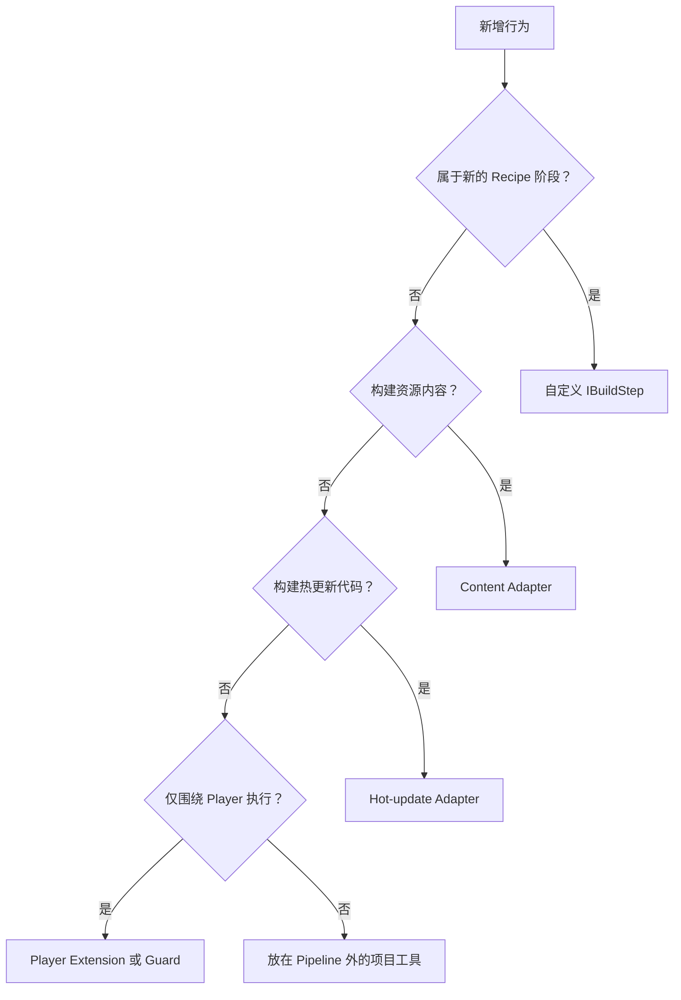

### 程序集边界

依赖方向必须清晰：

```text
Build.Pipeline.Editor（核心契约与编排）
  ^
  |
Your.Provider.Editor（强类型 Authoring + Adapter）
  |
  +-- 可选 Vendor Editor 程序集

Your.Provider.Tests.Editor
  +-- Your.Provider.Editor
  +-- Build.Pipeline.Editor
```

核心程序集不得引用可选 Vendor。UPM 包优先使用带 `versionDefines` 的独立 integration asmdef；`Assets` 下的本地可选包应采用物理隔离的 integration asmdef 和显式 assembly-level constraint。依赖缺失时应让 Integration 不可用，而不是让核心无法编译。

### 自定义 Step 骨架

只有当行为是独立 Recipe 阶段，并且需要自己的 Dependency Edge 与结果时，才使用自定义 Step。最小实现如下：

```csharp
[BuildStepRegistration(
    "catalog-index",
    DisplayName = "Catalog Index",
    Description = "Generates the product catalog index.",
    Category = "Content",
    ConfigurationType = typeof(CatalogIndexBuildConfig),
    ConfigurationRequired = true,
    Multiplicity = BuildStepMultiplicity.Multiple)]
public sealed class CatalogIndexBuildStep : IBuildStep, IBuildStepRequirementsProvider
{
    public string StepTypeId => "catalog-index";

    public BuildStepRequirements GetRequirements(
        BuildExecutionContext context,
        BuildStepInvocation invocation)
    {
        return BuildStepRequirements.None;
    }

    public bool IsApplicable(
        BuildExecutionContext context,
        BuildStepInvocation invocation) => true;

    public IReadOnlyList<string> Validate(
        BuildExecutionContext context,
        BuildStepInvocation invocation)
    {
        // 返回全部 authoring 错误；这里不得写文件或修改 Unity 状态。
        return Array.Empty<string>();
    }

    public void Execute(
        BuildExecutionContext context,
        BuildStepInvocation invocation)
    {
        // 只能通过有容量边界且有明确所有权的事务写入。
    }
}
```

Registration ID 是 Authoring、CI、Evidence 与 Recovery 共用的稳定协议标识。它必须是可移植的 Build Identifier，并且不区分大小写地全局唯一。重复注册会在执行前被拒绝。

Step 不得根据 Inspector 位置推断顺序。请在 Recipe 中添加 Invocation Dependency：Focused Selection 必须自动包含 Producer 时使用 `Required`；只有双方已被选中时才需要排序，则使用 `IfSelected`。

### Provider Adapter

资源 Provider 复用通用 `asset-content` Step：

1. 从 `AssetContentBuildConfiguration` 派生持久化配置。
2. 声明 Authoring 元数据，让 Inspector 可以创建强类型资产。
3. 为 Provider ID 注册唯一 `IAssetContentBuildAdapter`。
4. 将 `Validate` 实现为零写入 Preflight。
5. 返回有容量边界的 `AssetContentBuildOperation`、Result 与 Deferred Publication。
6. Provider 拥有终态目录时实现 `IAssetContentBuildOutputClaimProvider`。
7. 只有 Content 需要临时安装 Player 状态时才实现 `IAssetContentPlayerBuildSessionFactory`。

```csharp
[AssetContentAdapterRegistration("my-content")]
public sealed class MyContentBuildAdapter :
    IAssetContentBuildAdapter,
    IAssetContentBuildOutputClaimProvider
{
    public string ProviderId => "my-content";

    public AssetContentBuildResult Validate(AssetContentBuildRequest request)
    {
        // 校验 Provider 可用性、配置、路径与模式，不得写入。
        throw new NotImplementedException();
    }

    public AssetContentBuildOperation Build(AssetContentBuildRequest request)
    {
        // 在 Stage 中生成输出并返回 Deferred Publication。
        throw new NotImplementedException();
    }

    public IReadOnlyList<string> GetExclusiveOutputPaths(
        AssetContentBuildRequest request)
    {
        // 返回已规范化的绝对终态根目录。
        throw new NotImplementedException();
    }
}
```

Adapter 实例以一次运行中的单个 Invocation 为作用域。不要使用静态 Pending Publication 状态。Transaction 路径、Ownership Marker、Publication ID 与默认输出根都应包含 Invocation ID，保证多个实例互不冲突。

如果 Provider 使用进程级 Player Hook，应返回稳定的非空 `ExclusivePlayerSessionKey`。同一个 Player Dependency Closure 对同一个 Key 最多只能包含一个 Session Factory。只有不同 Invocation 的 Session 确实可以共存时才能返回空 Key。

**新增热更新 Provider**

热更新 Provider 复用通用 `hot-update` Step：

1. 从 `HotUpdateBuildConfiguration` 派生强类型配置。
2. 通过 `HotUpdateAdapterRegistrationAttribute` 注册 Provider 与精确配置类型。
3. 实现 `IHotUpdateBuildAdapter`。
4. 通过 `GetRequirements` 返回 Run-wide State Requirements。
5. 如果依赖它的 Player 有兼容限制，实现 `IHotUpdatePlayerBuildValidator`。

```csharp
[HotUpdateAdapterRegistration("my-hot-update", typeof(MyHotUpdateBuildConfig))]
public sealed class MyHotUpdateBuildAdapter :
    IHotUpdateBuildAdapter,
    IHotUpdatePlayerBuildValidator
{
    public string ProviderId => "my-hot-update";
    public Type ConfigurationType => typeof(MyHotUpdateBuildConfig);

    public BuildStepRequirements GetRequirements(HotUpdateBuildRequest request) =>
        BuildStepRequirements.None;

    public IReadOnlyList<string> Validate(HotUpdateBuildRequest request) =>
        Array.Empty<string>();

    public void Execute(HotUpdateBuildRequest request)
    {
    }

    public IReadOnlyList<string> ValidatePlayerBuild(HotUpdateBuildRequest request) =>
        Array.Empty<string>();
}
```

Execution Context 会为每个 Invocation 创建并缓存一个 Adapter，因此它可以保存 Invocation-local 状态。进程级 Vendor API 仍必须进行显式唯一性检查，并提供确定性清理。

### Player Extension

Player Extension 是由 `player` 生命周期消费的有序配置，适用于代码转换、签名前置准备、生成 Player 输入，或 Integration 自己拥有的前后 Scope。

1. 从 `PlayerBuildExtensionConfiguration` 派生强类型资产。
2. 将它加入 `PlayerBuildConfiguration`。
3. 使用稳定 Provider ID 与 Compatibility ID 注册唯一 Adapter。
4. 实现零写入 `Validate` 和可恢复的 `BeginPlayerBuild`。

```csharp
[PlayerBuildExtensionAdapterRegistration(
    "my-player-extension",
    "my-player-extension-contract",
    ConfigurationType = typeof(MyPlayerExtensionConfig))]
public sealed class MyPlayerExtensionAdapter : IPlayerBuildExtensionAdapter
{
    public string ProviderId => "my-player-extension";
    public string CompatibilityId => "my-player-extension-contract";

    public IReadOnlyList<string> Validate(PlayerBuildExtensionRequest request) =>
        Array.Empty<string>();

    public IDisposable BeginPlayerBuild(PlayerBuildExtensionRequest request)
    {
        return new MyReversibleScope();
    }
}
```

Compatibility ID 表达 Adapter 的输出兼容契约，不是展示名称。输出兼容性变化时必须改变该值，阻止 Incremental Player Publication 复用不兼容的受管目录。配置依赖与 Adapter Identity 都会进入 Player Compatibility Fingerprint。

对于即使没有选中 Extension 也必须检查的项目级不变量，请使用 `IPlayerBuildEnvironmentGuard`。Guard 先于 Extension 与 Content Session 开始，并按相反顺序释放。

### 持久化所有权与恢复

只要扩展在强制中断后可能留下 Stage、Backup、临时资产或被修改的 Project Setting，就必须拥有持久化状态。

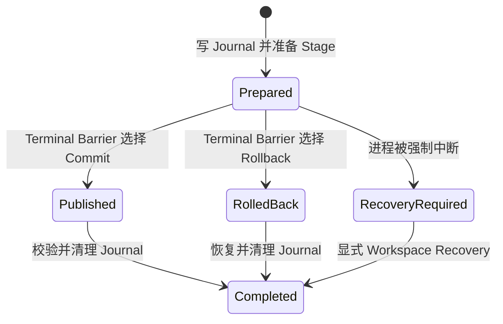

使用 `BuildRecoveryRegistrationAttribute` 注册恢复所有权，并实现 `IBuildRecoveryParticipant`。Recovery ID 必须全局唯一；Priority 只负责排列不同 ID 的 Participant。`StateDirectoryRelativePaths` 必须列出该 Participant 有容量边界的状态根。必须在所有普通 Owner 之后运行的协调器还应实现 `IBuildRecoveryCoordinator`。

Recovery 代码必须：

- 拒绝格式错误或未知 Evidence；
- 修改前重新验证规范化路径与 Reparse Point；
- 删除或替换数据前比较 Ownership 与 Content Identity；
- 可以幂等执行；
- 无法证明安全恢复时保留 Evidence；
- 当文件恢复可由核心实现时，不要求可选 Vendor 包仍然存在。

Cache 不能作为 Recovery Truth。不能仅因为路径与配置目标相同，就删除不属于 Build 的输出。

**Authoring 与 CI 对等**

每项持久化行为都必须由强类型配置资产表达。自定义 Inspector 可以提供拖拽、Create 按钮、诊断与 Preview，但不能创建第二套隐藏配置来源。

每个扩展都应记录：

- 稳定 Provider 或 Step ID；
- 配置资产类型与字段限制；
- Package 与 Assembly 可用条件；
- 支持的 `Clean` 与 `Incremental` 模式；
- 独占输出与进程级 Claim；
- 持久化文件与 Ownership Marker；
- Player Dependency 行为；
- CI Selection 与 Artifact 规则；
- Recovery 与升级验证步骤。

CI 通常应通过版本控制中的 Profile 选择扩展。只有明确需要一次性命令行 Recipe 替换时，才使用 `-pipelineStepConfig <invocation>=<asset-path>`。

### 扩展测试矩阵

满足适用行之前，Integration 不能视为完成。

| 范围 | 最低证据 |
| --- | --- |
| Registration | 缺失、重复、元数据不匹配、成功解析 |
| Authoring | 强类型创建、错误赋值、Package 不可用、Dirty Asset Guard |
| Graph | Full Recipe、Focused Selection、`Required` Closure、Cycle 拒绝 |
| Preflight | 零写入、聚合且可操作的错误 |
| Transaction | Clean 成功、Provider 失败、Rollback、强中断恢复 |
| Output | 相同/祖先路径重叠、Foreign Owner、篡改 Marker、路径逃逸 |
| Incremental | 兼容复用，以及所有要求 Clean 的 Identity Mismatch |
| Evidence | 有界 Artifact、Provenance、原始失败保留、Terminal Confirmation |
| Optional Package | 缺包时核心可编译；支持版本存在时 Integration 可编译并通过测试 |
| 目标平台 | 每个支持的 Target/Backend 至少一次真实 Clean Build |

静态 API 检查与 Core Compilation 不能证明 Vendor Build 已通过。Optional Package Compilation、真实 Player/Content 输出、IL2CPP 与目标平台验证必须分别记录。

## 10. 参考手册

本文是当前 Build 模块的紧凑参考。需要了解这些契约的设计原因，请阅读[架构与执行模型](#3-架构与执行模型)与[安全、恢复与证据](#8-安全恢复与证据)。

### 稳定 ID

**内置 Step Type**

| Step Type ID | 配置 | Multiplicity | 核心 Requirements |
| --- | --- | --- | --- |
| `player` | 可选 `PlayerBuildConfiguration` | `Single` | `UnityGlobalState`、`VersionInfoAsset`、`PlayerOutput` |
| `asset-content` | 必需 `AssetContentBuildConfiguration` | `Multiple` | Provider 定义；核心步骤不声明 |
| `hot-update` | 必需 `HotUpdateBuildConfiguration` | `Multiple` | Adapter 定义 |

**当前模块中的 Provider ID**

| 能力 | Provider ID | 配置 |
| --- | --- | --- |
| Addressables 资源内容 | `addressables` | `AddressablesBuildConfig` |
| YooAsset 资源内容 | `yooasset` | `YooAssetBuildConfig` |
| HybridCLR 热更新 | `hybridclr` | `HybridCLRBuildConfig` |
| HybridCLR 与 Obfuz | `hybridclr-obfuz` | `HybridCLRObfuzBuildConfig` |
| Obfuz Player extension | `obfuz` | 通过 `PlayerBuildConfiguration` extensions 选择 |

Provider 是否可用仍取决于相应可选 assembly/package 是否已安装且兼容。序列化的 Provider ID 不能证明 Adapter 一定可以解析。

**BuildData 字段**

| 分组 | 字段 | 含义 |
| --- | --- | --- |
| Scenes | Launch Scene | 第一个 Player 场景 |
| Scenes | Additional Scenes | 其他非空场景，按路径去重 |
| Version and Output | Application Version | `major.minor.patch` 应用版本身份 |
| Version and Output | Output Base Directory | 项目相对的默认构建根；默认 `Build` |
| Version and Output | VersionInfo destination | 高级项目相对 `Assets/.../Resources/VersionInfoData.asset` 路径 |
| Product Identity | Company Name | 仅在已选 requirement 需要 Unity global/Player state 时应用 |
| Product Identity | Product Name | 也用于默认 Player artifact 名称 |
| Product Identity | Application Identifier | 按 Player application identifier 验证 |
| Source Control | Source Cleanliness Policy | Qualified Release 与 batch mode 始终要求 verified-clean；`Allow Dirty Local Release` 只把 Inspector Release 路由到隔离且不可分发的本地 Player |
| Player Options | Cheat Build Mode | 控制 Player 构建的 invocation-local `ENABLE_CHEAT` |
| Build Recipe | Invocations | 稳定 ID、step type、强类型 config、incrementality 和依赖声明 |

默认 VersionInfo 目标是 `Assets/Build/Runtime/Resources/VersionInfoData.asset`。需要时管线会事务性创建并删除它，不需要把生成资产长期保存在版本控制中。

**标准 Preset**

| Inspector 名称 | 启用 Invocations | 依赖边 |
| --- | --- | --- |
| Player Only | `player` | 无 |
| Player + Content | `asset-content`、`player` | content 到 Player，`IfSelected` |
| Full Player | `hot-update`、`asset-content`、`player` | hot update 到 content 与 Player；content 到 Player，全部 `IfSelected` |
| Content Only | `asset-content` | 无 |
| Content + Hot Update | `hot-update`、`asset-content` | hot update 到 content，`IfSelected` |
| Hot Update Only | `hot-update` | 无 |

`Required` 依赖会扩展聚焦选择。`IfSelected` 不会扩展成员，只会排序并连接已经选中的成员。

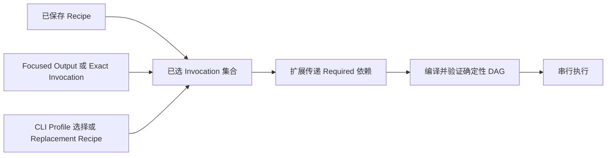

**Inspector 执行命令**

| 命令 | 行为 |
| --- | --- |
| Build Saved Recipe | 要求 profile 与已选 config 已保存，然后运行全部 enabled invocation |
| Release / Development | 使用相应 Player option 策略运行已保存 recipe |
| Local Optimized Preview | 只运行一个 Clean Player invocation；Release-like 优化、隔离输出、不可分发且不发布 Release Baseline |
| Focused Output | 不修改 profile，运行 Hot Update Only、Content Only 或 Content + Hot Update |
| Build Selected Invocation | 运行一个非 Player invocation 及其传递 `Required` 闭包 |
| Workspace Health | 零写入检查，只在安全时提供显式恢复 |

### 命令行选项

使用：

```text
-executeMethod Build.Pipeline.Editor.BuildEntryPoints.RunCommandLine
```

除 Unity 原生 `-buildTarget` 外，自定义参数均使用 `-pipeline` 前缀。

**单值参数**

| 参数 | 值 |
| --- | --- |
| `-buildTarget` | `Win64`、`OSXUniversal`、`Linux64`、`Android`、`iOS` 或 `WebGL` |
| `-pipelineProfile` | 指向 `BuildData` 的 portable 持久 `Assets/.../*.asset` 路径 |
| `-pipelineScriptingBackend` | Parser 与目标策略接受的 backend |
| `-pipelineOutput` | 显式 artifact 文件或文件夹 |
| `-pipelineOutputRoot` | 覆盖 profile 的输出基目录 |
| `-pipelineVersion` | `major.minor.patch` 形式的应用版本 |
| `-pipelineVersionInfo` | 项目相对 VersionInfo asset 目标 |
| `-pipelineBuildNumber` | 目标限制内的正数原生构建号 |
| `-pipelineSourceProvider` | 显式源码 Provider 身份 |
| `-pipelineSourceRevision` | 显式源码 Revision |
| `-pipelineSourceBranch` | 显式源码 Branch |
| `-pipelineCiProvider` | 记录进证据的 CI Provider 名称 |
| `-pipelineCiRunId` | 记录进证据的 CI Run 身份 |

Source provider、revision 与 branch 构成一个完整覆盖，必须一起提供。Batch 与 Release 构建要求可靠的已检测源码元数据，或完整显式源码身份加构建号。

**可重复 Recipe 参数**

| 参数 | 语法 | 说明 |
| --- | --- | --- |
| `-pipelineSelect` | `<invocation-id>` | 从 profile 选择 root，并扩展 `Required` 闭包 |
| `-pipelineRecipe` | `<invocation-id>=<step-type-id>` | 替换配置 recipe；不能与 `-pipelineSelect` 组合 |
| `-pipelineStepConfig` | `<invocation-id>=Assets/.../Config.asset` | 必须是持久主 `ScriptableObject`；拒绝 package asset 与 subasset |
| `-pipelineStepIncrementality` | `<invocation-id>=<Clean\|Incremental>` | 只应用于已选或 replacement invocation |
| `-pipelineStepDependency` | `<invocation-id>=<Required\|IfSelected>:<dependency-id>` | 向已选或 replacement invocation 添加显式边 |

Replacement recipe 不继承配置、依赖或 incrementality：配置默认为 null，依赖为空，incrementality 默认为 Clean，直到命令行显式覆盖。

**Flag 参数**

| 参数 | 作用 |
| --- | --- |
| `-pipelineDevelopment` | 使用 Development Player 选项 |
| `-pipelineExportAndroidProject` | 生成目录导出；仅适用于 Android 且必须选择 Player invocation |
| `-pipelineEnableCheat` | 启用 per-build `ENABLE_CHEAT` |
| `-pipelineDisableCheat` | 禁用 per-build `ENABLE_CHEAT` |
| `-pipelineAllowExternalOutput` | 显式允许普通 build root 外经过验证的输出 |
| `-pipelineRecoverOnly` | 仅运行 workspace recovery；不能与 pipeline build 参数组合 |

未知 `-pipeline*` 参数、重复的不可重复参数、不完整值和冲突 flag 都会使解析失败。

### 默认输出形态

未显式提供输出时，Request Factory 在以下位置生成输出：

```text
<OutputBaseDirectory>/<Platform>/<Release|Development>/<Artifact>
```

| 目标 | 默认 Artifact 形态 |
| --- | --- |
| Windows 64-bit | `<ProductName>.exe` |
| macOS | `<ProductName>.app` 目录 |
| Linux 64-bit | `<ProductName>` |
| Android package | `<ProductName>.apk` |
| Android Gradle export | `AndroidProject` 目录 |
| iOS | `<ProductName>` 目录 |
| WebGL | `<ProductName>` 目录 |

Android 显式 package 路径必须以 `.apk` 或 `.aab` 结尾。Android project export 要求目录。除非提供 `-pipelineAllowExternalOutput`，否则拒绝 external output；即使显式允许，它仍需通过删除边界和路径重定向检查。

### 持久化路径与生命周期

| 路径 | Owner 与生命周期 |
| --- | --- |
| `.buildpipeline/transactions` | 待处理持久事务；显式检查与恢复 |
| `.buildpipeline/results/<runId>.json` | 必需终态 manifest；保留 |
| `.buildpipeline/results/<runId>.started.json` | 中断 marker；只在终态证据确认后删除 |
| `.buildpipeline/results/<runId>.log` | 每次运行事件日志；保留 |
| `Temp/BuildPipeline/Workspace/lease.lock` | 可复用 OS lock 文件 |
| `Temp/BuildPipeline/Workspace/lease.json` | 诊断 Lease 元数据 |
| `Assets/Build/Runtime/Resources/VersionInfoData.asset` | 默认临时 runtime version 输入；事务性恢复或删除 |
| `<PlayerOutput>.buildpipeline-player-owner.json` | Player 输出所有权与增量兼容 sidecar |
| `<BuildRoot>/LocalPreview` | 隔离且不可分发的 Local Optimized Preview 输出；只能按正常 ownership-aware 输出规则安全删除 |

结果历史当前没有自动 prune 策略。不能为了让 CI 解除阻塞而手工删除事务状态和 ownership sidecar。

**结果与退出码参考**

Step 状态为 `Succeeded`、`Skipped` 和 `Failed`。

| 退出码 | 常量含义 |
| ---: | --- |
| `0` | 成功 |
| `1` | 构建失败 |
| `2` | 结果证据失败 |
| `3` | Workspace busy |

结果 evidence family 只接受当前 `build-result` 文档契约。所有 Build 自有 journal 与 ownership document 同样只有一份当前契约；不匹配的制品会 fail closed，且不会被迁移、改写或接管。

**核心预算**

| 预算 | 上限 |
| --- | ---: |
| Recipe invocations | 256 |
| Dependency edges | 4096 |
| Deferred publications | 512 |
| Exclusive output claims | 4096 |
| Transaction root 顶层条目 | 4096 |
| 每个 participant 的 recovery claims | 16 |
| Result manifest/evidence JSON | 64 MiB |
| 单个 evidence event | 32 KiB 字符 |
| Request scenes | 1024 |

Provider 与 provenance 代码还应用额外的 package 数量、tree entry、文件大小、聚合 hash、路径长度和递归预算。

### Incrementality 摘要

| Invocation | Clean | Incremental |
| --- | --- | --- |
| Player | 空的隔离 stage；Unity `CleanBuildCache` | 把匹配且归管线所有的 baseline 复制到隔离 stage |
| Addressables content | 新 Player/content baseline | Content Update；不能在同一 recipe 中提供给 Player |
| YooAsset content | Clean invocation 策略，但不会执行危险的全局历史缓存删除 | Provider build mode 与事务发布使用已有兼容 Provider 状态 |
| HybridCLR | 完整 prebuild/generation，并可发布 release baseline | 针对验证过的兼容 release baseline 编译 DLL |

Compatibility 错误表示应让该 invocation 使用 Clean。Clean 对每个 Provider 并不等于相同的文件系统删除行为。

### 源码地图与补充文档

```text
Assets/Build/Editor/BuildPipeline/Authoring/
Assets/Build/Editor/BuildPipeline/Core/Contracts/
Assets/Build/Editor/BuildPipeline/Core/Discovery/
Assets/Build/Editor/BuildPipeline/Core/Execution/
Assets/Build/Editor/BuildPipeline/Core/Recovery/
Assets/Build/Editor/BuildPipeline/Core/Results/
Assets/Build/Editor/BuildPipeline/Core/Transactions/
Assets/Build/Editor/BuildPipeline/EntryPoints/
Assets/Build/Editor/BuildPipeline/Steps/
Assets/Build/Editor/BuildPipeline/Integrations/
Assets/Build/Tests/Editor/
```

**当前限制**

- Invocation 串行执行；没有并行 DAG scheduler。
- 没有协作式步骤 cancellation API。
- Active build target 切换不属于管线职责。
- 普通构建不会执行隐式 recovery。
- Result 没有内置 retention cleanup。
- HybridCLR 与 invocation-local Cheat 当前不能安全地共同提供给同一 Player。
- 静态分析和 EditMode 测试不能替代目标 Player、IL2CPP、包版本或 build agent 验证。

**验证边界**

源码树包含针对 authoring、request 构建、图编译、workspace lease/recovery、全局状态恢复、VersionInfo 清理、publication、输出所有权、provenance 与结果证据的聚焦测试。本文陈述这些已实现契约，但不证明当前环境已经构建目标 Player 或所有可选 integration。把某个平台视为已验证前，必须在每个 release agent 上运行规范 batchmode 命令以及代表性的 Clean/Incremental 构建。

## 11. 故障排查

应从第一个失败边界开始定位：Authoring、Preflight、Execution、Restoration、Publication 或 Evidence。不要为了让下一次构建继续而删除 Transaction 文件、Ownership Marker、Baseline 或输出目录。这些信息的作用正是防止后续构建或另一平台接管不确定状态。

### 快速排查

1. 停止同一项目的其他 Unity 构建进程。
2. 打开 `BuildData` Inspector，读取 **Build Readiness**、**Source Qualification** 与 **Build Transaction Safety**。
3. 保留 Unity Editor Log 和 `.buildpipeline/results/`。
4. Build Transaction Safety 不是 Clean 时，打开 Workspace Health 检查 Recovery Evidence；Source Qualification 为 Dirty 或 Unknown 时，检查聚合 component count 与 VCS failure code，并为 Release/CI 恢复干净 worktree。
5. 只能通过 Inspector 或 `-pipelineRecoverOnly` 执行恢复。
6. Recovery 显示 Clean 后，再使用同一个 Profile 与 Target 重试。
7. Incremental 兼容性提示 Owned Baseline 或 Output 不匹配时，明确改用 `Clean`。

### 症状表

| 症状 | 常见原因 | 正确处理 |
| --- | --- | --- |
| Build 按钮禁用且 Header 显示 `UNSAVED` | Profile 或已选配置资产处于 Dirty 状态 | 对 Saved Recipe 点击 **Save Build Authoring Assets**；不属于该 Selection 的 retained focused config 需要单独保存 |
| Provider 显示不可用 | 可选 Package/API 或 Adapter Registration 缺失 | 安装受支持的包，等待 Unity 重新编译，必要时重新创建或分配强类型配置 |
| Preflight 报告缺少 Configuration | 已选 Invocation 要求强类型 `ScriptableObject` | 通过 Inspector 创建 Config 并保存 |
| Dependency Target 缺失 | Edge 指向不存在的 Invocation ID | 在 Advanced DAG 修复 Edge，不要依赖列表顺序 |
| 检测到 Cycle | Dependency Edge 构成环 | 删除或重定向 Edge，构建前检查 Compiled Plan |
| Exit Code `3` | 另一进程持有 Workspace Lease | 根据 `lease.json` 定位进程；Owner 可能仍存活时不要删除 `lease.lock` |
| Workspace 显示 Recovery Required | 进程在持久化状态有效时终止 | 执行 Token-bound Workspace Recovery；Recovery 拒绝所有权时保留 Evidence |
| 输出为 Foreign 或 Unowned | Destination 中的数据没有期望 Owner Identity | 选择新的空目录、备份并移走外部目录，或进行受控 Clean Publication；不得隐式接管 |
| Output Claim 重叠 | 两个 Invocation 拥有相同或祖先/子孙 Root | 为每个 Invocation 配置独立 Root，或在单个 Provider Invocation 内组合 |
| Incremental 要求 Clean | Target、Backend、Output、Application Identity、Unity Version、Config、Adapter 或 Baseline Identity 改变 | 对新 Identity 执行 Clean，并为各平台使用独立 Cache Root |
| Exit Code `2` | 必需 Result Evidence 无法写入或严格确认 | 将本次视为失败，保留产物与日志，修复磁盘/权限/容量问题，重试前检查 Workspace |

### 构建失败后切换平台

改变 Active Platform 不能让被中断的 Transaction 自动变安全。下一次运行会先获取 Workspace Lease 并检查持久化状态。如果之前留下 Recovery Evidence，新平台构建会在 Provider 或 Player 执行前被阻止。

不要删除 `.buildpipeline/transactions` 中的 JSON。应使用 Inspector 展示的 Token 执行 Workspace Recovery。Recovery 只会恢复或删除 Ownership 与当前 Identity 都能匹配的路径。如果外部修改使安全性无法证明，它会 Fail-closed 并保留 Journal 供排查。

不同平台的 Player Output、Addressables Publication、YooAsset Package Version 与 HybridCLR Baseline 必须使用各自兼容的 Root。跨不兼容 Target 用同一个 Player Output Root 执行 `Incremental` 会被拒绝。

### VersionInfo 或 Resources 残留

只有 Player 构建需要时，`VersionInfoData` 才会被临时安装。Transaction 会记录原 Asset、Asset Meta、Folder Chain、Folder Meta、Attribute 与 Timestamp。

- 正常成功或可处理失败：Scope 释放时恢复旧状态，并仅删除本次创建的空目录。
- 强制中断：Global-state Journal 保留，由 Workspace Recovery 负责清理。
- Content-only 与 Hot-update-only Selection 不创建该 Asset。

如果目录残留，先检查 Workspace Health。Unknown File、被修改的 Meta 或 Ownership Mismatch 都会有意阻止自动删除。只有确认 Owner 并保留 Recovery Evidence 后，才可以人工移动或删除数据。

### Addressables

**Provider 不可用**

当前项目 Manifest 可能没有安装 Addressables；Core Build Compilation 不会自动安装它。请在消费项目中加入受支持的 Addressables 包，等待干净编译，然后检查 Addressables Settings 与强类型 Config。

**Content Update 被拒绝**

逐项检查：

- Invocation Mode 是 `Incremental`。
- Remote Catalog 与 Publication 已启用。
- Baseline 只配置一种来源：Asset Reference 或项目相对 `.bin` Path。
- Baseline 位于之前由 Pipeline 所有的 Publication 中。
- `AddressablesArtifacts.json`、Target、Profile ID、Unity Version、Player Version、Remote Load Path、Size 与 SHA-256 全部匹配。
- 该 Invocation 不是 Player Dependency。

系统不会降级为完整内容构建。应修正 Baseline，或者显式选择 `Clean`。

**多个 Addressables Invocation 输入同一个 Player**

Addressables 拥有唯一进程级 Player Session。即使 Publication Root 不同，同一个 Player Dependency Closure 中包含多个 Addressables Session 也会被拒绝。请把内容合并到一个 Addressables Invocation，或在不依赖同一个 Player 的情况下独立构建。

### YooAsset

**Inspector 中没有 Provider**

YooAsset Integration Assembly 只对 `com.tuyoogame.yooasset` `[3.0.5,4.0.0)` 启用。放在仓库其他目录中的 Package Source 不是已经安装的 UPM Dependency。

改变 Package 前，必须先确认没有 Pending YooAsset Transaction；之后等待重新编译并运行 Version-gated Tests。

**Package Version 已存在**

默认 Collision Policy 会拒绝已存在版本。常规 CI 应使用新 Version。`ReplaceExactVersion` 只用于受控重试，并且精确 Destination 仍必须拥有有效 Build Ownership。

**OnlyCopy 无法继承内置包**

OnlyCopy Mode 从当前受管 Bundled Snapshot 继承。请恢复包含 `.yoo-pub.json` 的完整 Bundled Root；只有目录而没有 Ownership Marker 会被视为 Foreign。

**已选择 Cryptography，但 Player 无法加载内容**

Build Integration 只绑定已注册的 YooAsset Encryption/Decryption Service，并记录 Adapter 与 Runtime Contract Identity。它不提供算法、密钥、Secret Management 或 Player Runtime Decryptor。请确认 Player 中包含与 `RuntimeDecryptContractId` 对应的 Decryptor。

**当前验证边界**

当前 Checkout 未安装 YooAsset。此外，在声明 Optional Test Assembly 已编译前，还需要把一个 Version-gated Publication Test 更新到当前 `AssetContentBuildRequest` Constructor。在实际安装包、Test Assembly 编译成功并生成真实 Package Output 前，YooAsset 结论应视为静态 API 验证。

### HybridCLR 与 Obfuz

**Incremental 找不到 Release Baseline**

Baseline 只会由成功的 Clean Release Run 发布，并且必须恰好有一个 Player 直接依赖该 Hot-update Invocation。Hot Update Only、Content + Hot Update 与 Development 不会创建 Baseline。

请恢复 `.buildpipeline/baselines/hybridclr/` 下精确的 Target/Backend/Release-key 目录。Application ID/Version、Invocation ID、Unity Version、Provider/Settings Identity、Source Provenance 与 AOT Inventory 都必须一致。

**Player 使用 HybridCLR 与 Cheat Mode 时被拒绝**

当前 HybridCLR API 不能接收 Invocation-local `ENABLE_CHEAT` Define 来生成程序集。因此，Player 消费该 Hot-update Invocation 且启用 Cheat 时会被拒绝。请关闭该 Player 组合的 Cheat，或者使用能够接收相同 Define Set 的 Provider。

**HybridCLR + Obfuz Incremental 被拒绝**

该 Provider 只支持 `Clean`，因为 Integration 不能把已校验的 Release-baseline AOT Path 传给当前 Obfuz4HybridCLR API。请使用 Clean，或改用不混淆 Hot-update 输出的标准 HybridCLR Provider。

**Player Obfuz 状态与 Recipe 不一致**

Player Extension 不会切换持久化 Obfuz Settings。选中 Extension 时，`ProjectSettings/Obfuz.asset`、生成的 Encryption VM 与所需 Pipeline Setting 必须已经有效；没有选中时，持久开启的 Obfuz Pipeline 会被拒绝，避免发生未记录的 Player Transformation。

### CI Identity 与磁盘证据

普通 Git Checkout 应让内置 Provider 自动检测 Source Identity，只传 Build Number 与完整 CI Group：

```text
-pipelineBuildNumber 1234
-pipelineCiProvider Jenkins
-pipelineCiRunId my-job-1234
```

自动检测的 Git Revision 是最多 12 个字符的短 Hash。如果无法检测仓库元数据而必须显式传 Source Group，请同时传入三个字段，并使用相同约定：

```text
-pipelineSourceProvider Git
-pipelineSourceRevision <git rev-parse --short=12 HEAD>
-pipelineSourceBranch <branch>
```

不完整的 Source/CI Group 会被拒绝；显式 Source Identity 与可检测仓库 Identity 不一致时也会被拒绝。

如果 Manifest 的 `sourceWorkspace` 为 `Dirty` 或 `Unknown`，先查看稳定 `failureCode`，再恢复干净 checkout、可用 VCS 工具以及一致的 submodule/LFS 状态。不要绕过 Qualified Release 门禁；需要在本地验证 Release-like Player 优化时，可以使用 **Local Optimized Preview**，或为 Profile 选择 `Allow Dirty Local Release` 后点击 **Release (Local Dirty)**。两者都使用隔离且不可分发的 Clean Player purpose。需要运行完整的本地 Development Recipe 时，使用 `Allow Dirty Development` 或 `Allow Dirty Local Release`。

**Evidence 与磁盘错误**

必需 Evidence 包含：

```text
<BuildRoot>/.buildpipeline/results/<run-id>.started.json
<BuildRoot>/.buildpipeline/results/<run-id>.log
<BuildRoot>/.buildpipeline/results/<run-id>.json
```

Terminal Manifest 会经过容量检查、写入、重新读取，并与冻结的期望结果比较。Disk Full、Permission、Path Occupation、Serialization Capacity 或 Confirmation Failure 都会产生 Exit Code `2`。源码工作区只记录状态、稳定 failure code 与汇总数量，不包含变更路径、文件内容、stderr、命令参数或凭据。

如果 Terminal Evidence 在后期失败，Artifact 可能已经跨过 Publication Barrier。不能自动重建或覆盖。请保留 Output 与 Log，检查 Workspace Health；修复 Evidence Fault 后，再决定是否用新 Version 重新发布。

**建议收集的诊断信息**

- Unity Editor Log；
- 本次运行的 `.buildpipeline/results/`；
- Workspace Health Status 与 Recovery Token，但不包含 Secret；
- Profile Path、Invocation ID、Target、Backend 与 Incrementality；
- Package Manifest 与 Lock File；
- 相关 Ownership Marker 与 Transaction Journal Path；
- Output Root 是否从 CI Cache 恢复；
- 精确 Process Exit Code。

不要附加 Encryption Key、Signing Credential、Access Token 或含 Secret 的 Vendor Configuration。

## 12. 复制与发布验证

本 README 已包含使用 Build 模块所需的完整主线内容。以下资料用于更窄的 Provider 细节或架构浏览：

- [English README](README.md)
- [Addressables 集成说明](Editor/BuildPipeline/Integrations/Addressables/README.SCH.md)
- [YooAsset 3 集成说明](Editor/BuildPipeline/Integrations/YooAsset3/README.SCH.md)
- [HybridCLR 集成说明](Editor/BuildPipeline/Integrations/HybridCLR/README.SCH.md)
- [HybridCLR + Obfuz 集成说明](Editor/BuildPipeline/Integrations/HybridCLRObfuz/README.SCH.md)
- [Obfuz Player Extension 说明](Editor/BuildPipeline/Integrations/Obfuz/README.SCH.md)
- [Performance Testing 集成说明](Editor/BuildPipeline/Integrations/PerformanceTesting/README.SCH.md)
- [OMM 架构资料](../../../.omm/config.yaml)

复制 **Assets/Build** 到其他项目时，只复制源码、程序集定义、Runtime 数据和就地集成说明；不要把 **.buildpipeline**、**Build**、**Library**、**Temp**、Provider 输出或其他项目的配置资产当作模块模板。为新项目创建自己的 **BuildData** 与 Provider 配置，纳入版本控制，并在目标平台完成至少一次 Clean Build、一次适用的 Incremental Build、一次强中断恢复和一次 CI Artifact Restore 验证。
