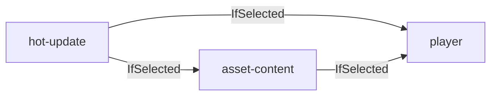
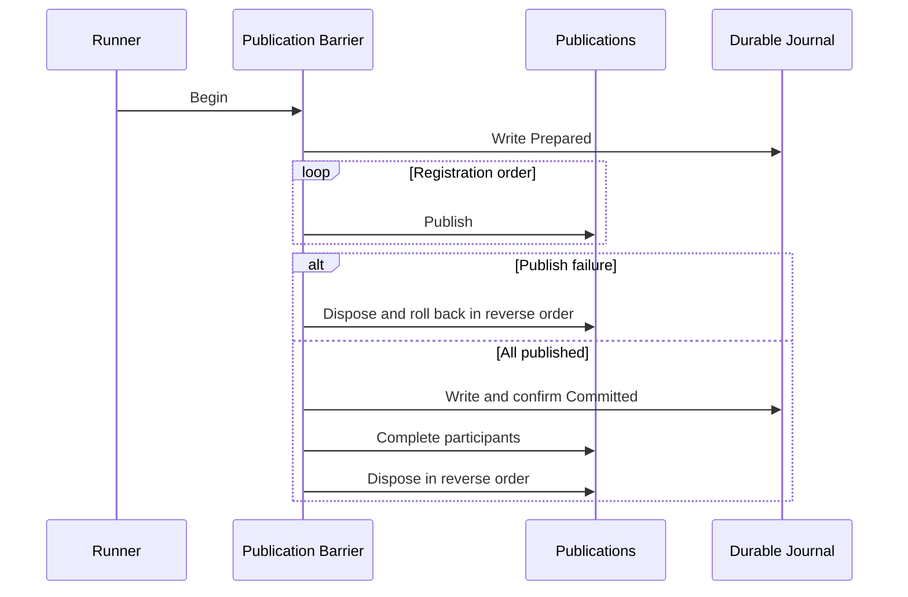

# Build Foundation

[简体中文](README.SCH.md)

`Assets/Build` is a reusable Unity build foundation for Player, asset-content, and hot-update outputs. A saved `BuildData` profile is compiled into an invocation dependency graph, validated before Unity state changes, executed under one project-wide lease, published through one durable terminal decision, and recorded as bounded result evidence for local tools and CI.

The module is provider-neutral. Addressables, YooAsset, HybridCLR, Obfuz, and other optional products are connected through typed configuration assets and isolated adapters. Removing an optional package must not break the core build assembly; selecting an unavailable provider must instead produce an actionable preflight error before mutation.

> **Current checkout:** the package manifest does not install Addressables, YooAsset, HybridCLR, Obfuz, or Obfuz4HybridCLR. Their behavior described below is based on the current integration source and static API review. It is not evidence that those optional assemblies compile, that a vendor build succeeds, or that a target Player can load the result. The installed Performance Testing package is handled separately by its Player guard.

## Contents

- [1. Purpose and supported workflows](#1-purpose-and-supported-workflows)
- [2. Getting started](#2-getting-started)
- [3. Architecture and execution model](#3-architecture-and-execution-model)
- [4. Recipes and composition](#4-recipes-and-composition)
- [5. Asset-content providers](#5-asset-content-providers)
- [6. Hot update and obfuscation](#6-hot-update-and-obfuscation)
- [7. CI/CD](#7-cicd)
- [8. Safety, recovery, and evidence](#8-safety-recovery-and-evidence)
- [9. Extending the pipeline](#9-extending-the-pipeline)
- [10. Reference](#10-reference)
- [11. Troubleshooting](#11-troubleshooting)
- [12. Copying and release qualification](#12-copying-and-release-qualification)

## 1. Purpose and supported workflows

The module gives Editor users and CI agents one source of truth for product identity, scenes, output policy, build steps, dependencies, typed provider configuration, and incrementality. The Inspector, menu actions, focused builds, TeamCity, Jenkins, and other batch-mode callers all resolve into the same immutable request and runner.

| Workflow | Typical use | Result |
| --- | --- | --- |
| Player Only | Native application without rebuilding content or hot-update code | Unity Player |
| Player + Content | Player backed by Addressables, YooAsset, or another content provider | Content, then Player |
| Full Player | Release containing hot-update code, content, and Player | Hot Update, Content, then Player |
| Content Only | CDN update, downloadable package, DLC, or localization publication | Content without Player |
| Content + Hot Update | Live update without rebuilding the Player | Hot Update, then Content |
| Hot Update Only | Compile hot-update assemblies and AOT metadata inputs | Hot-update outputs without Player |
| Exact Invocation | One retained DLC, language pack, or custom provider instance | Selected invocation plus its `Required` closure |

These are selections over one pipeline. There is no separate content-only runner or CI-specific recipe format.

The pipeline deliberately stops at validated local artifacts. Store upload, CDN deployment, code signing, credential management, environment promotion, and live rollback orchestration belong to subsequent release stages that consume a successful terminal manifest.

## 2. Getting started

### Prerequisites

Before authoring a build:

1. Open the project with the Unity version recorded in `ProjectSettings/ProjectVersion.txt`.
2. Install the target platform module and only the optional integrations required by the intended recipe.
3. Switch the Editor to the requested platform. The pipeline validates the active target but does not switch it during a transaction.
4. Keep profiles and provider configurations as persistent, version-controlled main assets below `Assets/`.
5. Save all vendor settings before preflight.
6. Use a clean version-control workspace for release and CI builds. The runner verifies this itself before any Unity or output mutation; an external CI guard is only an earlier diagnostic.

### Create a profile

In the Project window, choose:

```text
Assets/Create/CycloneGames/Build/Build Profile
```

Store the profile in a project-owned authoring directory, for example:

```text
Assets/Settings/Build/WindowsRelease.asset
```

Do not place a profile in `Packages/`, use a sub-asset, or create it only in memory. CI overrides require a persistent main `.asset` below `Assets/`.

### Configure the profile

The custom Inspector groups settings by responsibility and displays recipe, validation, workspace, authoring, and active-target status.

| Inspector field | Purpose | Important rules |
| --- | --- | --- |
| `Launch Scene` | First scene in a Player build | Required only when the selected recipe produces a Player |
| `Additional Scenes` | Scenes appended after the launch scene | Order is preserved; duplicate asset paths are removed |
| `Application Version` | Cross-platform marketing version | Exactly three unsigned components such as `1.2.3`, without leading zeroes |
| `Output Base Directory` | Default Build Root | Portable project-relative directory; default `Build` |
| `Company Name` | Company identity | Stable and non-empty when global/Player state is required |
| `Product Name` | Product identity and default artifact name | Configure a portable filename even for content-only profiles |
| `Application Identifier` | Player application identity | At least two dot-separated ASCII identifier segments |
| `Runtime Version Info` | Temporary `VersionInfoData` destination | Exact project-relative `Assets/.../Resources/VersionInfoData.asset` path |
| `Source Cleanliness Policy` | Version-control workspace qualification | `Require Clean` is the safe default; local exceptions never relax batch mode or qualified Release requests |
| `Cheat Build Mode` | Per-build `ENABLE_CHEAT` request | Applied transactionally to the selected target; independent of HybridCLR authoring |

Qualified Release and batch-mode requests always require verified-clean source, regardless of the saved policy. `Allow Dirty Development` permits only local interactive Development requests to continue with Dirty or Unknown source. `Allow Dirty Local Release` also permits local Development and lets the Inspector **Release** action route to the isolated Local Release Player described below when a qualified Release is blocked. It does not relax the formal Release request consumed by CI or direct entry points. The enum values are `Require Clean = 0`, `Allow Dirty Development = 1`, and `Allow Dirty Local Release = 2`; profiles without the field retain the safe default.

The Inspector also exposes **Local Optimized Preview** for developers who need Release-like Player optimization while the checkout is changing. `Allow Dirty Local Release` reuses this same protected purpose behind the **Release (Local Dirty)** action. It runs exactly one Clean Player invocation with `DebugBuild = false`, forces output below `<BuildRoot>/LocalPreview`, records Dirty or Unknown source evidence, and is explicitly non-distributable. It cannot run from batch mode or the command line, export an Android project, use an external output, include content/hot-update/custom invocations, publish a HybridCLR release baseline, or reuse a formal Release Player output. A recipe that requires Content, Hot Update, custom steps, or Incremental Player output remains blocked until the workspace is clean.

Qualification covers the containing version-control worktree, not only `Assets/`. Changes below sibling repository areas such as `Tools/` or `Docs/` therefore block a qualified Release by default. This conservative scope prevents the pipeline from claiming a reproducible repository revision without a machine-readable declaration of every build input.

The default runtime version destination is:

```text
Assets/Build/Runtime/Resources/VersionInfoData.asset
```

The asset does not need to exist in source control. A Player transaction creates the missing asset and folder chain, restores any prior asset and meta state, and removes transaction-owned empty folders afterward. Content-only and hot-update-only selections do not create the asset or a `Resources` folder unless another selected adapter explicitly requests that requirement.

### Choose a recipe

Use **Quick Setup** for common output combinations:

| Preset | Effective outputs | Compiled order |
| --- | --- | --- |
| `Player Only` | Player | Player |
| `Player + Content` | Content and Player | Content, Player |
| `Full Player` | Hot Update, Content, and Player | Hot Update, Content, Player |
| `Content Only` | Content | Content |
| `Content + Hot Update` | Hot Update and Content | Hot Update, Content |
| `Hot Update Only` | Hot Update and AOT metadata | Hot Update |

A preset edits the saved authoring graph. It preserves compatible configuration references and incrementality when unambiguous, retains unused invocations in a disabled state, supports Undo, and marks the profile dirty. It is not a separate execution implementation.

Quick Setup is disabled when a canonical invocation ID is duplicated, or when that ID is absent and multiple invocations of the same Step Type could fill the slot. Resolve the ambiguity in **Advanced DAG & CI** before applying a preset.

Use **Advanced DAG & CI** for multiple providers, multiple hot-update channels, custom step types, or non-standard routing. Dependency edges, not Inspector list order, determine execution.

### Assign typed configuration assets

The standard cards accept drag-and-drop references and provide **Create** actions.

| Built-in step | Configuration | Multiplicity |
| --- | --- | --- |
| `player` | Optional `PlayerBuildConfiguration`; null builds an unextended Player | Single |
| `asset-content` | Required provider-specific `AssetContentBuildConfiguration` | Multiple |
| `hot-update` | Required provider-specific `HotUpdateBuildConfiguration` | Multiple |

When a base configuration is abstract, **Create** lists only concrete providers registered in the current Editor. If no compatible adapter is available, the menu stays unavailable instead of producing an invalid asset. Creation refuses to overwrite an existing path.

### Read readiness and save authoring

- **Build Readiness** separately summarizes source qualification, build-transaction safety, recipe validation, dirty authoring, and active target.
- **Compiled Summary** shows the recognized preset, expected outputs, and topologically compiled plan.
- **Source Qualification** asynchronously previews tracked, untracked, submodule, and Git LFS evidence without running VCS commands from IMGUI. Release, Development, and Local Optimized Preview decisions are shown independently.
- **Build Transaction Safety** reports `Clean`, `Busy`, `Recovery Required`, or `Blocked` from durable transaction and lease evidence.
- **Validation** reports scene, identity, package, provider, configuration, dependency, provenance, and output errors.

Release, Android export, and focused non-Development actions remain disabled until the cached preview is verified clean. Development can remain available only under the explicit local exception; an eligible Local Optimized Preview remains available because its Player-only output is isolated and non-distributable. A provider that does not implement the optional thread-safe preview capability is reported as `RUNNER CHECK` instead of being blocked by the Inspector. The preview is never authorization: the runner captures a fresh authoritative snapshot at preflight and revalidates protected builds again before any deferred publication is committed.

Click **Save Build Authoring Assets** before an interactive build. This saves the profile and dirty configuration assets referenced by the saved selection; it does not silently save the entire project. A retained configuration selected only by a focused action may need to be saved explicitly with Unity's normal asset save command.

### Run from the Inspector

| Action | Membership |
| --- | --- |
| **Run Saved Recipe** | Every enabled invocation |
| **Release** / **Development** | Saved recipe with the corresponding Player option policy; under `Allow Dirty Local Release`, a blocked interactive Release becomes an isolated **Release (Local Dirty)** Player action |
| **Local Optimized Preview** | Exactly one Clean Player invocation, Release-like optimization, isolated non-distributable output |
| **Focused Output** | A standard non-Player subset without modifying the profile |
| **Exact Invocation** | One invocation plus its transitive `Required` dependencies |

Focused actions do not follow `IfSelected` edges to add nodes. They still validate the effective graph, packages, configurations, workspace, provenance, and output ownership.

### Run the same profile in batch mode

The canonical public entry point is:

```text
Build.Pipeline.Editor.BuildEntryPoints.RunCommandLine
```

Minimal Windows example:

```bat
"<Unity.exe>" ^
  -batchmode -nographics ^
  -projectPath "<Repository>\UnityStarter" ^
  -executeMethod Build.Pipeline.Editor.BuildEntryPoints.RunCommandLine ^
  -buildTarget Win64 ^
  -pipelineProfile Assets/Settings/Build/WindowsRelease.asset ^
  -pipelineScriptingBackend IL2CPP ^
  -pipelineBuildNumber 1001 ^
  -pipelineCiProvider LocalCI ^
  -pipelineCiRunId run-1001 ^
  -logFile "<Repository>\artifacts\unity-editor.log"
```

`-buildTarget` is both Unity's startup target selector and the required pipeline target. The entry point owns the batch process exit code, so `-quit` is unnecessary. CI reads serialized assets from disk and does not run the Inspector dirty-authoring guard or save in-memory Editor state.

### Outputs and first-run evidence

Without an explicit Player output override:

```text
<BuildRoot>/<Platform>/<Release|Development>/<Artifact>
```

Local Optimized Preview always ignores external output overrides and uses:

```text
<BuildRoot>/LocalPreview/<Platform>/Release/<Artifact>
```

Every command-line invocation attempts to write:

```text
<UnityProject>/.buildpipeline/results/<run-id>.started.json
<UnityProject>/.buildpipeline/results/<run-id>.log
<UnityProject>/.buildpipeline/results/<run-id>.json
```

Archive result evidence even when a build fails. A remaining started marker indicates that terminal evidence was not confirmed.

## 3. Architecture and execution model

### Layers and ownership

| Layer | Responsibility |
| --- | --- |
| Runtime Data | Serializable runtime version/build data without Editor dependencies |
| Authoring | `BuildData`, typed provider configurations, Player extensions, and the Inspector |
| Composition | Registry discovery, profile/CLI resolution, dependency compilation, and immutable requests |
| Execution | Preflight, scopes, step dispatch, deferred publication, and result aggregation |
| Integrations | Optional adapters that translate provider-neutral contracts into vendor APIs |
| Recovery | Workspace inspection, durable journals, ownership claims, and explicit replay |
| Evidence | Started marker, bounded log, terminal manifest, provenance, and exit code |

The core assemblies remain independent of optional vendors. Integrations depend inward on core contracts and outward on vendor Editor assemblies; the core never depends back on an integration.

### From profile to terminal result

```mermaid
flowchart LR
    profile["Saved BuildData profile"]
    selection["Saved, focused, or explicit selection"]
    request["Immutable BuildRequest"]
    preflight["Aggregated preflight"]
    plan["Compiled invocation DAG"]
    scopes["Transactional Unity state"]
    steps["Hot Update / Content / Player"]
    publish["Shared publication decision"]
    evidence["Terminal manifest and log"]

    profile --> selection --> request --> preflight --> plan --> scopes --> steps --> publish --> evidence
```



The graph compiler validates invocation IDs, configuration types, step multiplicity, missing dependency targets, duplicate edges, self-dependencies, selected `Required` membership, and cycles. It performs a stable topological sort; independent ready nodes are ordered by Invocation ID. The serialized list is an authoring container, not execution order.

Execution is intentionally serial. Unity global state, `AssetDatabase`, PlayerSettings, most provider settings, and publication decisions are process-global or main-thread-affine. Hardware utilization inside individual builds is delegated to Unity and the selected provider. Scale platform/profile matrices horizontally across isolated Unity workspaces rather than running two mutating pipelines in one checkout.

### Dynamic run requirements

Applicable steps contribute the smallest safe execution envelope through `IBuildStepRequirementsProvider`:

| Requirement | Effect |
| --- | --- |
| `UnityGlobalState` | Enables the journaled PlayerSettings and EditorBuildSettings transaction |
| `VersionInfoAsset` | Installs `VersionInfoData.asset` transactionally |
| `PlayerOutput` | Enables Player identity, scene, output-shape, and publication validation |

Player declares all three. Asset content declares none in the core and delegates behavior to its provider. HybridCLR declares `UnityGlobalState`. A requirements-free custom step can therefore run without Player scenes, identity, or a VersionInfo destination.

### Canonical runner lifecycle

1. Establish command-line result evidence when using the CI entry point.
2. Resolve the saved profile, selection, overrides, and immutable request.
3. Acquire the project-wide OS lease and require an idle, recoverable workspace.
4. Capture the ProjectSettings guard and saved-recipe provenance.
5. Resolve source identity plus the source-workspace snapshot, then enforce the cleanliness policy before Unity or output mutation.
6. Compile the graph and aggregate all applicable preflight errors.
7. Install only the dynamic global-state and VersionInfo scopes required by selected invocations.
8. Execute invocations serially and stop after the first applicable step failure.
9. Restore Unity state and revalidate configuration provenance.
10. For a protected Release/batch request, durably suspend transaction-owned downstream outputs, capture the terminal source snapshot, require the same revision and a verified-clean workspace, then restore those outputs exactly.
11. Seal the execution context and validate result/publication capacity.
12. Commit or roll back every deferred publication through one durable decision.
13. Persist, read back, and contract-validate terminal evidence.
14. Release the workspace lease.

Non-applicable or unexecuted later invocations are recorded as `Skipped`. Restoration, provenance, publication, and evidence failures are aggregated rather than replacing the original failure.

### Temporary state and deferred output

The transaction has two distinct phases:

1. **Temporary build state:** Unity settings, VersionInfo, content Player sessions, hot-update inputs, and extensions exist only while needed and are restored before terminal publication.
2. **Deferred output:** Player, content, and hot-update providers build into owned staging locations. The results become terminal only through `BuildPublicationBarrier`.

`IBuildDownstreamInputPublication` can expose staged data reversibly to a later invocation, such as hot-update DLLs consumed by content or bundled packages consumed by Player. This does not commit the output early.

An additive source-qualification capability can temporarily return such transaction-owned inputs to their exact pre-run state while the terminal VCS snapshot is captured, then restore the staged output before sealing and publication. The suspension is synchronous, journaled, identity-checked, and never implemented as a path/count exclusion from source evidence.

HybridCLR composes this capability across both its final output transaction and its generation transaction: outputs suspend before generation inputs, while generation resumes before outputs. Exact file/tree identities and portable path-overlap checks prevent either transaction from hiding or taking ownership of unrelated checkout changes.

The barrier records `Prepared`, publishes every participant, then durably records `Committed`. Recovery rolls back a `Prepared` decision and completes a `Committed` decision. It never infers a terminal decision from child state alone.

### Provenance and deterministic evidence

Preflight captures invocation ID, step type, incrementality, dependencies, configuration path/GUID/file ID/type, asset digest, and dependency-object digest. The pipeline rechecks provenance before mutation, before each invocation, and before publication. Dirty or changed authoring fails closed.

The full result manifest records the compiled order, request identity, build purpose, release-baseline policy eligibility, step outcomes, provider results, warnings, outputs, normalized failures, source/CI identity, and a redacted source-workspace snapshot.

All Build-owned JSON uses one current-only document contract. Each document begins with an exact `documentType`, rejects duplicate or unknown members, comments, invalid token types, excessive depth, and trailing content, and additionally carries ownership checksums or tree identities where recovery or deletion authorization requires them. The pipeline contains no historical readers, numeric wire versions, automatic migration, or compatibility DTOs. An artifact that does not match the current contract is rejected without mutation.

This policy applies only to Build-owned, reproducible state: results, journals, ownership markers, publication manifests, and release baselines. It does not replace application versions, package versions, source revisions, provider compatibility identities, or Unity's required `.meta` file format. Before updating the Build module, Workspace Health must be `Clean`; recover pending transactions and remove obsolete reproducible outputs with the checkout and ownership-aware tools that created them. If obsolete evidence remains after the update, the current pipeline rejects it without mutation. Return to the originating checkout to recover or clean it, or quarantine it only after an explicit ownership review, then perform a Clean build. Never reinterpret or adopt old artifacts in place.

### Current architectural limits

- There is no parallel DAG scheduler or cooperative step cancellation token.
- The pipeline does not synchronously switch the active build target.
- Normal builds never recover or discard pending evidence implicitly.
- Terminal evidence is required even when artifacts have already committed.
- Result history has no automatic retention cleanup.
- Each step/provider defines its own `Clean` and `Incremental` compatibility contract.

## 4. Recipes and composition

### Vocabulary and invocation contract

| Concept | Meaning |
| --- | --- |
| Step Type | A registered implementation such as `player`, `asset-content`, or `hot-update` |
| Invocation | One configured use of a Step Type with a stable ID |
| Recipe | Selected invocations and their dependency declarations |
| Execution Plan | Validated, topologically sorted immutable plan for one run |

Each invocation owns:

| Field | Contract |
| --- | --- |
| `Enabled` | Membership in the Saved Recipe |
| `Invocation ID` | Stable identity used by dependencies, CI, logs, provider state, and manifests |
| `Step Type` | Registry-backed implementation |
| `Configuration` | Optional or required typed persistent main asset |
| `Incrementality` | `Clean` or `Incremental` for this invocation only |
| `Dependencies` | Directed producer-to-consumer ordering declarations |

Invocation IDs are case-insensitively unique, at most 64 characters, start with a lowercase ASCII letter or digit, and otherwise contain only lowercase ASCII letters, digits, `.`, `_`, or `-`.

### Why dependencies remain necessary

List order cannot express focused membership, required inputs, or deterministic behavior after YAML reordering. Dependencies are the only sequencing and data-visibility contract.

| Mode | Focused membership | Saved/explicit membership | Absent dependency |
| --- | --- | --- | --- |
| `Required` | Recursively adds the dependency | Dependency must be selected | Validation fails |
| `IfSelected` | Does not add a node | Orders nodes only when both are selected | Edge is ignored |

Use `Required` when a consumer cannot produce a valid output without that exact producer. Use `IfSelected` when both can run independently but must be ordered when selected together. The Player inspects its transitive dependency closure for content sessions and hot-update validators; merely placing an invocation before Player does not make it an input.

The standard topology is:



### Saved, focused, and exact selection

- **Saved Recipe** selects every enabled invocation. A `Required` dependency must also be enabled.
- **Focused Output** selects standard non-Player roots, resolves canonical IDs or exactly one matching Step Type, expands the `Required` closure, and leaves unrelated retained nodes disabled.
- **Exact Invocation** selects one root plus its transitive `Required` closure. Use it for one DLC or provider channel.
- **CLI `-pipelineSelect`** provides the same root-selection model and may also select Player.

`IfSelected` never adds membership. Focused and exact actions do not modify the saved profile.

### Composition examples

Build one retained DLC configuration:

```text
-pipelineProfile Assets/Settings/Build/Release.asset
-pipelineSelect content-dlc
```

If `content-dlc` declares `Required:hot-dlc`, both run. With `IfSelected:hot-dlc`, only content runs.

Build content and hot update without Player:

```text
-pipelineProfile Assets/Settings/Build/Release.asset
-pipelineSelect hot-update
-pipelineSelect asset-content
```

An advanced multi-provider graph could contain:

| Invocation ID | Step Type | Dependencies |
| --- | --- | --- |
| `hot-release` | `hot-update` | None |
| `content-base` | `asset-content` | `Required:hot-release` |
| `content-dlc` | `asset-content` | `Required:hot-release` |
| `player` | `player` | `Required:content-base`, `Required:content-dlc` |

With all enabled, the plan is `hot-release`, the two content invocations in ID order, then `player`. Selecting `content-dlc` produces only `hot-release`, then `content-dlc`.

### Advanced authoring workflow

1. Expand **Advanced DAG & CI**.
2. Add a registered Step Type.
3. Assign a stable Invocation ID before external jobs reference it.
4. Assign or create its typed configuration.
5. Choose invocation-local `Clean` or `Incremental`.
6. Add dependency edges from the consumer to its producers.
7. Review **Expected Outputs** and **Compiled Execution Plan**.
8. Save the profile and selected configuration assets.
9. Run a Clean qualification before establishing an incremental baseline.

Inspector rename updates dependency references atomically. Removing a referenced invocation requires confirmation and cleans matching edges. Treat ID changes as CI protocol changes during review.

### Command-line recipe replacement

Normal CI should keep the graph in `BuildData` and select subsets. `-pipelineRecipe` is an advanced complete replacement:

```text
-pipelineRecipe hot-release=hot-update
-pipelineRecipe content-base=asset-content
-pipelineRecipe player=player
-pipelineStepConfig hot-release=Assets/Settings/Build/HotRelease.asset
-pipelineStepConfig content-base=Assets/Settings/Build/ContentBase.asset
-pipelineStepDependency content-base=Required:hot-release
-pipelineStepDependency player=Required:content-base
```

Every replacement node starts with null configuration, `Clean`, and no dependencies. It does not inherit a same-named profile invocation. `-pipelineSelect` and `-pipelineRecipe` are mutually exclusive. Profile selection expands authored `Required` dependencies before dependency overrides, so a CLI-added `Required` target must also be selected explicitly.

`-pipelineSelect` requires `-pipelineProfile`. Every keyed configuration, incrementality, or dependency override must target an invocation in the effective selection; an override cannot create or silently enable an unselected invocation.

### Incrementality and scale

Incrementality belongs to each invocation. Player ownership, Addressables content-state data, YooAsset package/version publications, and HybridCLR release baselines are different contracts. Missing or incompatible evidence fails closed instead of falling back silently to Clean.

The graph permits 256 invocations and 4096 dependency edges. Keep large graphs in a version-controlled profile rather than process arguments. Parallelize platform/profile matrices across isolated checkouts, Unity processes, Libraries, and output roots.

## 5. Asset-content providers

### Provider-neutral model and availability

An `asset-content` invocation stores a typed configuration, not a handwritten vendor name. The registry resolves exactly one adapter, which translates the immutable request to the vendor API and returns a validated staged publication.

| Provider | Configuration | Isolation | Missing-package behavior |
| --- | --- | --- | --- |
| Addressables | `AddressablesBuildConfig` | Reflection-based adapter in the core Editor assembly | Core compiles; selected invocation fails availability/API-shape validation |
| YooAsset 3 | `YooAssetBuildConfig` | `Build.Pipeline.Integrations.YooAsset3.Editor` | Core and authoring compile; selected invocation fails when adapter is absent |

YooAsset uses a `versionDefines` package range of `[3.0.5,4.0.0)` and the assembly constraint `BUILD_PIPELINE_HAS_YOOASSET_3`. Addressables probes the official API shape it uses rather than claiming a broad compatible version range. Every package upgrade needs integration compilation and target qualification.

A successful content build does not prove that the Player includes the matching runtime AssetManagement provider or decryption implementation.

### Configure an invocation

1. Install and lock the provider package.
2. Choose a recipe containing Asset Content.
3. Create or drag a registered provider configuration into the Asset Content card.
4. Keep the Invocation ID stable because it participates in output paths, journals, provenance, and artifacts.
5. Choose `Clean` or `Incremental` using the provider-specific rules.
6. Save profile and configuration.
7. Require Source Qualification `Verified Clean`, Build Transaction Safety `Clean`, and successful preflight.
8. Run Saved Recipe, Content Only, or Exact Invocation.

### Addressables

Before authoring, install Addressables, create its settings normally, select a valid profile/data builder, and decide whether the job creates a Clean baseline or official Content Update.

| Field | Meaning and rules |
| --- | --- |
| `Build Remote Catalog` | Required by this pipeline's Incremental mode |
| `Copy/Publish To Output` | Required for durable CI artifacts and Incremental |
| `Publication Root` | Empty resolves to `Build/AddressablesContent/<invocation-id>` |
| `Content Update Baseline Asset` | Drag a prior official `addressables_content_state.bin` |
| `Content Update Baseline Path` | Project-relative baseline restored by CI |
| `Allow External Profile Publication Sources` | Keep disabled unless CI explicitly owns and protects external roots |
| `Additional Publication Roots` | Extra source root and one collision-free destination folder |

Use either baseline asset or path, never both. The path must remain inside the project, end in `.bin`, and stay outside `.git`, `Library`, `Logs`, `Packages`, `ProjectSettings`, `Temp`, and `UserSettings`.

**Clean** invokes official `AddressableAssetSettings.BuildPlayerContent`, temporarily applies the requested catalog/player-version state, clears the active builder cache only when required, and restores settings afterward. A publication resembles:

```text
Build/AddressablesContent/<invocation-id>/<BuildTarget>/
  PlayerData/
  RemoteContent/
  BuildMetadata/
  <AdditionalDestination>/
  AddressablesArtifacts.json
  .buildpipeline-owner.json
```

`AddressablesArtifacts.json` records target, mode, versions, profile, catalog identity, and a size/SHA-256 inventory. Hashes support integrity and provenance; they are not signatures. A Clean invocation may feed Player, and the Player session suppresses Addressables' automatic duplicate content hook. Player Only also installs the transactional suppression guard when Addressables is available, so Unity cannot silently build stale or unselected Addressables content.

**Incremental** invokes `ContentUpdateScript.BuildContentUpdate`:

1. Restore the complete prior pipeline publication.
2. Preserve `AddressablesArtifacts.json` and the relative `BuildMetadata` layout.
3. Select exactly one official state file inside that publication.
4. Enable Remote Catalog and publication.
5. Run Content Only or the exact/focused invocation.
6. Archive the complete new publication, not only changed bundles.

Preflight binds target, profile ID, exact Unity version, Addressables player version, remote load path, file size, and SHA-256 evidence. Incremental Addressables cannot feed Player; run it content-only or choose Clean for a new Player baseline. One Player dependency closure cannot contain multiple Addressables invocations because the Player session is process-global.

### YooAsset 3

Install `com.tuyoogame.yooasset` in `[3.0.5,4.0.0)`, save one valid Bundle Collector settings asset, ensure enabled package names exist, choose an explicit package version, and reserve non-overlapping publication and bundled roots.

| Configuration field | Meaning |
| --- | --- |
| `Build Output Root` | Native publication root; default `Bundles` |
| `Bundled File Root` | Built-in package root; empty delegates to YooAsset's configured StreamingAssets root |
| `Packages` | One or more enabled profiles, maximum 128 |

Each package profile contains package name, `Scriptable`/`RawFile`/`ArchiveFile` pipeline, note, Scriptable compression, file-name style, optional typed cryptography, bundled copy mode/tags, supported native flags, and collision policy. Package/version tokens are 1-128 portable ASCII characters, start and end alphanumeric, reject consecutive dots, and reject reserved Windows device names.

Native output uses:

```text
<BuildOutputRoot>/<BuildTarget>/<Package>/<PackageVersion>/
<BundledFileRoot>/<Package>/
```

`.yoo-pub.json` records package/version, content identity, and cryptography/runtime-contract identity. All packages in one invocation stage and commit as one transaction.

Bundled modes:

- `None`: no downstream built-in Player input.
- `ClearAndCopyAll` / `ClearAndCopyByTags`: replacement built-in snapshots.
- `OnlyCopyAll` / `OnlyCopyByTags`: seed from the current build-owned snapshot and overlay selected data.

Only a package with a bundled copy mode opens a temporary Player session. `ReplaceExactVersion` may replace only the exact build-owned package-version destination; use a new version for normal release CI.

Both modes retain YooAsset's native cache and deliberately avoid `ClearBuildCacheFiles`, which deletes historical versions in YooAsset 3.0.5. The current adapter passes the same native parameters for Clean and Incremental. Incremental is therefore a cache-reuse policy, not a guarantee of a provider-native delta package.

The Build module provides cryptography contracts, not algorithms or secrets. A product extension derives `YooAssetCryptographyConfiguration`, registers a stable adapter/runtime decrypt contract, implements `IYooAsset3CryptographyAdapter`, and ships the matching runtime decryptor. Do not store keys in `EditorPrefs`, class-name strings, BuildData, logs, or committed configuration assets.

### Mixed providers and recovery

| Composition | Contract |
| --- | --- |
| Multiple YooAsset invocations | Allowed when roots and output claims do not overlap |
| Addressables plus YooAsset feeding one Player | Allowed architecturally; requires real project qualification |
| Multiple Addressables invocations feeding one Player | Rejected by exclusive global Player session |
| Mixed-provider content-only publication | Allowed; all outputs still share the terminal barrier |

Provider journals live under `.buildpipeline/transactions/addressables*` and `.buildpipeline/transactions/yooasset3/<invocation-id>`. After interruption, recover before switching target, changing packages, or retrying. Addressables file recovery does not require Addressables to remain installed; YooAsset recovery is in its version-gated assembly, so retain or reinstall a compatible package until recovery completes.

The current checkout has not compiled or executed either optional provider. A YooAsset version-gated publication test also contains an `AssetContentBuildRequest` call that omits the required invocation ID; the optional test assembly must not be reported as passing until that call is corrected and tests run with the supported package.

Detailed integration manuals:

- [Addressables](Editor/BuildPipeline/Integrations/Addressables/README.md)
- [YooAsset 3](Editor/BuildPipeline/Integrations/YooAsset3/README.md)

## 6. Hot update and obfuscation

### Separate capabilities

| Capability | Configuration | Effect |
| --- | --- | --- |
| HybridCLR hot update | `HybridCLRBuildConfig` on `hot-update` | Generates hot-update DLL and AOT metadata inputs |
| Obfuz4HybridCLR hot processing | `HybridCLRObfuzBuildConfig` on `hot-update` | Generates through HybridCLR, then transforms hot DLLs |
| Obfuz Player pipeline | `ObfuzPlayerBuildExtensionConfiguration` inside `PlayerBuildConfiguration` | Requires and validates the durable Obfuz Player pipeline |

The three concerns are independent. HybridCLR + Obfuz does not obfuscate Player; the Player extension does not transform hot-update DLLs. YooAsset cryptography is unrelated.

### Provisioning

The pipeline does not install or initialize vendor toolchains. Before preflight:

1. Install and lock HybridCLR, then run its required provisioning for the target Unity/platform.
2. Configure target IL2CPP and save HybridCLR settings.
3. Install/configure Obfuz when either Obfuz capability is selected.
4. Install Obfuz4HybridCLR for the combined hot provider.
5. Generate `Obfuz.EncryptionVM.GeneratedEncryptionVirtualMachine`.
6. Save all vendor settings assets.

Standard HybridCLR requires `HybridCLR.Editor.Commands.PrebuildCommand`. The combined provider also requires `Obfuz.Settings.ObfuzSettings` and `Obfuz4HybridCLR.PrebuildCommandExt`.

### Standard HybridCLR configuration and Clean

Create `CycloneGames/Build/Hot Update/HybridCLR` and configure:

| Field | Rule |
| --- | --- |
| `Hot Update Assemblies` | At least one project asmdef main asset below `Assets/`; package asmdefs are rejected |
| `Hot Update DLL Output Directory` | Build-exclusive folder below `Assets/` |
| `AOT DLL Output Directory` | Different, non-overlapping build-exclusive folder below `Assets/` |

A non-empty existing directory must carry valid `.buildpipeline-owner.json` evidence. The target must use IL2CPP and match the active Editor target.

Clean calls `HybridCLR.Editor.Commands.PrebuildCommand.GenerateAll` and stages:

- `<assembly>.dll.bytes` and `HotUpdate.bytes`;
- stripped AOT assemblies as `.dll.bytes` and `AOT.bytes`;
- ownership evidence for both output directories.

The outputs can be activated reversibly for downstream content, but commit only through the shared barrier. A Clean hot invocation creates a release baseline only when the complete request is a successful Release build with exactly one selected Player directly depending on that invocation.

### Release baseline and Incremental

Incremental calls `CompileDllCommand.CompileDll(target)` for hot DLLs and consumes AOT data exclusively from a prior pipeline-owned Release baseline:

```text
<BuildRoot>/.buildpipeline/baselines/hybridclr/
  <BuildTarget>/<ScriptingBackend>/<release-key>/
    baseline.json
    AOT/*.dll
```

The release key includes application ID, application version, and invocation ID. The manifest also binds target/backend, exact Unity version, HybridCLR identity, authoring/settings hashes, AOT-relevant Player settings, assembly inventory, source provenance, lengths, and SHA-256 hashes.

To create a baseline:

1. Select Clean.
2. Run Release, not Development.
3. Select exactly one Player with a direct dependency on this hot invocation; Full Player provides this edge.
4. Require all steps, publications, and evidence to succeed.
5. Archive the baseline with matching Player/content artifacts.

Hot Update Only, Content + Hot Update, Development Player, and merely transitive Player dependency do not publish a baseline.

To consume it, restore the complete target/backend/release-key tree under the same Build Root and keep all bound identities unchanged. Missing, corrupt, partial, modified, or incompatible evidence fails preflight. Do not synthesize `baseline.json` or copy only selected AOT DLLs.

### HybridCLR + Obfuz and Player Obfuz

The combined hot-update provider shares HybridCLR output ownership and recovery, but supports Clean only. The audited Obfuz4HybridCLR API consumes an implicit stripped-AOT location and cannot accept the pipeline's explicit validated baseline path; Incremental is rejected rather than using unverified global files.

Player obfuscation is an ordered Player extension:

1. Create `PlayerBuildConfiguration`.
2. Create `CycloneGames/Build/Player Extensions/Obfuz`.
3. Add the extension to the ordered list and assign the Player config.
4. Save and enable the durable vendor Player pipeline in `ProjectSettings/Obfuz.asset`.
5. Generate the Encryption VM before preflight.

The pipeline does not toggle the vendor's durable setting. When the extension is selected, the setting must be enabled; when it is not selected, an installed Obfuz Player pipeline must be disabled. This prevents machine-local vendor state from changing an undocumented build.

| Hot Update config | Player extension | Hot DLLs | Player |
| --- | --- | --- | --- |
| Standard HybridCLR | None | Standard | Standard |
| Standard HybridCLR | Obfuz | Standard | Obfuz |
| HybridCLR + Obfuz | None | Obfuz4HybridCLR | Standard |
| HybridCLR + Obfuz | Obfuz | Obfuz4HybridCLR | Obfuz |

### Provider constraints and Performance Testing

Current HybridCLR APIs use one process-global generation/output state. A run containing more than one HybridCLR-family invocation is rejected. The current API also cannot consume invocation-local `ENABLE_CHEAT` for a dependent Player, so HybridCLR + Player + Cheat is rejected. Hot Update Only does not consume the Player Cheat request.

Performance Testing is an automatic Player guard, not a recipe invocation. The current checkout installs `com.unity.test-framework.performance` 3.5.0; the guard recognizes the audited 3.5.x contract. It transactionally protects its two generated `Assets/Resources/*.json` files, their meta files, `Assets/Resources.meta`, and the package cleanup preference. A missing package is a no-op; an installed non-3.5.x version blocks Player builds pending review. Non-Player jobs do not activate this guard.

HybridCLR, Obfuz, and Obfuz4HybridCLR are not installed in the current manifest. Static source inspection and package-independent transaction tests do not prove IL2CPP/AOT behavior, runtime loading, transformations, stripping, signing, or clean-agent CI.

Detailed manuals:

- [HybridCLR](Editor/BuildPipeline/Integrations/HybridCLR/README.md)
- [HybridCLR + Obfuz](Editor/BuildPipeline/Integrations/HybridCLRObfuz/README.md)
- [Obfuz Player](Editor/BuildPipeline/Integrations/Obfuz/README.md)
- [Performance Testing](Editor/BuildPipeline/Integrations/PerformanceTesting/README.md)

## 7. CI/CD

### Delivery model and prerequisites

Use one saved profile as the reviewed baseline and a short command for normal jobs. Before invoking Unity:

1. Install the recorded Unity Editor and target module; make a license available.
2. Use a clean checkout containing all saved profiles, configurations, package locks, and optional packages.
3. Give every platform/profile matrix job a separate checkout, Library, output root, and artifact namespace.
4. Provision vendor settings/generated code outside the build transaction.
5. Run a source-control cleanliness guard before Unity starts for faster feedback.

Example PowerShell guard:

```powershell
if (git status --porcelain) {
    throw "The CI checkout contains uncommitted or untracked files."
}
```

This shell check is defense in depth, not the release gate. The pipeline captures tracked, untracked, submodule, and Git LFS state using bounded non-interactive commands, then fails closed when required state is dirty or cannot be established.

### Canonical invocation and precedence

```bat
"%UNITY_EDITOR%" ^
  -batchmode -nographics ^
  -projectPath "<repo-root>\UnityStarter" ^
  -executeMethod Build.Pipeline.Editor.BuildEntryPoints.RunCommandLine ^
  -buildTarget Win64 ^
  -pipelineProfile "Assets/UnityStarter/Editor/Build/BuildData.asset" ^
  -pipelineBuildNumber 1204 ^
  -pipelineCiProvider GenericCI ^
  -pipelineCiRunId run-1204 ^
  -logFile -
```

Resolution order:

1. Load identity/output/scenes/recipe/configuration/dependencies/incrementality from the profile.
2. Replace membership with repeated `-pipelineRecipe`, otherwise select roots with `-pipelineSelect`, otherwise select enabled profile invocations.
3. Apply per-invocation config, incrementality, and dependency overrides.
4. Apply scalar target, development, output, version, backend, Cheat, and identity overrides.
5. Preflight the resolved immutable request before mutation.

### Focused CI jobs

Saved recipe:

```text
-pipelineProfile Assets/UnityStarter/Editor/Build/BuildData.asset
```

Content only:

```text
-pipelineProfile Assets/UnityStarter/Editor/Build/BuildData.asset
-pipelineSelect asset-content
```

Content plus hot update:

```text
-pipelineProfile Assets/UnityStarter/Editor/Build/BuildData.asset
-pipelineSelect hot-update
-pipelineSelect asset-content
```

Override a retained invocation without modifying the profile:

```text
-pipelineSelect asset-content
-pipelineStepConfig asset-content=Assets/Settings/Build/YooAssetContent.asset
-pipelineStepIncrementality asset-content=Incremental
```

Config paths must refer to persistent main assets below `Assets/`; sub-assets, transient objects, and `Packages/` assets are rejected.

### Output paths

`-pipelineOutputRoot` overrides the profile Build Root. A relative `-pipelineOutput` resolves from the Unity project root and must stay inside the resolved root:

```text
-pipelineOutputRoot Build
-pipelineOutput Build/CI/Win64/UnityStarter.exe
```

External output requires `-pipelineAllowExternalOutput` and still passes path, redirection, ownership, and deletion-boundary validation. Workspace-local output is preferred; let CI publish it afterward.

### Build identity and Git

Release and batch builds need reliable source identity and a positive build number. In a normal Git checkout, omit source overrides and let the built-in provider capture:

- provider `Git`;
- up to the first 12 characters of `HEAD`;
- symbolic branch or `detached-<short-hash>`;
- a default build number of at least 1 from commit count.

Normally pass only:

```text
-pipelineBuildNumber 1204
-pipelineCiProvider TeamCity
-pipelineCiRunId 98122
```

The source override group (`Provider`, `Revision`, `Branch`) and CI group (`Provider`, `RunId`) are each all-or-nothing. When Git is detectable, explicit values must match. Wrappers should use `git rev-parse --short=12 HEAD`, not the full hash. Explicit identity does not waive source-workspace verification. A VCS-less export can run only as an explicitly relaxed local Development request; Release requires a supported provider that can prove cleanliness.

The Git provider captures two matching porcelain-v2 snapshots around identity resolution, recursively inspects submodules, and queries bounded `git lfs status --json` without enumerating tracked paths. Command timeout, missing `git`/`git-lfs`, output-budget exhaustion, malformed output, non-zero command exit, or a changing snapshot produces a stable `failureCode` and `Unknown` state. Required-clean requests reject both `Dirty` and `Unknown`.

The Perforce provider compares two bounded, read-only `p4 -ztag status` snapshots, which include opened and reconcile candidates, and separates supported tracked/untracked actions. Submodules and Git LFS are `NotApplicable`. Any non-zero exit, changing snapshot, error record, non-empty unrecognized tagged schema, timeout, or missing command produces `Unknown`, never an assumed clean state. Perforce installations and server versions must be qualified on the build agent before release use.

The application version is exactly `major.minor.patch`; the package version appends the build number. Android restricts build numbers to `2100000000` or less.

### TeamCity example

```bat
"%env.UNITY_EDITOR%" ^
  -batchmode -nographics ^
  -projectPath "%teamcity.build.checkoutDir%\UnityStarter" ^
  -executeMethod Build.Pipeline.Editor.BuildEntryPoints.RunCommandLine ^
  -buildTarget Win64 ^
  -pipelineProfile "Assets/UnityStarter/Editor/Build/BuildData.asset" ^
  -pipelineBuildNumber "%build.counter%" ^
  -pipelineCiProvider TeamCity ^
  -pipelineCiRunId "%teamcity.build.id%" ^
  -logFile -
```

Fail on every non-zero exit. Publish configured outputs on success and `UnityStarter/.buildpipeline/results/**` always. Do not run platform configurations against the same checkout.

### Jenkins example

```groovy
stage('Build Win64') {
    steps {
        bat '''
        "%UNITY_EDITOR%" ^
          -batchmode -nographics ^
          -projectPath "%WORKSPACE%\UnityStarter" ^
          -executeMethod Build.Pipeline.Editor.BuildEntryPoints.RunCommandLine ^
          -buildTarget Win64 ^
          -pipelineProfile "Assets/UnityStarter/Editor/Build/BuildData.asset" ^
          -pipelineBuildNumber "%BUILD_NUMBER%" ^
          -pipelineCiProvider Jenkins ^
          -pipelineCiRunId "%BUILD_TAG%" ^
          -logFile -
        '''
    }
    post {
        always {
            archiveArtifacts artifacts: 'UnityStarter/.buildpipeline/results/**',
                             allowEmptyArchive: true
        }
        success {
            archiveArtifacts artifacts: 'UnityStarter/Build/**',
                             fingerprint: true
        }
    }
}
```

### Exit codes, evidence, and recovery-only mode

| Exit | Meaning | CI action |
| ---: | --- | --- |
| `0` | Build or recovery succeeded | Confirm terminal manifest, then publish |
| `1` | Parse/profile/preflight/build/rollback/recovery failure | Fail and inspect manifest/log |
| `2` | Required result evidence failed | Fail closed; preserve workspace and do not publish |
| `3` | Another process owns the lease | Retry in an isolated checkout; never steal a live lock |

After a hard interruption:

```bat
"%UNITY_EDITOR%" ^
  -batchmode -nographics ^
  -projectPath "<repo-root>\UnityStarter" ^
  -executeMethod Build.Pipeline.Editor.BuildEntryPoints.RunCommandLine ^
  -pipelineRecoverOnly ^
  -logFile -
```

Recovery-only may be combined only with optional `-buildTarget`; profile, recipe, output, identity, and build flags are rejected. A clean workspace succeeds as a no-op. Never delete journals merely to start another build.

For large projects, promote immutable artifacts using terminal manifests/checksums rather than rebuilding in a deployment stage. Retain result evidence, Unity log, package manifests, CI metadata, and provider baseline manifests according to an explicit retention policy.

## 8. Safety, recovery, and evidence

### Safety envelope

Four mechanisms cooperate:

1. **Preflight before mutation** validates graph, optional capabilities, paths, claims, configurations, and provenance.
2. **Project-wide lease** prevents overlapping build and recovery operations.
3. **Write-ahead transactions** preserve enough ownership to restore temporary state or complete publication after interruption.
4. **Required result evidence** gives CI a durable terminal record; inability to persist it is a failure.

The design fails closed and preserves ambiguous state for inspection rather than guessing what may be deleted.

### Preflight gate

Before mutable Unity state changes, the runner verifies project identity, portable safe paths, no redirection, deletion boundaries, output shape, Editor idle state, workspace cleanliness, persistent clean configurations, bounded unchanged dependencies, graph correctness, optional APIs, exclusive claims, active target/backend, source identity, scenes, and dynamic Player requirements. All applicable step errors are aggregated.

### Workspace lease and statuses

| Path | Purpose |
| --- | --- |
| `Temp/BuildPipeline/Workspace/lease.lock` | Authoritative reusable OS byte-range lock |
| `Temp/BuildPipeline/Workspace/lease.json` | Diagnostic owner metadata |

The lock is fail-fast. PID and JSON are diagnostic; the OS lock is authoritative. A stale unlocked file is safely reused. Do not delete it to steal a live lease.

Durable state lives below `.buildpipeline/transactions`. Zero-write inspection returns:

| Status | Meaning | Normal build | Recovery |
| --- | --- | --- | --- |
| `Clean` | No pending transaction | Allowed | No work |
| `RecoveryRequired` | Known owners have recoverable state | Blocked | Allowed when `CanRecover` |
| `Blocked` | Invalid, ambiguous, unsafe, or unavailable ownership | Blocked | Blocked |
| `Busy` | Unity or another workspace operation is active | Blocked | Blocked |

Unknown entries, overlapping claims, reparse points, corrupt journals, or a missing required integration produce `Blocked`. `.buildpipeline/results` is outside the transaction root and survives recovery.

### Explicit recovery

1. Inspect Workspace Health and retain the optimistic token.
2. Confirm `RecoveryRequired` and `CanRecover`.
3. Start recovery with that exact token.
4. Recovery acquires its own lease and reconfirms an idle Editor.
5. Ordinary participants run in deterministic priority/ID order; coordinators run last.
6. Refresh `AssetDatabase` if assets changed.
7. Reinspect and require `Clean`.

If state changed since inspection, token matching fails. Participant failures are aggregated and evidence remains. Normal builds never invoke this procedure automatically.

### Unity global state and VersionInfo

`GlobalBuildStateTransaction` captures/restores target/backend PlayerSettings, identity/native versions, build flags, build scenes, splash/license state, preloaded assets, relevant ProjectSettings files, and dirty-state expectations. `ProjectSettingsStateGuard` permits only scoped writes and fails on unrelated mutation.

For VersionInfo, an existing clean asset/meta is restored byte-for-byte. A missing asset is created through staging and removed. Transaction-owned missing parent folders/meta are removed bottom-up only while empty and unchanged. Unknown contents or changed identity retain recovery evidence.

### Publication barrier



A `Prepared` decision recovers by rollback. A confirmed `Committed` decision recovers by finishing the new outputs. Cleanup failure after commit retains committed evidence for later completion.

### Player output protection

Player builds use an isolated sibling stage:

- Clean starts empty and adds Unity `CleanBuildCache`.
- Incremental copies a matching pipeline-owned output into the stage.
- The last-known-good Player remains untouched until commit.
- A non-empty unowned destination is rejected; an empty unowned directory may be adopted.
- Ownership sidecar and journal support rollback/committed completion.

Compatibility includes an automatically derived pipeline-implementation fingerprint, build purpose, Unity version, target/backend, output shape/name, product identity, Android export, debug/Cheat options, and Player-extension fingerprint. A mismatch requires Clean. The current ownership document binds this identity to the complete output tree and checksum. The ownership-aware full-clean tool accepts only that exact current document and rejects duplicate, unknown, malformed, or stale evidence.

### Required result evidence

The started marker is removed only after the terminal manifest is durably written, deserialized, validated, and the log is flushed. Evidence begins before option parsing, so early failures still attempt a terminal result.

The full result document includes `buildPurpose`, `releaseBaselinePolicyEligible`, and the `sourceWorkspace` envelope. Baseline eligibility reports only whether the request purpose and source policy may participate in a formal Release baseline; it does not claim that a HybridCLR baseline was requested, produced, or durably published. Provider-specific publication evidence remains the authority for an actual baseline. `sourceWorkspace` contains `policy`, `required`, `overallStatus`, `failureCode`, and the `trackedChanges`, `untrackedChanges`, `submodules`, and `gitLfs` components. Each component has a stable `status` plus an optional aggregate count represented by `hasChangeCount` and `changeCount`. The manifest intentionally excludes changed paths, file contents, command lines, environment values, and stderr, so it cannot become a source or credential disclosure channel.

The full manifest is validated against the frozen snapshot used by the runner. A `partial = true` early terminal manifest created before request or source capture omits `sourceWorkspace` because neither `policy` nor `required` is known; consumers must treat the missing field as `Unknown` and fail closed. A Runner terminal manifest whose request exists but whose workspace capture was unavailable records `Unknown/MetadataUnavailable`. Only the current `build-result` document contract is accepted for automated decisions.

An evidence failure has precedence. Artifacts may already be committed when a later manifest write fails; exit `2` still means the run is not publishable. Inspect output ownership, manifest/log, transaction root, and sidecars before retrying.

### Failure playbook

1. Preserve Unity log and `.buildpipeline/results` for every exit code.
2. Treat a remaining started marker as interrupted until proven otherwise.
3. Inspect Workspace Health before another platform build.
4. Run recovery only for reviewed `RecoveryRequired` state.
5. Never delete transaction roots, stages, baselines, or ownership markers to force progress.
6. Restore a missing optional integration if it owns pending recovery.
7. Retry only after `Clean`; use invocation-level Clean when compatibility requires it.

Representative budgets include 256 invocations, 4096 edges, 512 publications, 4096 output claims, 4096 transaction-root entries, 16 recovery claims per participant, 64 MiB result JSON, 32 KiB per evidence event, and 1024 scenes. Provider/path/tree/provenance code applies further bounded limits.

## 9. Extending the pipeline

### Choose the narrowest seam

| Requirement | Seam | Core step |
| --- | --- | --- |
| Entirely new recipe phase | `IBuildStep` + `BuildStepRegistrationAttribute` | New type |
| Asset-content provider | `AssetContentBuildConfiguration` + `IAssetContentBuildAdapter` | `asset-content` |
| Hot-update compiler | `HotUpdateBuildConfiguration` + `IHotUpdateBuildAdapter` | `hot-update` |
| Player transformation/preparation | `PlayerBuildExtensionConfiguration` + `IPlayerBuildExtensionAdapter` | `player` |
| Process-global Player invariant | `IPlayerBuildEnvironmentGuard` | `player` |
| Hard-interruption cleanup | `IBuildRecoveryParticipant` | Workspace Recovery |

Do not create a new step when a provider-neutral step already owns the lifecycle. An adapter keeps recipe semantics stable while the optional implementation can be installed, upgraded, or removed.

### Assembly boundaries

```text
Build.Pipeline.Editor (core contracts and orchestration)
  ^
  |
Your.Provider.Editor (typed authoring and adapter)
  |
  +-- optional vendor Editor assembly

Your.Provider.Tests.Editor
  +-- Your.Provider.Editor
  +-- Build.Pipeline.Editor
```

For UPM packages, prefer an isolated integration asmdef with `versionDefines`. For optional packages below `Assets`, use physical isolation and explicit assembly constraints. Missing dependencies make the integration unavailable, never the core uncompilable.

### Custom step skeleton

```csharp
[BuildStepRegistration(
    "catalog-index",
    DisplayName = "Catalog Index",
    Description = "Generates the product catalog index.",
    Category = "Content",
    ConfigurationType = typeof(CatalogIndexBuildConfig),
    ConfigurationRequired = true,
    Multiplicity = BuildStepMultiplicity.Multiple)]
public sealed class CatalogIndexBuildStep : IBuildStep, IBuildStepRequirementsProvider
{
    public string StepTypeId => "catalog-index";

    public BuildStepRequirements GetRequirements(
        BuildExecutionContext context,
        BuildStepInvocation invocation) => BuildStepRequirements.None;

    public bool IsApplicable(
        BuildExecutionContext context,
        BuildStepInvocation invocation) => true;

    public IReadOnlyList<string> Validate(
        BuildExecutionContext context,
        BuildStepInvocation invocation) => Array.Empty<string>();

    public void Execute(
        BuildExecutionContext context,
        BuildStepInvocation invocation)
    {
        // Write only through a bounded, owned transaction.
    }
}
```

Registration IDs are globally unique, case-insensitive protocol identifiers used by authoring, CI, evidence, and recovery. Validation must be zero-write and aggregate actionable errors. The recipe, not Inspector position, defines sequencing.

The compiler evaluates `IsApplicable` once for each invocation in a run and freezes that decision into the compiled plan. Do not make applicability depend on mutable state that an earlier step could change; use explicit dependencies and validation instead.

### Provider adapters

An asset-content provider should:

1. derive a persistent typed configuration;
2. register exactly one adapter ID;
3. implement zero-write validation;
4. return a bounded result and deferred publication;
5. claim normalized terminal output roots;
6. create a Player session only when downstream Player state is required.

Include Invocation ID in state paths, owner markers, publications, and defaults. Do not use static pending-publication state. A process-global Player hook exposes a stable `ExclusivePlayerSessionKey` so incompatible sessions are rejected.

A hot-update provider derives a typed configuration, registers exact provider/configuration identity, declares state requirements, validates and executes through `IHotUpdateBuildAdapter`, and optionally implements `IHotUpdatePlayerBuildValidator`. Invocation-local adapter state is allowed; process-global vendor APIs still need uniqueness checks and deterministic cleanup.

### Player extensions

```csharp
[PlayerBuildExtensionAdapterRegistration(
    "my-player-extension",
    "my-player-extension-contract",
    ConfigurationType = typeof(MyPlayerExtensionConfig))]
public sealed class MyPlayerExtensionAdapter : IPlayerBuildExtensionAdapter
{
    public string ProviderId => "my-player-extension";
    public string CompatibilityId => "my-player-extension-contract";

    public IReadOnlyList<string> Validate(PlayerBuildExtensionRequest request) =>
        Array.Empty<string>();

    public IDisposable BeginPlayerBuild(PlayerBuildExtensionRequest request) =>
        new MyReversibleScope();
}
```

Change the compatibility ID whenever output compatibility changes so an Incremental Player cannot reuse an incompatible tree. Use an environment guard for global invariants checked regardless of selected extensions.

### Durable ownership and recovery

Any extension that can leave a stage, backup, temporary asset, or global setting after termination needs a write-ahead journal and recovery participant. Register it with `BuildRecoveryRegistrationAttribute` and implement `IBuildRecoveryParticipant`. Recovery IDs are globally unique; priority orders participants with different IDs and never resolves duplicate ownership. `StateDirectoryRelativePaths` declares the participant's bounded state roots. A coordinator that must run after ordinary owners also implements `IBuildRecoveryCoordinator`.

Recovery code must reject unknown evidence, validate paths/reparse points, compare ownership before mutation, be idempotent, retain ambiguous evidence, and avoid requiring a vendor package when core file restoration is sufficient.

Document stable IDs, config fields, availability, incrementality, exclusive claims, persisted files, Player dependency behavior, CI selection, artifacts, recovery, and upgrade qualification for every extension.

### Extension test matrix

| Area | Minimum evidence |
| --- | --- |
| Registration | Missing, duplicate, mismatched, and successful resolution |
| Authoring | Typed creation, invalid assignment, package unavailable, dirty guard |
| Graph | Saved/focused selection, Required closure, cycle/multiplicity rejection |
| Preflight | Zero writes and aggregated messages |
| Transaction | Success, provider failure, rollback, interrupted recovery |
| Output | Overlap, foreign owner, tampered marker, path escape |
| Incremental | Compatible reuse and each identity mismatch requiring Clean |
| Evidence | Bounded artifacts, provenance, failure preservation, terminal confirmation |
| Optional package | Core compiles without it; integration compiles/tests with supported version |
| Platform | One real Clean build per supported target/backend |

## 10. Reference

### Stable IDs

| Step ID | Configuration | Multiplicity | Core requirements |
| --- | --- | --- | --- |
| `player` | Optional `PlayerBuildConfiguration` | Single | Global state, VersionInfo, Player output |
| `asset-content` | Required `AssetContentBuildConfiguration` | Multiple | Provider-defined |
| `hot-update` | Required `HotUpdateBuildConfiguration` | Multiple | Adapter-defined |

| Capability | Provider ID | Configuration |
| --- | --- | --- |
| Addressables | `addressables` | `AddressablesBuildConfig` |
| YooAsset | `yooasset` | `YooAssetBuildConfig` |
| HybridCLR | `hybridclr` | `HybridCLRBuildConfig` |
| HybridCLR + Obfuz | `hybridclr-obfuz` | `HybridCLRObfuzBuildConfig` |
| Obfuz Player | `obfuz` | Player extension configuration |

Serialized IDs do not prove that the corresponding adapter is installed or compatible.

### Command-line options

Use:

```text
-executeMethod Build.Pipeline.Editor.BuildEntryPoints.RunCommandLine
```

Value options:

| Option | Contract |
| --- | --- |
| `-buildTarget` | `Win64`, `OSXUniversal`, `Linux64`, `Android`, `iOS`, or `WebGL` |
| `-pipelineProfile` | Persistent `Assets/.../*.asset` BuildData path |
| `-pipelineScriptingBackend` | `Mono2x` or `IL2CPP`, subject to target/provider policy |
| `-pipelineOutput` | Explicit artifact file or directory |
| `-pipelineOutputRoot` | Override profile Build Root |
| `-pipelineVersion` | `major.minor.patch` |
| `-pipelineVersionInfo` | Project-relative VersionInfo destination |
| `-pipelineBuildNumber` | Positive target-compatible native number |
| `-pipelineSourceProvider` | Explicit source provider; complete group only |
| `-pipelineSourceRevision` | Explicit source revision; complete group only |
| `-pipelineSourceBranch` | Explicit source branch; complete group only |
| `-pipelineCiProvider` | CI provider; paired with run ID |
| `-pipelineCiRunId` | CI run ID; paired with provider |

Repeatable recipe options:

| Option | Syntax |
| --- | --- |
| `-pipelineSelect` | `<invocation-id>` |
| `-pipelineRecipe` | `<invocation-id>=<step-type-id>` |
| `-pipelineStepConfig` | `<invocation-id>=Assets/.../Config.asset` |
| `-pipelineStepIncrementality` | `<invocation-id>=Clean` or `...=Incremental` |
| `-pipelineStepDependency` | `<invocation-id>=Required:<dependency-id>` or `IfSelected:<dependency-id>` |

Flags:

| Option | Effect |
| --- | --- |
| `-pipelineDevelopment` | Development Player options |
| `-pipelineExportAndroidProject` | Android directory export; requires selected Player |
| `-pipelineEnableCheat` | Enable per-build `ENABLE_CHEAT` |
| `-pipelineDisableCheat` | Disable per-build `ENABLE_CHEAT` |
| `-pipelineAllowExternalOutput` | Permit a separately validated external output |
| `-pipelineRecoverOnly` | Recovery only; incompatible with normal build options |

Unknown `-pipeline*` arguments, duplicate non-repeatable options, incomplete values, and conflicting flags fail parsing.

### Default output shapes

| Target | Default artifact |
| --- | --- |
| Windows 64-bit | `<ProductName>.exe` |
| macOS | `<ProductName>.app` directory |
| Linux 64-bit | `<ProductName>` |
| Android package | `<ProductName>.apk` |
| Android Gradle export | `AndroidProject` directory |
| iOS | `<ProductName>` directory |
| WebGL | `<ProductName>` directory |

Android explicit packages end in `.apk` or `.aab`; project export is a directory.

### Persistent paths and lifecycle

| Path | Owner and lifecycle |
| --- | --- |
| `.buildpipeline/transactions` | Pending durable transaction state; inspect/recover explicitly |
| `.buildpipeline/results/<runId>.json` | Required retained terminal manifest |
| `.buildpipeline/results/<runId>.started.json` | Removed only after terminal evidence confirmation |
| `.buildpipeline/results/<runId>.log` | Retained bounded event log |
| `Temp/BuildPipeline/Workspace/lease.*` | Reusable lock and diagnostic metadata |
| `Assets/Build/Runtime/Resources/VersionInfoData.asset` | Default temporary Player input; restored/removed |
| `<PlayerOutput>.buildpipeline-player-owner.json` | Player output ownership/compatibility sidecar |
| `<BuildRoot>/LocalPreview` | Isolated, non-distributable Local Optimized Preview output; delete only through normal ownership-aware output handling |
| `<BuildRoot>/.buildpipeline/baselines/hybridclr` | Pipeline-owned HybridCLR release baselines |

Result history has no automatic pruning. Transaction state and ownership sidecars are not disposable caches.

### Incrementality summary

| Invocation | Clean | Incremental |
| --- | --- | --- |
| Player | Empty stage plus `CleanBuildCache` | Copy matching pipeline-owned output into stage |
| Addressables | New content/Player baseline | Official Content Update; cannot feed Player |
| YooAsset | Provider build without destructive historical-cache clear | Same native parameters with compatible cache reuse policy |
| HybridCLR | Full generation and optional release baseline | Compile hot DLLs against validated Release AOT baseline |

### Source map and additional documentation

```text
Assets/Build/Runtime/Data/
Assets/Build/Editor/BuildPipeline/Authoring/
Assets/Build/Editor/BuildPipeline/Core/Contracts/
Assets/Build/Editor/BuildPipeline/Core/Discovery/
Assets/Build/Editor/BuildPipeline/Core/Execution/
Assets/Build/Editor/BuildPipeline/Core/Recovery/
Assets/Build/Editor/BuildPipeline/Core/Results/
Assets/Build/Editor/BuildPipeline/Core/Transactions/
Assets/Build/Editor/BuildPipeline/EntryPoints/
Assets/Build/Editor/BuildPipeline/Steps/
Assets/Build/Editor/BuildPipeline/Integrations/
Assets/Build/Tests/Editor/
```

The synchronized Chinese manual is [README.SCH.md](README.SCH.md). The architecture scan starts at [`.omm/overall-architecture/diagram.mmd`](../../../.omm/overall-architecture/diagram.mmd).

## 11. Troubleshooting

### Fast triage

1. Stop additional Unity build processes using the same project.
2. Read **Build Readiness**, **Source Qualification**, and **Build Transaction Safety**.
3. Preserve the Unity log and `.buildpipeline/results`.
4. If Build Transaction Safety is not Clean, inspect Workspace Health. If Source Qualification is Dirty or Unknown, inspect the aggregate component counts and VCS failure code, then restore a clean worktree for Release/CI.
5. Recover only through the Inspector or `-pipelineRecoverOnly`.
6. Retry only after Clean and with the correct active target.
7. Select invocation-level Clean when compatibility validation requires it.

### Symptom table

| Symptom | Likely cause | Correct action |
| --- | --- | --- |
| Header says `UNSAVED` | Profile or selected config is dirty | Save authoring; save retained focused configs explicitly |
| Provider unavailable | Optional package/API or registration absent | Install supported package; never add an ad-hoc global define |
| Missing configuration | Selected step requires typed config | Create, assign, and save a compatible main asset |
| Missing dependency | Edge targets absent ID | Repair Advanced DAG; do not rely on list order |
| Cycle | Dependency loop | Remove/redirect an edge and inspect compiled plan |
| Exit `3` | Live workspace lease | Find owner from metadata; never delete a live lock |
| Recovery Required | Process stopped with active durable state | Run token-bound recovery |
| Foreign/unowned output | Destination lacks matching owner | Use a new root or remove the output through an explicitly reviewed cleanup; do not adopt implicitly |
| Output overlap | Invocations claim same/ancestor roots | Separate roots or combine under one provider invocation |
| Incremental requires Clean | Compatibility identity changed | Run Clean and separate platform caches |
| Source workspace is Dirty/Unknown | Local changes, submodule/LFS state, missing VCS tool, timeout, output limit, malformed output, or changing snapshot | Preserve the manifest failure code; restore a verified-clean checkout/toolchain, or explicitly relax only a Development profile |
| Exit `2` | Evidence cannot be persisted/confirmed | Preserve artifacts, fix disk/permission/capacity, inspect before retry |

### Failed build followed by platform switch

A platform switch does not make earlier durable state safe. The next run inspects the workspace and blocks before provider/Player execution. Recover with the reviewed token; do not delete transaction JSON. Keep platform-specific Player outputs, content publications, package versions, and HybridCLR baselines in compatible separate roots.

### VersionInfo or Resources remains

Normal success/handled failure restores prior asset/meta and removes only transaction-created empty folders. Hard interruption leaves the journal for recovery. Unknown files, changed meta identity, or competing edits intentionally stop cleanup. Inspect Workspace Health before moving or deleting anything.

### Addressables

- **Provider unavailable:** install a compatible package and valid settings; core compilation does not install it.
- **Content Update rejected:** require Incremental, Remote Catalog, publication, exactly one complete pipeline-owned baseline, matching target/profile/versions/load path/hash, and no Player dependency.
- **Multiple invocations feed Player:** consolidate to one Addressables invocation or build independently; the session is global.

### YooAsset

- **Provider missing:** install `com.tuyoogame.yooasset` in `[3.0.5,4.0.0)`; a source copy elsewhere is not an installed dependency.
- **Version exists:** use a new version; guarded replacement requires exact build ownership.
- **OnlyCopy cannot inherit:** restore the full bundled root and `.yoo-pub.json`.
- **Runtime cannot decrypt:** ship the decryptor matching the recorded runtime contract; the Build module does not supply keys or algorithms.
- **Verification claim:** install the package, repair the version-gated test constructor call, compile tests, and produce real package outputs before claiming validation.

### HybridCLR and Obfuz

- **Baseline missing:** only a successful Clean Release with exactly one directly dependent Player creates it. Restore the exact release-key tree or create a new qualifying release.
- **HybridCLR + Cheat rejected:** disable Cheat for that Player composition or use an adapter supporting matching defines.
- **HybridCLR + Obfuz Incremental rejected:** use Clean; the audited vendor API cannot consume the validated baseline path.
- **Player Obfuz mismatch:** make `ProjectSettings/Obfuz.asset` and generated VM match explicit extension selection.

### CI identity and disk evidence

Let Git detection provide source identity when possible. Explicit source and CI groups must be complete; detected Git revisions use at most 12 characters. An explicit identity that disagrees with detectable repository state is rejected.

Disk full, denied permissions, occupied paths, serialization limits, or terminal readback mismatch produce exit `2`. Outputs may already be committed, so do not automatically overwrite or rebuild. Preserve evidence, inspect ownership/workspace state, and republish with a new version only after diagnosis.

An actionable diagnostic bundle includes Unity log, result evidence, workspace status/token without secrets, profile/invocation/target/backend/mode, package manifest/lock, relevant owner/journal paths, cache restoration history, and exact exit code. Never attach signing keys, encryption keys, access tokens, or secret-bearing vendor settings.

## 12. Copying and release qualification

To reuse the module in another project:

1. Copy `Assets/Build` while preserving `Build.Data`, `Build.VersionControl.Editor`, and `Build.Pipeline.Editor` assembly boundaries.
2. Create project-owned profiles and assign scenes, product identity, and safe output roots.
3. Install only required optional providers.
4. Create provider/Player-extension configurations and connect them through the recipe graph.
5. Commit profiles, configurations, package locks, and vendor settings required by selected integrations.
6. Do not copy `.buildpipeline`, generated `Build`, `Library`, `Temp`, provider publications, or baselines as authoring source.
7. Run affected EditMode tests, a clean domain reload/reimport when assemblies change, and at least one real Clean target build.
8. Qualify Incremental baselines, hard-interruption recovery, provider upgrades, target switching, IL2CPP/AOT, runtime loading, and clean-agent CI before release.

Static analysis and EditMode tests validate contracts; they do not certify unexecuted package versions, target Players, managed stripping, platform SDKs, signing, runtime patch compatibility, deployment, or recovery at every filesystem instruction. Record those results separately for each supported target/backend/provider combination.
