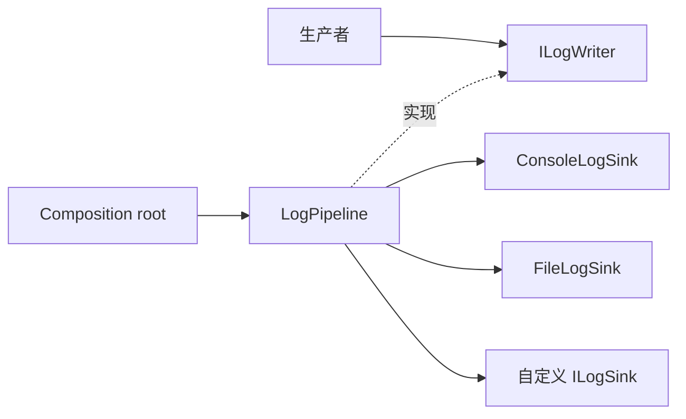

# CycloneGames.Logging.Pipeline

`CycloneGames.Logging.Pipeline` 是 `CycloneGames.Logging` 的 Unity-free 后端包。它提供显式拥有的 `LogPipeline`、有界接纳、过滤、sink dispatch、运行统计、文件与 console sink、断言支持、内存池维护，以及结果明确的确定性关闭流程。

包版本为 `1.0.0`。Runtime assembly 与公共后端 namespace 均为 `CycloneGames.Logging.Pipeline`；该 assembly 只引用 `CycloneGames.Logging.Core`，并保持 `noEngineReferences: true`。

## 在日志包族中的位置



三个核心概念拥有不同的所有权：

| 概念 | 使用方 | 所有权 |
| --- | --- | --- |
| `ILogWriter` | 业务/包代码 | 仅生产者引用；生产者从不 dispose |
| `LogPipeline` | Composition root | 拥有处理状态与所有成功注册的 sink |
| `ILogSink` | 后端 integration | 消费借用的 `LogEvent`；成功注册后所有权转移给 pipeline |

业务包不引用本 assembly。纯 C# 应用 host 可以直接引用它；Unity 应用通常使用 `CycloneGames.Logging.Unity` 作为 composition layer。

Host 需要 ambient 生产者入口时，把自己拥有的 pipeline 安装到 `LogRuntime.Writer`，并在 shutdown 前移除同一实例。

## 快速开始

创建、配置、安装并关闭一个由调用方拥有的 pipeline：

```csharp
using System;
using CycloneGames.Logging;
using CycloneGames.Logging.Pipeline;

var options = new LogPipelineOptions
{
    MaxQueuedMessages = 4096,
    MaxQueuedCharacters = 2 * 1024 * 1024,
    OverflowPolicy = LogQueueOverflowPolicy.DropNewest,
    CriticalSeverity = LogSeverity.Error
};

LogPipeline pipeline = LogPipelineFactory.CreateThreaded(options);
pipeline.MinimumSeverity = LogSeverity.Info;
var consoleSink = new ConsoleLogSink();
LogSinkRegistrationResult consoleRegistration = pipeline.RegisterSink(
    consoleSink,
    LogSinkRegistrationMode.UniqueExactType);
if (!consoleRegistration.IsRegistered)
{
    if (consoleRegistration.CallerRetainsOwnership)
    {
        consoleSink.Dispose();
    }

    pipeline.Shutdown();
    throw new InvalidOperationException("The console sink could not be registered.");
}

if (!LogRuntime.TryInstallWriter(pipeline))
{
    pipeline.Shutdown();
    throw new InvalidOperationException("Another process writer is already installed.");
}

LogChannel log = LogChannel.Create("CycloneGames.Host");
log.Info("Host started.");

LogRuntime.TryResetWriter(pipeline);
LogPipelineShutdownResult result = pipeline.Shutdown(LogFlushMode.Buffered, 2000);
```

Owner 必须检查 `result`。Shutdown 超时意味着仍有未解决的所有权；释放阻塞的 sink 或依赖后应重试。丢弃引用不会完成关闭。

## 处理模型

当处理模型很重要时使用 factory：

| Factory | 投递线程 | Pump 要求 | 典型用途 |
| --- | --- | --- | --- |
| `LogPipelineFactory.CreateThreaded` | 后台 worker dispatch sink | 不要求生产者侧 pump | Desktop、server 与受支持的 mobile host |
| `LogPipelineFactory.CreateSingleThreaded` | `Pump` 所在调用线程 | Owner 定期调用 `Pump(maxItems)` | WebGL 与需要确定性 caller-driven 的 host |

Pipeline 统一通过 `LogPipelineFactory` 创建，因此 composition root 必须显式选择处理模型。`CreateThreaded` 在 WebGL Player 中抛出异常。显式创建的 single-threaded pipeline 在 owner pump 或 shutdown 前不会投递记录。

`ILogSink.Emit` 是同步调用。Threaded 模式从 worker 执行，single-thread 模式从 `Pump` 执行。Sink 必须线程安全、尽快返回，而且不能直接调用 Unity main-thread-only API。跨线程 UI、网络、SDK 或 Unity 工作需要另一个被显式拥有的有界 handoff。

## 接纳、容量与背压

接纳同时受消息数量和保留字符数量限制。Options 还限制消息文本、category、source path、member name、category filter 条目数和 filter 字符数。超限记录字段会按配置截断；统计中可观察 queue 峰值与 drop。

构造 pipeline 时会复制以下重要默认值：

| Option | 默认值 | 含义 |
| --- | ---: | --- |
| `MaxQueuedMessages` | 8192 | Pipeline queue 消息容量 |
| `MaxQueuedCharacters` | 4 Mi characters | Pipeline 保留字符容量 |
| `MaxMessageCharacters` | 16 Ki characters | 单条消息字符限制 |
| `ReservedCriticalMessages` | 64 | 低于 `CriticalSeverity` 的记录不能使用的消息容量 |
| `ReservedCriticalCharacters` | 64 Ki characters | 保留字符容量 |
| `CriticalSeverity` | `Error` | 可以使用保留容量的 severity |
| `EnqueueBlockTimeoutMs` | 1 ms | `Block` 接纳的最大等待时间 |
| `ShutdownDrainTimeoutMs` | 2000 ms | 默认 shutdown 预算 |
| `SinkFailureThreshold` | 3 | 进入隔离前的连续故障次数 |

保留容量可以减少普通记录的竞争，但有限队列无法保证投递。消息数与字符数会同时检查，因此即使其中一个计数仍未达到上限，记录也可能被拒绝。

Overflow 行为：

| Policy | 行为 |
| --- | --- |
| `DropNewest` | 容量不足时拒绝新记录 |
| `DropOldest` | 可能时驱逐符合条件的已排队记录，以接纳新记录 |
| `Block` | 最多等待 `EnqueueBlockTimeoutMs`，然后计为 newest drop |

Critical 记录可以在普通记录不能驱逐时驱逐非 critical 记录。如果所有合格容量都被占用，critical 记录仍可能丢失，并通过独立计数器报告。延迟敏感生产者线程应避免 `Block`。WebGL Player 的 options 校验会拒绝它。

延迟 builder 只在 level、category、active sink、lifecycle 与 queue reservation 全部通过后调用。Builder 抛出的非 `OutOfMemoryException` 会转成有界 failure message，并增加 `MessageBuilderFailureCount`，避免 formatter 异常改变正常生产者控制流。

## 过滤与路由

`MinimumSeverity` 包含阈值本身。`CategoryFilter` 支持：

- `All`：接受所有通过 severity 的 category；
- `AllowList`：只接受 allow list 中精确匹配且忽略大小写的 category；
- `DenyList`：拒绝 deny list 中精确匹配且忽略大小写的 category。

使用 `AddAllowedCategory`、`RemoveAllowedCategory`、`AddDeniedCategory` 和 `RemoveDeniedCategory`。Filter mutation 使用 copy-on-write snapshot，并受 `MaxFilterCategories` 与 `MaxFilterCharacters` 限制。预算耗尽会抛出异常并增加 `RejectedFilterMutationCount`，不会静默无限增长。

没有 active sink 的 pipeline 会把记录视为 disabled，从而避免无投递目标时仍执行延迟格式化和排队。

## Sink 契约与所有权

`ILogSink.Emit(LogEvent)` 接收借用的池化对象。必须在 `Emit` 返回前读取或复制所需字段，不能保留 `LogEvent`、其内部 builder，或任何没有独立所有权的引用。

注册规则：

- `RegisterSink` 是唯一注册入口。默认 `AllowMultiple` 模式允许同一具体类型存在多个 active 实例；`UniqueExactType` 会拒绝同一精确运行时类型的另一个 active 实例。
- 新实例注册成功或同一 active 实例重复注册时，`LogSinkRegistrationResult.IsRegistered` 为 `true`。
- `PipelineOwnsSink` 是所有权判断依据。其为 `true` 时调用方不得 dispose sink；`CallerRetainsOwnership` 为 `true` 时，调用方必须 dispose 或复用该 sink。
- 注册被拒绝时，`RegisterSink` 绝不会隐式 dispose 传入的 sink。可读取 `Status` 区分类型重复、容量不足与 pipeline 正在停止。
- `RemoveSink(sink, quiescenceTimeoutMs) == true` 表示之前的 dispatch 已静止，所有权已转回调用方。Timeout 只允许从零到 `MaxSupportedShutdownDrainTimeoutMs`；非法值会在所有权变化前被拒绝。
- `RemoveSink(sink) == false` 表示调用方不得 dispose 它。
- `ClearSinks` 与 pipeline shutdown 会 retire 并 dispose pipeline-owned sink，不把所有权转回调用方。

Pipeline 最多跟踪 256 个 owned sink，包括等待安全 disposal 的 sink。应保持少量且明确的 sink 集合。

Sink exception 会被隔离并计数；成功 emit 后连续失败计数会重置。达到 `SinkFailureThreshold` 后，该 sink 从未来 dispatch 中移除、进入 quarantine，并安排 disposal。Disposal failure 与 pending disposal work 可单独观察。故障隔离可以保护其他 sink。阻塞 sink 仍会拖慢对应 processor path，并可能造成 queue 压力或 shutdown 超时。

在 owned sink callback 内调用 lifecycle API 会快速失败，不会等待自身 callback：shutdown 返回 `InProgress`，flush 与 removal 返回 `false`，`ClearSinks` 抛出异常。Sink disposal 抛出 `OutOfMemoryException` 时，同步 disposal path 会先释放该批次其余已经接管的 sink，再重新抛出第一个终止故障。

可选 sink capability：

- `IFlushableLogSink.TryFlush` 参与显式 flush 与 shutdown；
- `IIdempotentLogSinkDisposal` 声明 disposal 失败后可以重试。

## 内置 Sink 与持久化

### ConsoleLogSink

`ConsoleLogSink` 向进程 console 写入格式化记录，并在 `Console.Out`/`Console.Error` 能力范围内实现 buffered/durable flush。持久化与保留策略属于应用 owner。必须在目标 service/container 中验证 stdout/stderr 采集与关闭行为。

### FileLogSink

`FileLogSink` 以 UTF-8 without BOM 明文追加写入，创建父目录，允许并发读取，并公开 health 及详细 write、flush、rotation、cleanup 与 recovery 计数。Archive observability 包含累计检查条目数、已删除文件数，以及增量 cleanup 是否仍 pending。每次打开 writer 或执行 recovery 时，都会先重建缺失的父目录，再打开 active file。构造时会校验完整解析后的路径与可移植 leaf file name。

```csharp
var fileSink = new FileLogSink(
    logFilePath,
    new FileLogSinkOptions
    {
        MaintenanceMode = FileMaintenanceMode.Rotate,
        MaxFileBytes = 10L * 1024L * 1024L,
        MaxArchiveFiles = 5,
        FlushBatchSize = 64,
        FlushIntervalMs = 1000,
        DurableFlushOnFatal = true,
        SourcePathMode = LogSourcePathMode.FileName
    });

LogSinkRegistrationResult fileRegistration = pipeline.RegisterSink(
    fileSink,
    LogSinkRegistrationMode.UniqueExactType);
if (!fileRegistration.IsRegistered)
{
    if (fileRegistration.CallerRetainsOwnership)
    {
        fileSink.Dispose();
    }

    throw new InvalidOperationException("The file sink could not be registered.");
}
```

`Rotate` 限制 active file，并只保留符合本 sink archive 命名语法的归档。`WarnOnly` 只报告增长，不限制大小；`None` 不执行大小维护。`MaxArchiveFiles == 0` 会在 rotation 后删除 owned archive。Archive retention 采用增量维护：每次 maintenance 最多扫描 64 个顶层目录项、删除 16 个严格 owned archive，并使用固定容量候选存储，不会实例化或排序整个目录。Rotation 不会重新开始 active scan，而是标记后续 pass，因此持续 rotation 不会饿死 cursor 推进。在目录趋于稳定且文件系统允许删除后，持续执行 pipeline maintenance——threaded processor loop，或 single-threaded mode 下由调用方执行 `Pump`——会最终收敛到 `MaxArchiveFiles`。如果 sink 由调用方直接持有且没有注册到 pipeline，调用方必须定期调用 `FileLogSink.PerformMaintenance()`，才能获得相同的推进与 idle-flush 行为。这些操作次数预算限制了锁内工作量与内存，但不能限制单次文件系统调用的延迟。Rotation 与 retention 不构成应用全局存储配额。

Maintenance 还会检测 writer 仍打开但 active path 被外部 unlink 的情况：关闭不可达 handle、重建路径，并记录 degraded recovery。外部 unlink 到下一次 maintenance 之间写入的记录可能不可达，因此产品不能把外部删除当作正常 rotation 机制。

Open/write failure 会使 sink 进入 degraded 或 faulted，并通过 `FileLogSinkStatistics` 报告；recovery attempt 有速率限制。`TryFlush(LogFlushMode.Durable)` 会在 runtime 支持时请求操作系统 durable flush，但存储硬件与平台保证不属于本 API 契约。

`FileLogSink.IsSupported` 在 WebGL Player 中为 `false`，构造也会抛出异常。在其他平台，它只表示代码路径已编译，不证明 permission、free space、quota、durability 或 storage health。

日志是明文，可能包含 source location 或应用数据。敏感信息必须在到达 pipeline 前脱敏；需要时选择 `LogSourcePathMode.None` 或 `FileName`；在 sink 外部定义 retention，并在目标 sandbox 中测试删除与恢复。

## 监控与内存维护

`ILogPipelineMonitor` 通过 `IsFaulted` 与 `GetStatistics()` 提供观察能力，不授予 lifecycle authority。`LogPipelineStatistics` 包含 queued/reserved/in-flight 与峰值、保留字符、enqueue/process/drop 总数、critical drop、stop 后拒绝、sink failure/quarantine/disposal、filter budget、timestamp provider failure 与 builder failure。

`LogMemoryPools.GetStatistics()` 报告进程级 idle `LogEvent` 与 `StringBuilder` cache。`LogMemoryPools.TrimStep(targetEvents, targetBuilders, maxWork)` 最多按调用方预算释放 idle pool，不删除 queued 或 in-flight 记录。该接口适合可选 MemoryGovernance integration，因为它只提供监控与有界 idle 维护，不转移 pipeline 所有权。

这些统计是诊断信息，不是完整 heap profile；它们不包含 caller-owned string、sink buffer、操作系统 buffer 与许多 runtime allocation。

## 断言

`LogAssertionService` 是显式构造的 `ILogAssertion` 实现。`LogAssertionOptions` 选择 `LogOnly`、`Throw` 或 `LogAndThrow`，并设置失败 severity/category 以及 throw 前是否 flush。需要断言策略的位置注入该 service，不要把它当作全局运行时断言单例。

断言日志仍受 writer 与 pipeline limit 约束。请求的 pre-throw flush 可能失败或超时，不能理解为 durability guarantee。

## 关闭与故障恢复

Owner 按以下顺序关闭：

1. 停止或重定向生产者；
2. 如果 pipeline 安装在 `LogRuntime.Writer`，移除同一实例；
3. 调用 `Shutdown(flushMode, timeoutMs)`；
4. 检查 `LogPipelineShutdownResult`；
5. 如果结果未完成，保留实例并重试。

Shutdown 会停止接纳，在预算内 drain processor，flush 具备能力的 sink，等待 dispatch/disposal 静止，dispose owned sink，并返回 `Completed`、`CompletedWithDrops`、`CompletedWithFailures`、`TimedOut` 或 `InProgress`。完成后的重复调用会返回缓存的终止结果。`Dispose` 会调用默认 shutdown，但不能把未完成结果变成成功；可靠性重要时应显式 shutdown。

Public flush 与 shutdown 入口会在 drain、retire 或修改 sink ownership 前校验 `LogFlushMode` 与有界 timeout。`-1` 表示使用已配置 shutdown budget；其他合法值为零到 `MaxSupportedShutdownDrainTimeoutMs`。

Processing 或 sink callback 抛出的 `OutOfMemoryException` 是 pipeline 终止故障。第一个故障会被保留，通过 producer call 与 `IsFaulted` 持续可观察，并让已完成的 shutdown 返回 `CompletedWithFailures`。该 fail-stop 策略避免在 capacity 或 ownership state 可能损坏后静默继续；composition root 应停止 producer，等待旧 owner 完成 shutdown 后再替换 pipeline。

`Buffered` 请求 sink 刷新 managed buffer；`Durable` 还请求具备能力的 sink 执行操作系统 durable flush。两者都不能保证抵抗强制进程终止、断电、不支持的存储语义或不配合的自定义 sink。

自定义 timestamp provider 抛出非 `OutOfMemoryException` 后会在第一次失败时被隔离，增加 `TimestampProviderFailureCount`，并在该 pipeline 剩余生命周期内回退到 `DateTime.UtcNow`。

## 性能、AOT 与平台范围

设计使用有界 array/queue、copy-on-write routing snapshot、延迟 builder、generic-state overload 与有界 idle pool。Sink formatting、I/O、console rendering、cache miss、exception、builder growth 与 caller-created string 仍可能分配或阻塞。

Assembly 不使用 Unity API、反射发现、动态代码生成或 unsafe code。从静态分析上支持面向 AOT 的使用。编译期 WebGL 分支移除 worker-thread 与 file-sink path。IL2CPP、stripping、真实线程可用性、文件系统行为、console capture 与性能仍需要目标 build 和代表性硬件验证。

## Integration 检查清单

- 业务 assembly 只引用 `CycloneGames.Logging.Core`，代码使用 `CycloneGames.Logging` 生产者 namespace。
- 纯 C# host 引用 `CycloneGames.Logging.Pipeline`，并保留具体 `LogPipeline` owner。
- Unity host 引用 `CycloneGames.Logging.Unity`，由其组合本包。
- 依赖可选 SDK 的自定义 sink 放入专用 integration assembly。
- Remote/network sink 拥有自己的有界队列、byte budget、timeout、retry/backoff、redaction 与 shutdown policy；不在 `Emit` 中执行无界或阻塞工作。
- 选择本包不需要 PlayerSettings symbol。

## 验证

最小验证：

1. 在 `noEngineReferences: true` 下编译 `CycloneGames.Logging.Pipeline`。
2. 运行 `CycloneGames.Logging.Pipeline.Tests.Editor`。
3. 运行 `CycloneGames.Logging.Pipeline.Tests.Performance` 作为回归证据，而不是 Player benchmark。
4. 对所有 overflow policy 测试 count 与 character 饱和，并验证 drop counter。
5. 测试 sink exception quarantine、移除后的 ownership transfer、flush failure、disposal failure，以及可重试的 timeout shutdown。
6. 在每个 shipping platform 测试文件 append、rotation、archive cleanup、recovery、permission failure、低空间/quota 与 durable-flush reporting。
7. 构建并运行由调用方 pump、且不使用文件输出的 WebGL。
8. 使用真实 sink set 与 workload，在代表性 Mono 与 IL2CPP Player 中 profile。

目标设备性能、AOT 行为、durability 与平台认证需要在代表性 build 中验证。
