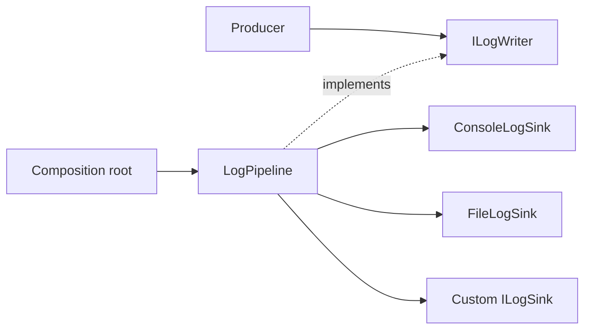

# CycloneGames.Logging.Pipeline

`CycloneGames.Logging.Pipeline` is the Unity-free backend package for `CycloneGames.Logging`. It provides an explicitly owned `LogPipeline`, bounded admission, filtering, sink dispatch, operational statistics, file and console sinks, assertion support, memory-pool maintenance, and deterministic shutdown results.

The package version is `1.0.0`. Its runtime assembly and public backend namespace are both `CycloneGames.Logging.Pipeline`; the assembly references only `CycloneGames.Logging.Core` and keeps `noEngineReferences: true`.

## Position in the logging family



The three central concepts have distinct ownership:

| Concept | Used by | Ownership |
| --- | --- | --- |
| `ILogWriter` | Business/package code | Producer-only reference; never disposed by the producer |
| `LogPipeline` | Composition root | Owns processing state and every successfully registered sink |
| `ILogSink` | Backend integration | Borrowed `LogEvent` consumer; ownership transfers to the pipeline after successful registration |

Business packages do not reference this assembly. A pure C# application host may reference it directly. A Unity application normally uses `CycloneGames.Logging.Unity` as the composition layer.

A host wanting ambient producer access installs its owned pipeline into `LogRuntime.Writer` and removes that exact instance before shutdown.

## Quick start

Create, configure, install, and shut down one owned pipeline:

```csharp
using System;
using CycloneGames.Logging;
using CycloneGames.Logging.Pipeline;

var options = new LogPipelineOptions
{
    MaxQueuedMessages = 4096,
    MaxQueuedCharacters = 2 * 1024 * 1024,
    OverflowPolicy = LogQueueOverflowPolicy.DropNewest,
    CriticalSeverity = LogSeverity.Error
};

LogPipeline pipeline = LogPipelineFactory.CreateThreaded(options);
pipeline.MinimumSeverity = LogSeverity.Info;
var consoleSink = new ConsoleLogSink();
LogSinkRegistrationResult consoleRegistration = pipeline.RegisterSink(
    consoleSink,
    LogSinkRegistrationMode.UniqueExactType);
if (!consoleRegistration.IsRegistered)
{
    if (consoleRegistration.CallerRetainsOwnership)
    {
        consoleSink.Dispose();
    }

    pipeline.Shutdown();
    throw new InvalidOperationException("The console sink could not be registered.");
}

if (!LogRuntime.TryInstallWriter(pipeline))
{
    pipeline.Shutdown();
    throw new InvalidOperationException("Another process writer is already installed.");
}

LogChannel log = LogChannel.Create("CycloneGames.Host");
log.Info("Host started.");

LogRuntime.TryResetWriter(pipeline);
LogPipelineShutdownResult result = pipeline.Shutdown(LogFlushMode.Buffered, 2000);
```

The owner must inspect `result`. A timed-out shutdown retains unresolved ownership and should be retried after releasing the blocked sink or dependency; dropping the reference does not complete shutdown.

## Processing models

Use a factory when the processing model matters:

| Factory | Delivery thread | Pump requirement | Typical use |
| --- | --- | --- | --- |
| `LogPipelineFactory.CreateThreaded` | Background worker dispatches sinks | No producer-side pump required | Desktop, server, and supported mobile hosts |
| `LogPipelineFactory.CreateSingleThreaded` | Calling thread during `Pump` | Owner calls `Pump(maxItems)` regularly | WebGL and deterministic caller-driven hosts |

Creation goes through `LogPipelineFactory`, so the processing model is explicit at the composition root. `CreateThreaded` throws in WebGL Player builds. An explicitly single-threaded pipeline does not deliver records until the owner pumps or shuts it down.

`ILogSink.Emit` is synchronous. In threaded mode it runs on the worker; in single-thread mode it runs from `Pump`. A sink must be thread-safe, return promptly, and never call a Unity main-thread-only API directly. Cross-thread UI, network, SDK, or Unity work requires a separately owned bounded handoff.

## Admission, capacity, and backpressure

Admission is bounded by both message count and retained character count. Options also bound message text, category, source path, member name, category-filter entries, and filter characters. Oversized record fields are truncated to configured limits; statistics expose queue peaks and drops.

Important defaults are copied into each pipeline during construction:

| Option | Default | Meaning |
| --- | ---: | --- |
| `MaxQueuedMessages` | 8192 | Pipeline queue message capacity |
| `MaxQueuedCharacters` | 4 Mi characters | Pipeline retained-character capacity |
| `MaxMessageCharacters` | 16 Ki characters | Per-record message limit |
| `ReservedCriticalMessages` | 64 | Capacity unavailable to records below `CriticalSeverity` |
| `ReservedCriticalCharacters` | 64 Ki characters | Reserved character capacity |
| `CriticalSeverity` | `Error` | Severity allowed to use reserved capacity |
| `EnqueueBlockTimeoutMs` | 1 ms | Maximum wait for `Block` admission |
| `ShutdownDrainTimeoutMs` | 2000 ms | Default shutdown budget |
| `SinkFailureThreshold` | 3 | Consecutive failures before quarantine |

Reserved capacity reduces competition from ordinary records. A finite queue cannot guarantee delivery. Count and character limits are enforced together, so a queue may reject a record even when one count alone appears below its limit.

Overflow behavior:

| Policy | Behavior |
| --- | --- |
| `DropNewest` | Reject the incoming record when capacity is unavailable |
| `DropOldest` | Evict an eligible queued record to admit the incoming record when possible |
| `Block` | Wait up to `EnqueueBlockTimeoutMs`, then record a newest drop |

Critical records may evict non-critical queued records even when ordinary records cannot. If all eligible capacity is occupied, critical records can still be dropped and are counted separately. Avoid `Block` on latency-sensitive producer threads. It is rejected by validated options in WebGL Player builds.

The deferred builder is invoked only after level, category, active-sink, lifecycle, and queue-reservation checks succeed. A builder failure other than `OutOfMemoryException` becomes a bounded failure message and increments `MessageBuilderFailureCount`. This preserves diagnostics without allowing a formatter exception to escape normal producer control flow.

## Filtering and routing

`MinimumSeverity` is inclusive. `CategoryFilter` supports:

- `All`: accept every category that passes severity;
- `AllowList`: accept exact, case-insensitive categories present in the allow list;
- `DenyList`: reject exact, case-insensitive categories present in the deny list.

Use `AddAllowedCategory`, `RemoveAllowedCategory`, `AddDeniedCategory`, and `RemoveDeniedCategory`. Filter mutations use copy-on-write snapshots and enforce `MaxFilterCategories` plus `MaxFilterCharacters`. Exhausting the filter budget throws and increments `RejectedFilterMutationCount`; it does not silently grow memory.

A pipeline with no active sink reports records as disabled. This prevents deferred formatting and queue work when there is nowhere to deliver a record.

## Sink contract and ownership

`ILogSink.Emit(LogEvent)` receives a borrowed pooled object. Read or copy required fields before `Emit` returns. Never retain the `LogEvent`, its internal builder, or references whose lifetime is not independently owned.

Registration rules:

- `RegisterSink` is the only registration entry point. The default `AllowMultiple` mode accepts multiple active instances of the same concrete type; `UniqueExactType` rejects a different active instance of the same exact runtime type.
- `LogSinkRegistrationResult.IsRegistered` is `true` for a newly registered sink and an idempotent registration of the same active instance.
- `PipelineOwnsSink` is authoritative. When it is true, the caller must not dispose the sink. When `CallerRetainsOwnership` is true, the caller must dispose or reuse the sink.
- A rejected registration never disposes the supplied sink as a side effect. Inspect `Status` to distinguish duplicate type, capacity, and stopping rejections.
- `RemoveSink(sink, quiescenceTimeoutMs) == true` means prior dispatches are quiescent and ownership transferred back to the caller. The timeout is bounded from zero through `MaxSupportedShutdownDrainTimeoutMs`; an invalid value is rejected before ownership changes.
- `RemoveSink(sink) == false` means the caller must not dispose it.
- `ClearSinks` and pipeline shutdown retire and dispose pipeline-owned sinks; they do not transfer ownership back.

The pipeline stores at most 256 owned sinks, including sinks awaiting safe disposal. Prefer a small intentional sink set.

Sink exceptions are contained and counted. Consecutive failures reset after a successful emit. Once `SinkFailureThreshold` is reached, the sink is removed from future dispatch, quarantined, and scheduled for disposal. Disposal failures and pending disposal work are separately observable. Fault isolation protects other sinks. Blocking sinks still delay their processor path and can contribute to queue pressure or shutdown timeout.

Lifecycle calls from inside an owned sink callback fail fast instead of waiting on their own callback: shutdown reports `InProgress`, flush and removal return `false`, and `ClearSinks` throws. If sink disposal raises `OutOfMemoryException`, synchronous disposal paths finish releasing the rest of the already-owned disposal batch before rethrowing the first terminal failure.

Optional sink capabilities:

- `IFlushableLogSink.TryFlush` participates in explicit flush and shutdown;
- `IIdempotentLogSinkDisposal` declares that disposal may be retried after a failed attempt.

## Built-in sinks and persistence

### ConsoleLogSink

`ConsoleLogSink` writes formatted records to the process console and implements buffered/durable flush as the capabilities available from `Console.Out` and `Console.Error`. Persistence and retention belong to the application. Verify stdout/stderr capture and shutdown behavior in the target service or container.

### FileLogSink

`FileLogSink` appends plaintext UTF-8 without BOM, creates the parent directory, allows concurrent readers, and exposes health plus detailed write, flush, rotation, cleanup, and recovery counters. Archive observability includes lifetime entries inspected, files deleted, and whether incremental cleanup remains pending. Every writer open or recovery recreates a missing parent directory before opening the active file. Construction validates a fully resolved path and a portable leaf file name.

```csharp
var fileSink = new FileLogSink(
    logFilePath,
    new FileLogSinkOptions
    {
        MaintenanceMode = FileMaintenanceMode.Rotate,
        MaxFileBytes = 10L * 1024L * 1024L,
        MaxArchiveFiles = 5,
        FlushBatchSize = 64,
        FlushIntervalMs = 1000,
        DurableFlushOnFatal = true,
        SourcePathMode = LogSourcePathMode.FileName
    });

LogSinkRegistrationResult fileRegistration = pipeline.RegisterSink(
    fileSink,
    LogSinkRegistrationMode.UniqueExactType);
if (!fileRegistration.IsRegistered)
{
    if (fileRegistration.CallerRetainsOwnership)
    {
        fileSink.Dispose();
    }

    throw new InvalidOperationException("The file sink could not be registered.");
}
```

`Rotate` bounds the active file and retains only archives matching this sink's archive-name grammar. `WarnOnly` reports growth but does not bound it. `None` performs no size maintenance. `MaxArchiveFiles == 0` removes owned archives after rotation. Archive retention is incremental: each maintenance call scans at most 64 top-level directory entries and deletes at most 16 strictly owned archives, using fixed-size candidate storage instead of materializing or sorting the directory. A rotation never restarts an active scan; it marks a follow-up pass so continuous rotation cannot starve cursor progress. Continued pipeline maintenance--the threaded processor loop, or caller `Pump` calls in single-threaded mode--converges to `MaxArchiveFiles` when the directory becomes stable and the filesystem permits deletion. A directly owned sink that is not registered with a pipeline must call `FileLogSink.PerformMaintenance()` periodically for the same progress and idle-flush behavior. These operation-count budgets bound lock-held work and memory, but cannot bound individual filesystem-call latency. Rotation and retention do not establish an application-wide storage quota.

Maintenance also detects an active path that was externally unlinked while the writer remained open, closes the unreachable handle, recreates the path, and records a degraded recovery. Records written between the external unlink and the next maintenance step may be unreachable, so products must not use external deletion as their normal rotation mechanism.

Open/write failures degrade or fault the sink and are reported through `FileLogSinkStatistics`; recovery attempts are rate-limited. `TryFlush(LogFlushMode.Durable)` requests an operating-system durable flush where the runtime supports it, but storage hardware and platform guarantees remain outside this API.

`FileLogSink.IsSupported` is `false` in WebGL Player builds and construction throws there. On every other platform it only indicates that the code path is compiled; it does not prove permission, free space, quota, durability, or storage health.

Logs are plaintext and may include source locations or application data. Redact secrets before they reach the pipeline, select `LogSourcePathMode.None` or `FileName` when appropriate, define retention outside the sink, and test deletion/recovery under the target sandbox.

## Monitoring and memory maintenance

`ILogPipelineMonitor` exposes `IsFaulted` and `GetStatistics()` without lifecycle authority. `LogPipelineStatistics` includes queued/reserved/in-flight and peak counts, retained characters, enqueue/process/drop totals, critical drops, after-stop rejection, sink failure/quarantine/disposal, filter budget, timestamp-provider failure, and builder failure.

`LogMemoryPools.GetStatistics()` reports the process-wide idle `LogEvent` and `StringBuilder` caches. `LogMemoryPools.TrimStep(targetEvents, targetBuilders, maxWork)` releases at most the caller budget from idle pools. It never removes queued or in-flight records. This surface is suitable for an optional MemoryGovernance integration because it grants monitoring and bounded idle maintenance without transferring pipeline ownership.

Statistics are diagnostics, not a complete heap profile. They exclude caller-owned strings, sink buffers, operating-system buffers, and many runtime allocations.

## Assertions

`LogAssertionService` is an explicitly constructed `ILogAssertion` implementation. `LogAssertionOptions` selects `LogOnly`, `Throw`, or `LogAndThrow`, the failure severity/category, and whether to flush before throwing. Inject the service where assertion policy is required; do not treat it as a global runtime assertion singleton.

Assertion logging still follows the configured writer and pipeline limits. A requested pre-throw flush can fail or time out and must not be interpreted as a durability guarantee.

## Shutdown and fault recovery

The owner shuts down in this order:

1. stop or redirect producers;
2. remove the exact pipeline from `LogRuntime.Writer` if it was installed there;
3. call `Shutdown(flushMode, timeoutMs)`;
4. inspect `LogPipelineShutdownResult`;
5. retain and retry the instance if the result is not complete.

Shutdown stops admission, drains the processor within the budget, flushes capable sinks, waits for dispatch/disposal quiescence, disposes owned sinks, and reports one of `Completed`, `CompletedWithDrops`, `CompletedWithFailures`, `TimedOut`, or `InProgress`. Repeated calls after completion return the cached terminal result. `Dispose` invokes default shutdown but cannot turn an incomplete result into success; explicit shutdown is preferred when reliability matters.

Public flush and shutdown entry points validate `LogFlushMode` and their bounded timeout before draining, retiring, or changing sink ownership. `-1` selects the configured shutdown budget; other accepted values range from zero through `MaxSupportedShutdownDrainTimeoutMs`.

`OutOfMemoryException` from processing or sink callbacks is a terminal pipeline fault. The first failure is retained, remains observable through producer calls and `IsFaulted`, and makes a completed shutdown report `CompletedWithFailures`. This fail-stop policy avoids silently continuing with potentially corrupted capacity or ownership state; the composition root should stop producers and replace the pipeline only after the old owner has completed shutdown.

`Buffered` asks sinks to flush managed buffers. `Durable` additionally asks capable sinks for an operating-system durable flush. Neither mode can guarantee survival of forced process termination, power loss, unsupported storage semantics, or an uncooperative custom sink.

A custom timestamp provider that throws a non-`OutOfMemoryException` is quarantined after its first failure, increments `TimestampProviderFailureCount`, and falls back to `DateTime.UtcNow` for the rest of that pipeline's lifetime.

## Performance, AOT, and platform scope

The design uses bounded arrays/queues, copy-on-write routing snapshots, deferred builders, generic-state overloads, and bounded idle pools. Sink formatting, I/O, console rendering, cache misses, exceptions, builder growth, and caller-created strings can allocate or block.

The assembly contains no Unity API, reflection discovery, dynamic code generation, or unsafe code. Static analysis supports AOT-oriented use. The compile-time WebGL branch removes worker-thread and file-sink paths. IL2CPP, stripping, actual thread availability, filesystem behavior, console capture, and performance still require target builds and representative hardware.

## Integration checklist

- Business assemblies reference only `CycloneGames.Logging.Core` and use the `CycloneGames.Logging` producer namespace.
- A pure C# host references `CycloneGames.Logging.Pipeline` and retains the concrete `LogPipeline` owner.
- A Unity host references `CycloneGames.Logging.Unity`, which composes this package.
- Custom sinks are placed in a dedicated integration assembly when they depend on an optional SDK.
- Remote/network sinks add their own bounded queue, byte budget, timeout, retry/backoff, redaction, and shutdown policy; they do not perform unbounded or blocking work inside `Emit`.
- No PlayerSettings symbol is required to select this package.

## Validation

Minimum validation:

1. Compile `CycloneGames.Logging.Pipeline` with `noEngineReferences: true`.
2. Run `CycloneGames.Logging.Pipeline.Tests.Editor`.
3. Run `CycloneGames.Logging.Pipeline.Tests.Performance` as regression evidence, not as a Player benchmark.
4. Test count and character saturation for all overflow policies and verify drop counters.
5. Test sink exception quarantine, removal ownership transfer, flush failure, disposal failure, and retryable timeout shutdown.
6. Test file append, rotation, archive cleanup, recovery, permission failure, low-space/quota behavior, and durable-flush reporting on each shipping platform.
7. Build and run WebGL with caller pumping and without file output.
8. Profile representative Mono and IL2CPP Players with the real sink set and workload.

Target-device performance, AOT behavior, durability, and platform certification require representative build validation.
