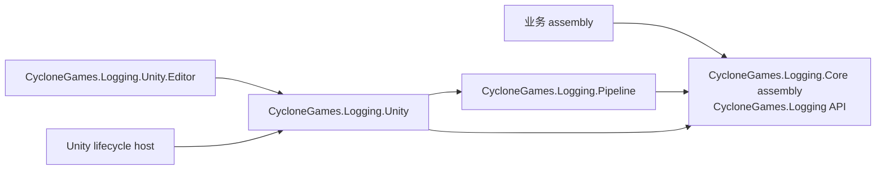
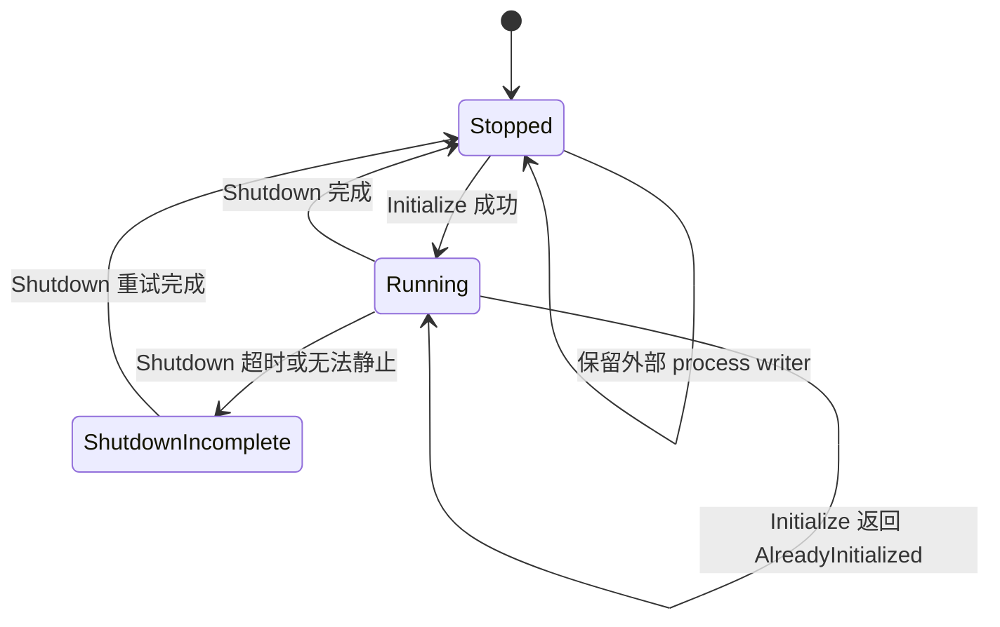

# CycloneGames.Logging.Unity

`CycloneGames.Logging.Unity` 是 Unity-free 日志契约与 Pipeline 的 Unity composition 包。它拥有 Unity 生命周期接入、`LoggingSettings` authoring、Unity Console 投递、Editor 工具、构建期 settings override 与示例。

包版本为 `1.0.0`。它依赖 `com.cyclone-games.logging` 与 `com.cyclone-games.logging.pipeline`，版本均为 `1.0.0`。业务包仍然只依赖 `com.cyclone-games.logging`；本包属于应用 composition root。

## 包边界



| Assembly | 职责 | Unity 范围 |
| --- | --- | --- |
| `CycloneGames.Logging.Unity` | Runtime settings、bootstrap、hidden host 与 Unity Console sink | Runtime 与 Editor |
| `CycloneGames.Logging.Unity.Editor` | Inspector、Edit Mode owner、build processor 与 Console hyperlink support | 仅 Editor |
| `CycloneGames.Logging.Unity.Samples` | 教学与本地诊断 | 可选，`autoReferenced: false` |
| `CycloneGames.Logging.Unity.Tests.Editor` | 聚焦 EditMode 测试 | 仅 Editor test |

`LogRuntime.Writer` 仍是唯一 ambient writer 槽位。`LoggingBootstrap` 是其创建 pipeline 的 owner，不是另一套生产者 API 或静态 pipeline accessor。Package 与业务代码始终通过 `LogChannel`/`ILogWriter` 写入。

## 设置

1. 确保三个日志包都以 `1.0.0` 版本存在。
2. 在 Unity 中选择 `Tools/CycloneGames/Logging/Create Default Settings`。
3. 编辑生成的 canonical asset：

   `Assets/Resources/CycloneGames.Logging.Unity/LoggingSettings.asset`

4. 让 automatic bootstrap 在首个 scene 前运行，或在 Unity main thread 显式调用 `LoggingBootstrap.Initialize(settings)`。
5. 业务 assembly 通过各自 package-local `LogChannel` facade 写入记录。

Resources key 如下：

| 用途 | Resources key | Asset path |
| --- | --- | --- |
| Canonical settings | `CycloneGames.Logging.Unity/LoggingSettings` | `Assets/Resources/CycloneGames.Logging.Unity/LoggingSettings.asset` |
| Player build override | `CycloneGames.Logging.Unity/LoggingSettingsBuildOverride` | `Assets/Generated/CycloneGames.Logging.Unity/Resources/CycloneGames.Logging.Unity/LoggingSettingsBuildOverride.asset` |

Canonical asset 不存在时，bootstrap 使用 package defaults。直接传入的 `LoggingSettings` object 优先于 Resources 加载。Runtime state 在初始化时从 asset 复制，之后不会写回。

## Settings 模型

`LoggingSettings` 是 `LogPipelineOptions` 与 sink options 的 Unity authoring bridge。

### 处理

| 分组 | 字段 | 契约 |
| --- | --- | --- |
| Execution | `executionMode` | `Automatic`、`Threaded` 或 `SingleThreaded`；WebGL Player 始终 single-threaded |
| Pipeline capacity | `maxQueuedMessages`、`maxQueuedCharacters` | 按消息数与保留字符数限制 Pipeline queue |
| Record limits | `maxMessageCharacters`、`maxCategoryCharacters`、`maxSourcePathCharacters`、`maxMemberNameCharacters` | 限制复制的 record 数据 |
| Filter budget | `maxFilterCategories`、`maxFilterCharacters` | 限制 allow/deny snapshot |
| Critical reserve | `reservedCriticalMessages`、`reservedCriticalCharacters`、`criticalSeverity` | 减少普通记录竞争，不保证投递 |
| Backpressure | `overflowPolicy`、`enqueueBlockTimeoutMs` | Pipeline `DropNewest`、`DropOldest` 或有界 `Block` 行为 |
| Lifecycle | `shutdownDrainTimeoutMs`、`maintenanceIntervalMs`、`sinkFailureThreshold` | Shutdown 预算、maintenance 频率与 quarantine 阈值 |

### Sink 注册

- `registerUnityConsoleLogSink` 使用有界 worker-to-main-thread handoff 并投递到 Unity Console。
- `registerConsoleLogSink` 写入进程 console，适合捕获 stdout/stderr 的 host。
- `registerFileLogSink` 根据 path、rotation、flush 与 source-path policy 创建 `FileLogSink`。

必须至少成功注册一个 sink，否则初始化返回 `NoSinksConfigured`。File sink 构造失败会被隔离；只要其他配置的 sink 成功注册，bootstrap 仍可继续运行。

### 文件输出

当 `usePersistentDataPath == true` 时，`fileName` 必须是可移植 leaf name，解析后的路径必须直接位于 `Application.persistentDataPath` 下。默认值为：

`Application.persistentDataPath/App.log`

自定义位置需要同时满足：

- `usePersistentDataPath == false`；
- `allowCustomFilePath == true`；
- `customFilePath` 非空且为 fully qualified absolute path；
- 已验证目标平台 permission、quota、retention、privacy 与 cleanup。

`fileSourcePathMode` 控制 source path 暴露。`FileName` 是保护隐私的默认值；`None` 移除路径，`FullPath` 可能暴露构建机器或源码布局信息。

### 过滤

`minimumSeverity` 包含阈值本身。`categoryFilter` 选择 `All`、精确且忽略大小写的 `AllowList`，或精确且忽略大小写的 `DenyList`。Settings asset 只选择模式；allow/deny 条目属于 runtime pipeline state，需要时由 owning composition code 添加。

## Bootstrap 生命周期与所有权

Unity 生命周期遵循以下状态：



1. `SubsystemRegistration` 重置静态状态。如果之前 owned pipeline 无法完成 shutdown，就保留所有权并阻止新初始化。
2. `BeforeSceneLoad` 自动调用 `LoggingBootstrap.Initialize()`。Unity runtime initializer 内部处理失败报告，不让初始化异常逃出该 callback。
3. 初始化创建 pipeline、配置 Unity handoff、注册 sink、应用 filter、创建 hidden runtime host，最后才尝试把 pipeline 安装到 `LogRuntime.Writer`。
4. 如果另一个 owner 赢得 writer install race，bootstrap 保留该 writer，并 rollback 自己的 pipeline。
5. Hidden host 在 `Update` 中 pump single-thread processing 与 Unity Console handoff。
6. Pause 请求 50 ms buffered pipeline flush，并最多用 20 ms drain Unity handoff。
7. Player quit 使用配置的 pipeline budget 执行一次 owned shutdown，进入 terminal quitting state，并最多用 50 ms drain Unity handoff。

`Initialize`、`Reinitialize` 与 `Shutdown` 必须在 Unity main thread 调用。返回结果属于正式契约：

| Status | 含义 |
| --- | --- |
| `Initialized` | 新的 owned pipeline 已安装 |
| `AlreadyInitialized` | 现有 package-owned pipeline 继续运行 |
| `NoSinksConfigured` | 没有 sink 成功注册，未安装 process writer |
| `ShutdownFailed` | 之前 owned pipeline 未安全停止；保留所有权等待重试 |
| `ExistingProcessWriterNotOwned` | 另一个 composition root 拥有 `LogRuntime.Writer`；保持不变 |

`Reinitialize` 会先关闭当前 owner；旧 pipeline 未完成时不会创建替代实例。`Shutdown` 只移除 bootstrap 安装的同一 writer，再 drain 并释放其 owned pipeline。Timeout 会进入可恢复的 `ShutdownIncomplete` 状态；释放阻塞依赖后再次调用 `Shutdown` 或 `Reinitialize`。

显式构造的 `UnityConsoleLogSink` 在成功注册到 pipeline 前由调用方拥有。它的 host/queue lifetime 独立于 package bootstrap，因此必须由调用方或 owning pipeline dispose。

## 两级有界队列

Unity Console 投递包含两个容量边界：


Pipeline queue 使用 `maxQueuedMessages`、`maxQueuedCharacters`、字段预算、reserved critical capacity、`overflowPolicy` 与 `enqueueBlockTimeoutMs`。

Unity handoff 独立使用 `unityConsoleMaxQueuedMessages`、`unityConsoleMaxQueuedCharacters` 与 `unityConsoleOverflowPolicy`，并把 queued、reserved 与 in-flight 的消息和字符都计入容量。Unity delivery 不能阻塞 producer/worker thread，因此 handoff 只支持 `DropNewest` 与 `DropOldest`。

这些 handoff 值会复制到 `UnityConsoleLogSinkOptions`，不属于 Unity-free `LogPipelineOptions`。直接构造的 Unity sink 会在分配或修改 main-thread queue 前校验自身有界 options。

容量耗尽、格式化条目过大、generation 失效、shutdown 或 reservation 不匹配都可能丢弃 Unity handoff record。`UnityConsoleLogSink.GetStatistics()` 公开 current/reserved/in-flight/peak 数量与字符、总 drop、critical drop，以及 reset 时 abandoned 的条目。

Hidden host 每次 update 最多处理 256 项，pipeline pump budget 为一毫秒，Unity handoff budget 为两毫秒。这些是有界工作控制，不是延迟或投递保证。调整容量前应同时检查 `LogPipeline.GetStatistics()` 与 `UnityConsoleLogSink.GetStatistics()`。

如果 pipeline 在 worker 上记录终止故障，host 会在下一次 main-thread pump 中观察并重新抛出一次，然后只对该 pipeline 禁用自动 pump，避免逐帧异常循环。Composition owner 仍负责 shutdown 与 replacement。

## Unity Console 与 Editor 行为

`UnityConsoleLogSink` 把借用的 `LogEvent` 复制进有界 handoff，再在 Unity main thread 格式化并输出。记录包含 severity、category、message，以及可用时的 source location。

Editor 中的有界 source-link registry 会把显示路径与行号映射回原始调用路径。Editor bridge 会尝试更丰富的 Console path；Unity 内部 Editor 行为不可用时，回退到 Unity public Console API。反射仅存在于 Editor assembly，不属于 Player runtime code。

Edit Mode composition root 在 Editor load 后延迟初始化，通过 `EditorApplication.update` pump；进入 Play Mode、assembly reload 或 Editor quit 前关闭，并在返回 Edit Mode 后建立新 owner。它不会替换外部拥有的 process writer。

## 构建期覆盖

Build override 只由 Editor build preprocessor 解析，不是 Player runtime command-line setting。

应用顺序为：

```text
canonical settings（不存在则使用 ScriptableObject defaults）
→ optional profile asset
→ optional build mode
→ individual field overrides
```

Environment variable 先解析，command-line argument 后解析。同一个 option 同时存在时，command line 胜出。不同 option 仍按层应用：例如 environment 中的 individual field override 会在 command-line profile 之后应用，因为 profile 与 individual field 属于不同层。

| Environment | Command line |
| --- | --- |
| `CG_LOGGING_SETTINGS` | `-loggingSettings` |
| `CG_LOGGING_MODE` | `-loggingMode` |
| `CG_LOGGING_UNITY` | `-loggingUnity` |
| `CG_LOGGING_CONSOLE` | `-loggingConsole` |
| `CG_LOGGING_FILE` | `-loggingFile` |
| `CG_LOGGING_USE_PERSISTENT_DATA_PATH` | `-loggingUsePersistentDataPath` |
| `CG_LOGGING_FILE_NAME` | `-loggingFileName` |
| `CG_LOGGING_CUSTOM_FILE_PATH` | `-loggingCustomFilePath` |
| `CG_LOGGING_MINIMUM_SEVERITY` | `-loggingMinimumSeverity` |
| `CG_LOGGING_CATEGORY_FILTER` | `-loggingCategoryFilter` |
| `CG_LOGGING_EXECUTION_MODE` | `-loggingExecutionMode` |
| `CG_LOGGING_MAX_QUEUED_MESSAGES` | `-loggingMaxQueuedMessages` |
| `CG_LOGGING_UNITY_CONSOLE_MAX_QUEUED_MESSAGES` | `-loggingUnityConsoleMaxQueuedMessages` |
| `CG_LOGGING_SHUTDOWN_DRAIN_TIMEOUT_MS` | `-loggingShutdownDrainTimeoutMs` |
| `CG_LOGGING_OVERFLOW_POLICY` | `-loggingOverflowPolicy` |
| `CG_LOGGING_CRITICAL_SEVERITY` | `-loggingCriticalSeverity` |

`loggingMode` 接受 `Settings`、`Off`、`Unity`、`File` 与 `UnityAndFile`。除 `Settings` 外的 preset 都会关闭 process console sink；之后可以由 individual console override 修改。Boolean 支持 `1/0`、`true/false`、`yes/no`、`on/off`、`enable/disable` 与 `enabled/disabled`。显式存在的非法值会让 build 失败。

`loggingSettings` 必须指向当前项目 `Assets/` 树中的 `LoggingSettings` asset，不能指向 generated override asset。

只要存在任意 override，preprocessing 就会 clone canonical asset 或 defaults，应用并校验 override，再创建 generated Resources asset。Player bootstrap 优先加载该 override。Postprocessing 只有在 provenance、payload hash、Unity GUID 与文件 hash 全部校验通过后才删除它。Processor 只保存 generated settings asset，不会调用项目级全局 `AssetDatabase.SaveAssets()`。

Cleanup 是 fail-closed transaction。`journal.json` 记录随机 transaction ID、可随项目移动的 project token、phase、revision、受管 asset path、payload SHA-256、Unity GUID、文件 SHA-256/size，以及 transaction 拥有的每次 folder creation。调用 `AssetDatabase.CreateFolder` 前会先 flush 带 transaction-unique staging path 的 folder intent；随后将 staging folder GUID 以 `Applied` 状态持久化，在 GUID 不变的前提下把目录移动到最终路径，再将记录推进为 `Identified`。显式恢复会在清理前协调 intent-only、staged、已移动但尚未发布、已识别四类目录；它不会把最终路径上无关的空目录当作 ownership 证据，因此能在不删除歧义数据的前提下关闭 folder creation、GUID 查询、move 和 journal 发布周围的中断窗口。Generated asset 自身携带匹配的隐藏 provenance 与 payload hash，因此 `AssetDatabase.CreateAsset` 和 active journal 发布之间的崩溃窗口也能安全恢复。Journal 输入上限为 64 KiB，generated asset hash 上限为 1 MiB，state entry 数量有界；受管路径拒绝 traversal 与 reparse point。

正常 preprocessing 永远不会执行恢复。中断操作留下的 `journal.json`、`journal.json.tmp`、`journal.json.bak`、`journal.recovery.json`、lock 或 generated override 都会阻止下一次 build。恢复必须显式调用 `CycloneGames.Logging.Unity.Editor.LoggingSettingsBuildRecovery.Recover(string projectRoot)`。恢复会评估所有 journal candidate，在删除 asset 前验证 ownership；身份不明确时保留全部证据。恢复规范化会先 flush `journal.recovery.json`，裁剪旧 candidate 时始终保留该 anchor，最后将其原子改名为 main journal；因此恢复过程自身被中断时仍至少保留一份持久 ownership 记录。Journal 不存储 checkout 的绝对路径，因此完整移动项目不会让原本匹配的 transaction 失效。

## 持久化与清理

| 数据 | 路径与格式 | Owner 与生命周期 |
| --- | --- | --- |
| Canonical settings | `Assets/Resources/CycloneGames.Logging.Unity/LoggingSettings.asset` | 项目拥有的 Unity asset；通常提交；删除后回退 package defaults |
| Build override | `Assets/Generated/CycloneGames.Logging.Unity/Resources/CycloneGames.Logging.Unity/LoggingSettingsBuildOverride.asset` | 临时 build transaction；不要提交或作为 profile 使用 |
| Build transaction | `.buildpipeline/transactions/logging-settings/`，UTF-8 JSON 与 exclusive lock | 可显式恢复、被 Git 忽略的 Editor state；main、temporary、backup 与 recovery-anchor journal 都是 candidate |
| Folder staging | `Assets/**/__CycloneGamesLoggingBuild_<transactionId>_<index>` 与 Unity `.meta` | Transaction 拥有、通常短暂存在的 Editor evidence；匹配 journal 存在时不得提交或手工删除；显式恢复会验证 GUID/空目录条件并移动或清理 |
| Active default log | `Application.persistentDataPath/App.log`，UTF-8 without BOM 明文 | `FileLogSink` 写入/rotation；产品拥有 privacy、quota、backup、retention 与最终 cleanup |
| Rotated archives | Active log 同目录 | `FileLogSink` 只删除符合自身命名语法且超出配置数量的 archive |
| Custom log | Fully qualified `customFilePath` | 产品/platform owner；显式验证 sandbox 与 cleanup |
| Sample diagnostics | `Application.temporaryCachePath/CycloneGames.Logging/` | Sample-owned 临时文件；owning sample 停止后可删除 |

本包不使用 `EditorPrefs`、`PlayerPrefs` 或 `SessionState`。Runtime log file 是明文，必须在记录到达 sink 前完成脱敏。

## 平台行为

| Target | 本包中的静态行为 | 必需的产品验证 |
| --- | --- | --- |
| WebGL Player | 强制 single-thread processing，把 pipeline `Block` 转换为 `DropNewest`，不注册 file sink | Browser pump、memory、tab close/unload 与 remote-output 策略 |
| Dedicated Server | 禁用 Unity Console；无 settings 时默认启用 process console output | stdout capture、service/container shutdown、file quota 与 forced termination |
| Desktop/mobile Player | Automatic mode 选择 threaded processing；可使用配置的 Unity/process/file sink | IL2CPP/Mono、pause/kill、permission、storage pressure、rotation 与 graceful quit |
| Editor | 独立 Edit Mode lifecycle 与 source-link tooling | Domain reload on/off、Play Mode transition、assembly reload 与 build cleanup |

Runtime code 不使用 unsafe code、动态代码生成、runtime reflection discovery 或 native plugin。Editor Console bridge 只在 Editor assembly 内使用反射，并有 public-API fallback。目标 Player、IL2CPP、stripping、设备文件系统、browser 与 server soak 行为需要在 build 中验证。

## Integration 与扩展

- 业务 assembly 始终使用 `CycloneGames.Logging` 中的 `ILogWriter`/`LogChannel`。
- Unity-specific composition 留在本包，不通过 PureCore API 暴露 `LoggingSettings`、`UnityConsoleLogSink` 或 `UnityEngine` 类型。
- 自定义 Unity/platform sink 放入引用 Pipeline 与可选 SDK 的 integration assembly。
- 跨线程 sink 只复制有界数据到自己的 queue，并说明 capacity、overflow、thread affinity、retry、flush 与 shutdown ownership。
- MemoryGovernance integration 应消费纯 C# Pipeline 包中的 `ILogPipelineMonitor` 与 `LogMemoryPools`；除非提供 Unity lifecycle scheduling，否则不需要依赖本 Unity 包。

## 故障排查

| 现象 | 检查项 |
| --- | --- |
| 初始化返回 `ExistingProcessWriterNotOwned` | 另一个 composition root 拥有 `LogRuntime.Writer`；通过其 owner 关闭，或有意保留 |
| 初始化返回 `NoSinksConfigured` | 启用至少一个受支持 sink，并检查 file-sink initialization diagnostics |
| 初始化返回 `ShutdownFailed` | 释放阻塞 sink/dependency，保留所有权，再重试 `Shutdown` 或 `Reinitialize` |
| 没有记录 | 检查 `minimumSeverity`、`categoryFilter`、active sink、pipeline drop 与 Unity handoff drop |
| Burst 时 Unity Console 丢记录 | 检查两层 queue；不能把 critical reserve 当作投递保证 |
| 文件不存在 | 检查 WebGL exclusion、path mode、绝对 custom path、sandbox、quota 与 `FileLogSink` health |
| LoggingSettings recovery 阻止 build | 检查 `.buildpipeline/transactions/logging-settings/` 与 generated asset，再通过 owning build workspace 调用 `LoggingSettingsBuildRecovery.Recover(projectRoot)`；identity mismatch 会有意拒绝删除 |
| Play 中 settings 修改未生效 | Runtime state 在初始化时已经复制；在 main thread 调用 `Reinitialize` 并检查结果 |

## 验证

最小 EditMode test command：

```text
<UnityEditor> -batchmode -nographics -projectPath <repo-root>/UnityStarter -runTests -testPlatform EditMode -assemblyNames CycloneGames.Logging.Unity.Tests.Editor -testResults <result-path> -quit
```

Release validation 还应执行：

1. 在 domain reload 启用与禁用两种情况下反复进入、退出 Play Mode；
2. 验证 external writer ownership、initialization race、no-sink behavior 与 shutdown-timeout recovery；
3. 分别执行无 override build，以及 environment、command-line、profile、mode 与 individual override 组合 build；
4. 确认成功 build 后 generated override、journal 与 staging folder 被清理，并用 identity mismatch 和 non-empty-folder fixture 验证 fail-closed evidence 保留；
5. 让两级 queue 的 count/character 饱和，并检查 critical/drop/abandoned counter；
6. 在每个 target 测试 pause、graceful quit、forced termination、file permission、rotation、low storage 与 recovery；
7. 使用 IL2CPP 时单独构建；
8. 在 browser 中验证 WebGL，并在真实 service/container supervisor 下验证 Dedicated Server；
9. 每次只运行一个 sample scenario，并把 timing 仅作为本地诊断。

仓库目前只有 Editor test assembly，没有 Player 或 PlayMode test assembly。只通过 EditMode test 不能证明 Player、AOT、平台、durability 或性能 readiness。

## 示例

Sample scene、producer example、finite load generator、queue/pool monitor 与本地 comparison harness 见 `Samples/README.md` 或 `Samples/README.SCH.md`。
