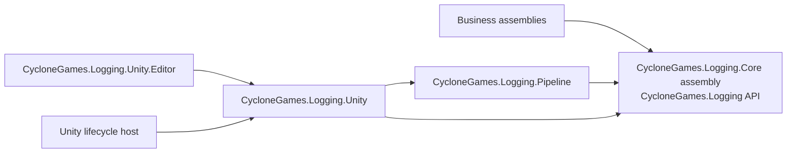
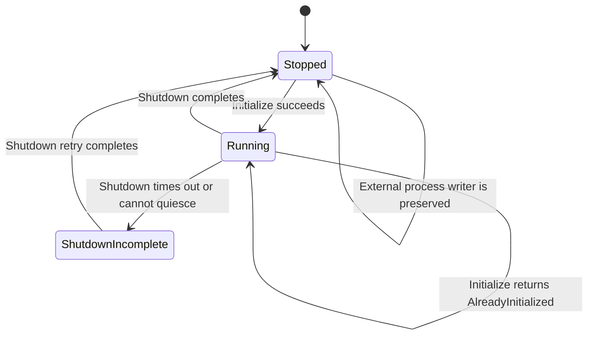
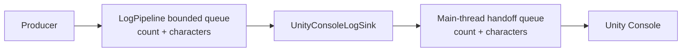

# CycloneGames.Logging.Unity

`CycloneGames.Logging.Unity` is the Unity composition package for the Unity-free logging contract and pipeline. It owns Unity lifecycle integration, `LoggingSettings` authoring, Unity Console delivery, Editor tooling, build-time settings overrides, and samples.

The package version is `1.0.0`. It depends on `com.cyclone-games.logging` and `com.cyclone-games.logging.pipeline`, both at `1.0.0`. Business packages still depend only on `com.cyclone-games.logging`; this package belongs at the application composition root.

## Package boundaries



| Assembly | Role | Unity scope |
| --- | --- | --- |
| `CycloneGames.Logging.Unity` | Runtime settings, bootstrap, hidden host, and Unity Console sink | Runtime and Editor |
| `CycloneGames.Logging.Unity.Editor` | Inspector, Edit Mode owner, build processor, and Console hyperlink support | Editor only |
| `CycloneGames.Logging.Unity.Samples` | Teaching and local diagnostics | Optional, `autoReferenced: false` |
| `CycloneGames.Logging.Unity.Tests.Editor` | Focused EditMode tests | Editor tests only |

`LogRuntime.Writer` remains the only ambient writer slot. `LoggingBootstrap` is an owner for the pipeline it creates; it is not another producer API or a static pipeline accessor. Package and business code continues to write through `LogChannel`/`ILogWriter`.

## Setup

1. Ensure the three logging packages are available at version `1.0.0`.
2. In Unity, choose `Tools/CycloneGames/Logging/Create Default Settings`.
3. Edit the generated canonical asset:

   `Assets/Resources/CycloneGames.Logging.Unity/LoggingSettings.asset`

4. Let the automatic bootstrap run before the first scene, or call `LoggingBootstrap.Initialize(settings)` explicitly on the Unity main thread.
5. Write records through the package-local `LogChannel` facade used by each business assembly.

The Resources keys are:

| Purpose | Resources key | Asset path |
| --- | --- | --- |
| Canonical settings | `CycloneGames.Logging.Unity/LoggingSettings` | `Assets/Resources/CycloneGames.Logging.Unity/LoggingSettings.asset` |
| Player build override | `CycloneGames.Logging.Unity/LoggingSettingsBuildOverride` | `Assets/Generated/CycloneGames.Logging.Unity/Resources/CycloneGames.Logging.Unity/LoggingSettingsBuildOverride.asset` |

If the canonical asset is absent, bootstrap uses package defaults. A directly supplied `LoggingSettings` object has higher priority than Resources loading. Runtime state is copied from the asset during initialization and is never written back.

## Settings model

`LoggingSettings` is a Unity authoring bridge over `LogPipelineOptions` and sink options.

### Processing

| Group | Fields | Contract |
| --- | --- | --- |
| Execution | `executionMode` | `Automatic`, `Threaded`, or `SingleThreaded`; WebGL Player is always single-threaded |
| Pipeline capacity | `maxQueuedMessages`, `maxQueuedCharacters` | Bound the pipeline queue by count and retained characters |
| Record limits | `maxMessageCharacters`, `maxCategoryCharacters`, `maxSourcePathCharacters`, `maxMemberNameCharacters` | Bound copied record data |
| Filter budget | `maxFilterCategories`, `maxFilterCharacters` | Bound allow/deny snapshots |
| Critical reserve | `reservedCriticalMessages`, `reservedCriticalCharacters`, `criticalSeverity` | Reduce ordinary contention; do not guarantee delivery |
| Backpressure | `overflowPolicy`, `enqueueBlockTimeoutMs` | Pipeline `DropNewest`, `DropOldest`, or bounded `Block` behavior |
| Lifecycle | `shutdownDrainTimeoutMs`, `maintenanceIntervalMs`, `sinkFailureThreshold` | Shutdown budget, maintenance cadence, and quarantine threshold |

### Sink registration

- `registerUnityConsoleLogSink` uses a bounded worker-to-main-thread handoff and Unity Console delivery.
- `registerConsoleLogSink` writes to the process console and is suitable for hosts that capture stdout/stderr.
- `registerFileLogSink` creates a `FileLogSink` with the configured path, rotation, flush, and source-path policy.

At least one sink must register successfully. Otherwise initialization returns `NoSinksConfigured`. File-sink construction failure is isolated; bootstrap can continue when another configured sink registered successfully.

### File output

With `usePersistentDataPath == true`, `fileName` must be a portable leaf name and the resolved path must remain directly inside `Application.persistentDataPath`. The default is:

`Application.persistentDataPath/App.log`

A custom location requires all of the following:

- `usePersistentDataPath == false`;
- `allowCustomFilePath == true`;
- a non-empty, fully qualified absolute `customFilePath`;
- target-platform permission, quota, retention, privacy, and cleanup validation.

`fileSourcePathMode` controls source-path disclosure. `FileName` is the privacy-preserving default; `None` removes it and `FullPath` can disclose build-machine or source-layout information.

### Filtering

`minimumSeverity` is inclusive. `categoryFilter` selects `All`, exact case-insensitive `AllowList`, or exact case-insensitive `DenyList`. The settings asset selects the mode; allow/deny entries are runtime pipeline state and must be added by the owning composition code where needed.

## Bootstrap lifecycle and ownership

Unity lifecycle follows this sequence:



1. `SubsystemRegistration` resets static state. If a previously owned pipeline cannot finish shutdown, ownership is retained and new initialization is blocked.
2. `BeforeSceneLoad` calls `LoggingBootstrap.Initialize()` automatically. The Unity runtime initializer contains failure reporting so an initialization exception does not escape that callback.
3. Initialization creates a pipeline, configures the Unity handoff, registers sinks, applies filtering, creates the hidden runtime host, and only then attempts to install the pipeline in `LogRuntime.Writer`.
4. If another owner wins the writer-install race, bootstrap preserves that writer and rolls back its own pipeline.
5. The hidden host pumps single-thread processing and the Unity Console handoff during `Update`.
6. Pause requests a 50 ms buffered pipeline flush and spends up to 20 ms draining the Unity handoff.
7. Player quit performs one owned shutdown using the configured pipeline budget, enters terminal quitting state, and spends up to 50 ms draining the Unity handoff.

`Initialize`, `Reinitialize`, and `Shutdown` must run on Unity's main thread. Their result values are part of the contract:

| Status | Meaning |
| --- | --- |
| `Initialized` | A new owned pipeline was installed |
| `AlreadyInitialized` | The existing package-owned pipeline remains active |
| `NoSinksConfigured` | No sink could be registered; no process writer was installed |
| `ShutdownFailed` | A previous owned pipeline did not stop safely; ownership is retained for retry |
| `ExistingProcessWriterNotOwned` | Another composition root owns `LogRuntime.Writer`; it is left unchanged |

`Reinitialize` first shuts down the current owner. It does not create a replacement if the old pipeline remains incomplete. `Shutdown` removes only the exact writer installed by bootstrap, then drains and releases its owned pipeline. A timeout enters the recoverable `ShutdownIncomplete` state; call `Shutdown` or `Reinitialize` again after the blocking dependency is released.

An explicitly constructed `UnityConsoleLogSink` is owned by its caller until successfully registered with a pipeline. Its host/queue lifetime is independent of the package bootstrap, so the caller or owning pipeline must dispose it.

## Two bounded queues

Unity Console delivery has two capacity boundaries:



The pipeline queue uses `maxQueuedMessages`, `maxQueuedCharacters`, per-field budgets, reserved critical capacity, `overflowPolicy`, and `enqueueBlockTimeoutMs`.

The Unity handoff independently uses `unityConsoleMaxQueuedMessages`, `unityConsoleMaxQueuedCharacters`, and `unityConsoleOverflowPolicy`. It counts queued, reserved, and in-flight messages and characters. Because Unity delivery must not block producer/worker threads, this handoff supports only `DropNewest` and `DropOldest`.

These handoff values are copied into `UnityConsoleLogSinkOptions`; they are not part of the Unity-free `LogPipelineOptions`. A directly constructed Unity sink validates its own bounded options before it allocates or mutates the main-thread queue.

Capacity exhaustion, an oversized formatted entry, stale generation, shutdown, or a reservation mismatch can drop a Unity handoff record. `UnityConsoleLogSink.GetStatistics()` exposes current/reserved/in-flight/peak counts and characters, total drops, critical drops, and entries abandoned by reset.

The hidden host processes at most 256 entries per update, with a one-millisecond pipeline pump budget and a two-millisecond Unity handoff budget. These are bounded work controls, not latency or delivery guarantees. Inspect both `LogPipeline.GetStatistics()` and `UnityConsoleLogSink.GetStatistics()` before changing capacity.

If the pipeline records a terminal fault on its worker, the host observes and rethrows it once from the next main-thread pump, then disables automatic pumping for that exact pipeline to prevent a frame-by-frame exception loop. The composition owner remains responsible for shutdown and replacement.

## Unity Console and Editor behavior

`UnityConsoleLogSink` copies the borrowed `LogEvent` into the bounded handoff, then formats and emits it on the Unity main thread. Output includes severity, category, message, and a source location when available.

In the Editor, a bounded source-link registry maps the displayed path and line back to the original caller path. The Editor bridge attempts a richer Console path and falls back to Unity's public Console API if internal Editor behavior is unavailable. Reflection is confined to the Editor assembly and is not part of Player runtime code.

The Edit Mode composition root initializes after Editor load, pumps on `EditorApplication.update`, shuts down before entering Play Mode or assembly reload and on Editor quit, then initializes a new owner when Edit Mode resumes. It does not replace an externally owned process writer.

## Build-time overrides

Build overrides are evaluated only by the Editor build preprocessor. They are not Player runtime command-line settings.

The application order is:

```text
canonical settings (or ScriptableObject defaults)
→ optional profile asset
→ optional build mode
→ individual field overrides
```

Environment variables are parsed before command-line arguments. For the same option, the command-line value wins. Layer ordering still applies across different options: for example, an individual environment field override is applied after a command-line profile because profile and individual fields are separate layers.

| Environment | Command line |
| --- | --- |
| `CG_LOGGING_SETTINGS` | `-loggingSettings` |
| `CG_LOGGING_MODE` | `-loggingMode` |
| `CG_LOGGING_UNITY` | `-loggingUnity` |
| `CG_LOGGING_CONSOLE` | `-loggingConsole` |
| `CG_LOGGING_FILE` | `-loggingFile` |
| `CG_LOGGING_USE_PERSISTENT_DATA_PATH` | `-loggingUsePersistentDataPath` |
| `CG_LOGGING_FILE_NAME` | `-loggingFileName` |
| `CG_LOGGING_CUSTOM_FILE_PATH` | `-loggingCustomFilePath` |
| `CG_LOGGING_MINIMUM_SEVERITY` | `-loggingMinimumSeverity` |
| `CG_LOGGING_CATEGORY_FILTER` | `-loggingCategoryFilter` |
| `CG_LOGGING_EXECUTION_MODE` | `-loggingExecutionMode` |
| `CG_LOGGING_MAX_QUEUED_MESSAGES` | `-loggingMaxQueuedMessages` |
| `CG_LOGGING_UNITY_CONSOLE_MAX_QUEUED_MESSAGES` | `-loggingUnityConsoleMaxQueuedMessages` |
| `CG_LOGGING_SHUTDOWN_DRAIN_TIMEOUT_MS` | `-loggingShutdownDrainTimeoutMs` |
| `CG_LOGGING_OVERFLOW_POLICY` | `-loggingOverflowPolicy` |
| `CG_LOGGING_CRITICAL_SEVERITY` | `-loggingCriticalSeverity` |

`loggingMode` accepts `Settings`, `Off`, `Unity`, `File`, and `UnityAndFile`. Every preset except `Settings` also disables the process console sink; an individual console override can then change that field. Boolean values accept `1/0`, `true/false`, `yes/no`, `on/off`, `enable/disable`, and `enabled/disabled`. An explicitly present invalid value fails the build.

`loggingSettings` must identify a `LoggingSettings` asset under the current project's `Assets/` tree. It cannot point to the generated override asset.

When any override exists, preprocessing clones the canonical asset or defaults, applies and validates the override, and creates the generated Resources asset. Player bootstrap loads this override before the canonical asset. Postprocessing removes it only after provenance, payload hash, Unity GUID, and file hash validation. Only the generated settings asset is saved; the processor never calls the project-wide `AssetDatabase.SaveAssets()` API.

Cleanup is a fail-closed transaction. `journal.json` records a random transaction ID, a relocatable project token, phase, revision, owned asset path, payload SHA-256, Unity GUID, file SHA-256/size, and every folder creation owned by the transaction. A folder intent with a transaction-unique staging path is flushed before `AssetDatabase.CreateFolder`; the staging folder's GUID is then persisted as `Applied`, the folder is moved to its final path without changing that GUID, and the record becomes `Identified`. Explicit recovery reconciles intent-only, staged, moved-but-not-published, and identified folders before cleanup. It never treats an unrelated empty final-path folder as proof of ownership, closing the interruption windows around folder creation, GUID lookup, move, and journal publication without deleting ambiguous data. The generated asset carries matching hidden provenance and payload hash, which closes the crash window between `AssetDatabase.CreateAsset` and active-journal publication. Journal input is capped at 64 KiB, generated asset hashing is capped at 1 MiB, state entry counts are bounded, and owned paths reject traversal and reparse points.

Normal preprocessing never performs recovery. Any `journal.json`, `journal.json.tmp`, `journal.json.bak`, `journal.recovery.json`, lock, or generated override left by an interrupted operation blocks the next build. Recovery is an explicit operation through `CycloneGames.Logging.Unity.Editor.LoggingSettingsBuildRecovery.Recover(string projectRoot)`. Recovery evaluates every journal candidate, validates asset ownership before deletion, and preserves all evidence when identity is ambiguous. Recovery normalization first flushes `journal.recovery.json`, retains that anchor while pruning older candidates, and atomically renames it to the main journal; an interruption of recovery itself therefore retains at least one durable ownership record. The journal stores no absolute checkout path, so moving the complete project does not invalidate an otherwise matching transaction.

## Persistence and cleanup

| Data | Path and format | Owner and lifecycle |
| --- | --- | --- |
| Canonical settings | `Assets/Resources/CycloneGames.Logging.Unity/LoggingSettings.asset` | Project-owned Unity asset; normally committed; deletion restores package defaults |
| Build override | `Assets/Generated/CycloneGames.Logging.Unity/Resources/CycloneGames.Logging.Unity/LoggingSettingsBuildOverride.asset` | Temporary build transaction; do not commit or use as a profile |
| Build transaction | `.buildpipeline/transactions/logging-settings/`, UTF-8 JSON plus an exclusive lock | Explicitly recoverable, Git-ignored Editor state; main, temporary, backup, and recovery-anchor journals are candidates |
| Folder staging | `Assets/**/__CycloneGamesLoggingBuild_<transactionId>_<index>` plus Unity `.meta` | Transaction-owned, normally short-lived Editor evidence; never commit or delete manually while a matching journal exists; explicit recovery verifies GUID/emptiness and moves or removes it |
| Active default log | `Application.persistentDataPath/App.log`, plaintext UTF-8 without BOM | `FileLogSink` writes/rotates; product owns privacy, quota, backup, retention, and final cleanup |
| Rotated archives | Beside the active log | `FileLogSink` removes only archives matching its own naming grammar and configured count |
| Custom log | Fully qualified `customFilePath` | Product/platform owner; validate sandbox and cleanup explicitly |
| Sample diagnostics | `Application.temporaryCachePath/CycloneGames.Logging/` | Sample-owned temporary files; safe to delete after the owning sample stops |

The package does not use `EditorPrefs`, `PlayerPrefs`, or `SessionState`. Runtime log files are plaintext. Redaction must happen before a record reaches a sink.

## Platform behavior

| Target | Static behavior in this package | Required product validation |
| --- | --- | --- |
| WebGL Player | Forces single-thread processing, converts pipeline `Block` to `DropNewest`, and does not register a file sink | Browser pump, memory, tab close/unload, and remote-output strategy |
| Dedicated Server | Disables Unity Console; with no settings, enables process console output by default | stdout capture, service/container shutdown, file quota, and forced termination |
| Desktop/mobile Player | Automatic mode selects threaded processing; configured Unity/process/file sinks are available | IL2CPP/Mono, pause/kill, permissions, storage pressure, rotation, and graceful quit |
| Editor | Own Edit Mode lifecycle and source-link tooling | Domain reload on/off, Play Mode transitions, assembly reload, and build cleanup |

Runtime code uses no unsafe code, dynamic code generation, runtime reflection discovery, or native plugin. The Editor Console bridge uses reflection only inside the Editor assembly and has a public-API fallback. Target Player, IL2CPP, stripping, device filesystem, browser, server-soak, and console certification behavior require build validation.

## Integration and extension

- Business assemblies keep using `ILogWriter`/`LogChannel` from `CycloneGames.Logging`.
- Unity-specific composition stays here; do not expose `LoggingSettings`, `UnityConsoleLogSink`, or `UnityEngine` types through a PureCore API.
- A custom Unity/platform sink belongs in an integration assembly that references the pipeline and its optional SDK.
- A cross-thread sink copies only bounded data into its own queue and documents capacity, overflow, thread affinity, retries, flush, and shutdown ownership.
- MemoryGovernance integration should consume `ILogPipelineMonitor` and `LogMemoryPools` from the pure C# pipeline package; it does not need a dependency on this Unity package unless it provides Unity lifecycle scheduling.

## Troubleshooting

| Symptom | Check |
| --- | --- |
| Initialization reports `ExistingProcessWriterNotOwned` | Another composition root owns `LogRuntime.Writer`; shut it down through that owner or keep it intentionally |
| Initialization reports `NoSinksConfigured` | Enable at least one supported sink and inspect file-sink initialization diagnostics |
| Initialization reports `ShutdownFailed` | Release the blocking sink/dependency, retain ownership, then retry `Shutdown` or `Reinitialize` |
| No records | Check `minimumSeverity`, `categoryFilter`, active sink registration, pipeline drops, and Unity handoff drops |
| Unity Console loses records under burst | Inspect both queue layers; avoid assuming critical reserve guarantees delivery |
| File is absent | Check WebGL exclusion, selected path mode, absolute custom path, sandbox, quota, and `FileLogSink` health |
| Build is blocked by LoggingSettings recovery | Inspect `.buildpipeline/transactions/logging-settings/` and the generated asset, then invoke `LoggingSettingsBuildRecovery.Recover(projectRoot)` through the owning build workspace; identity mismatch intentionally prevents deletion |
| Settings changes are not visible during play | Runtime state was copied at initialization; call `Reinitialize` on the main thread and inspect its result |

## Validation

Minimum EditMode test command:

```text
<UnityEditor> -batchmode -nographics -projectPath <repo-root>/UnityStarter -runTests -testPlatform EditMode -assemblyNames CycloneGames.Logging.Unity.Tests.Editor -testResults <result-path> -quit
```

Release validation should also:

1. enter and leave Play Mode repeatedly with domain reload enabled and disabled;
2. verify external writer ownership, initialization races, no-sink behavior, and shutdown-timeout recovery;
3. build once without overrides and with environment, command-line, profile, mode, and individual override combinations;
4. confirm generated override, journal, and staging-folder cleanup after a successful build, and fail-closed evidence preservation on identity-mismatch and non-empty-folder fixtures;
5. exercise count/character saturation in both queues and inspect critical/drop/abandoned counters;
6. test pause, graceful quit, forced termination, file permission, rotation, low storage, and recovery on each target;
7. build IL2CPP separately where used;
8. validate WebGL in a browser and Dedicated Server under its real service/container supervisor;
9. run one sample scenario at a time and treat its timings only as local diagnostics.

The repository currently defines an Editor test assembly, not Player or PlayMode test assemblies. Passing EditMode tests alone does not establish Player, AOT, platform, durability, or performance readiness.

## Samples

See `Samples/README.md` or `Samples/README.SCH.md` for the sample scene, producer example, finite load generator, queue/pool monitor, and local comparison harness.
