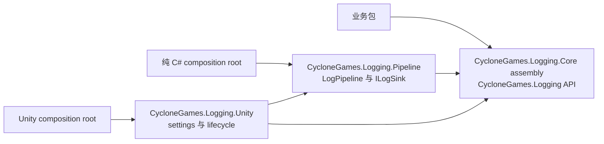
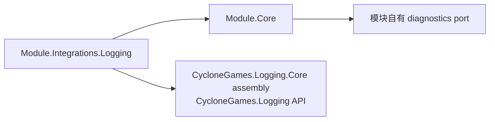

# CycloneGames.Logging

`CycloneGames.Logging` 是 CycloneGames 各包共享的 Unity-free 日志生产者契约。它规定代码如何产生带分类的日志记录，但不选择队列、线程、sink、文件格式、Unity 生命周期或具体后端。

包版本为 `1.0.0`。Core assembly 名称为 `CycloneGames.Logging.Core`，设置了 `noEngineReferences: true`；公共生产者 API 继续使用简洁的 `CycloneGames.Logging` namespace。消费方 asmdef 需要显式声明 assembly 依赖。

## 架构与命名

日志包族由三个 package root 组成，每一层只承担一种职责：



这些名称表达分层，而不是多套相互竞争的日志 API：

| Package | 职责 | Unity 依赖 |
| --- | --- | --- |
| `com.cyclone-games.logging` | 生产者契约与安全的 ambient fallback | 无 |
| `com.cyclone-games.logging.pipeline` | 显式拥有的队列、路由、sink、监控与关闭流程 | 无 |
| `com.cyclone-games.logging.unity` | Unity settings、bootstrap、Console bridge、Editor 工具与示例 | 必需 |

该家族遵循仓库现有 package 惯例：基础 package ID 保持 `com.cyclone-games.logging`，Unity-free 实现物理隔离在 `Core/`，并编译为 `CycloneGames.Logging.Core`。`CycloneGames.Logging.Pipeline` 包含 `Runtime/` 与 `Tests/`；`CycloneGames.Logging.Unity` 额外包含 `Editor/`、`Samples/` 与 `Documents~/`。

业务包只依赖本包，不引用 Pipeline 或 Unity composition 包。具体后端由 host 选择并拥有。该依赖方向使可复用包能够用于 Unity、命令行测试、headless 进程和其他 C# host。

唯一的 ambient writer 槽位是 `LogRuntime.Writer`。

## 生产者契约

| 类型 | 用途 |
| --- | --- |
| `ILogWriter` | 与后端无关的接纳检查与写入契约 |
| `LogSeverity` | 有序的 `Trace`、`Debug`、`Info`、`Warning`、`Error` 与 `Fatal`；`None` 是过滤哨兵 |
| `LogChannel` | 绑定显式 writer 或当前 ambient writer 的不可变 category |
| `LogChannelExtensions` | 统一的级别方法，以及 string、延迟 builder、generic-state 和 exception 重载 |
| `LogWriterGuard` | 校验生产者输入并隔离非灾难性后端故障 |
| `LogRuntime` | 原子安装并按引用身份安全交接不拥有生命周期的进程 fallback |
| `NullLogWriter` | host 尚未安装后端时使用的静默默认实现 |

`ILogWriter` 只面向生产者。Sink 注册、flush、shutdown 与 disposal 属于具体 owner。

Category 是稳定标识符。使用 `CycloneGames.<Package>[.<Area>]`，例如 `CycloneGames.AssetManagement.Download`。消息文本不重复 category。异常使用 exception 重载，让后端收到异常类型、stack 和 inner exception，而不是只保留 `Exception.Message`。

## 统一的包内门面

每个产生日志记录的非 Core assembly，都在一个内部文件中集中创建 category，例如 `Diagnostics/AssetManagementLog.cs`：

```csharp
using System;
using CycloneGames.Logging;

internal static class AssetManagementLog
{
    internal const string Category = "CycloneGames.AssetManagement";
    internal static readonly LogChannel Channel = LogChannel.Create(Category);

    internal static LogChannel Create(ILogWriter logWriter)
    {
        return LogChannel.Create(
            Category,
            logWriter ?? throw new ArgumentNullException(nameof(logWriter)));
    }
}
```

它是小型 assembly-local facade，而不是另一层日志抽象。它集中 category，并让各模块保持一致的使用形态：

- static 或 Unity-owned 入口使用 `AssetManagementLog.Channel`；
- 通过构造创建的服务接收 `ILogWriter`，并调用 `AssetManagementLog.Create(logWriter)`；
- 实现文件不临时创建 category；
- Samples、Tests、Runtime 与 Editor assembly 如果拥有不同 category，就使用互不冲突的 facade 类型名。

### 严格 PureCore 边界

严格 PureCore assembly 不引用 Unity，也不引用本包。如果它需要 best-effort diagnostics，就自行拥有最小的模块专属 port，例如 `IAssetDiagnostics`，并提供自己的 disabled 实现与诊断级别/category 模型。可选 adapter 放在 `<Module>.Integrations.Logging`，同时引用 PureCore assembly 与 `CycloneGames.Logging.Core` 契约 assembly。



Adapter 从 Core 向外连接，Core 不会获得传递式 Unity 依赖。模块本地 port 也不扩展队列、文件、sink 或生命周期管理。只有确实需要物理 Core 独立时才使用该模式；普通 Runtime assembly 直接使用 `LogChannel`。

Assembly 独立与 package 安装独立是两个边界。Core asmdef 可以完全不引用 Logging，但如果同一个物理 UPM package 内的其他 assembly 需要 Logging，该 package root 仍会声明 `com.cyclone-games.logging`，安装整个 package 时仍会解析该依赖。必须在不安装任何 Logging package 的情况下单独使用 Core 时，需要拆成独立的物理 Core package root。

## 使用方法

普通 C# 服务优先使用显式注入：

```csharp
public sealed class CacheService
{
    private readonly LogChannel _log;

    public CacheService(ILogWriter logWriter)
    {
        _log = AssetManagementLog.Create(logWriter);
    }

    public void Clear()
    {
        _log.Info("Cache cleared.");
    }
}
```

如果静默是显式策略，传入 `NullLogWriter.Instance`，不要用 `null` 表达该选择。

Static 与 Unity-owned 入口可以跟随 ambient writer：

```csharp
private static readonly LogChannel Log = AssetManagementLog.Channel;

Log.Warning("The download queue reached its soft limit.");
```

`LogChannel.Create(category)` 每次调用都会解析 `LogRuntime.Writer`，因此可以观察到 owner 控制的替换。`LogChannel.Create(category, writer)` 始终绑定传入的 writer。

对于经过测量的热路径，不要预先构造可能被过滤的插值字符串。将 state 单独传入，并使用 static 或缓存的 delegate：

```csharp
Log.Debug(
    itemCount,
    static (value, builder) => builder.Append("Queued items: ").Append(value));
```

合规 writer 只在记录通过接纳检查后调用 builder。该写法避免了示例中的闭包与预格式化字符串，但不保证具体后端或 sink 完全不分配内存。

## Ambient 所有权与替换

`LogRuntime` 只拥有一个原子的 `ILogWriter` 引用：

- `TryInstallWriter` 只在静默默认实现仍被安装时成功；`NullLogWriter` 哨兵不能取得 owner 身份；
- `TryReplaceWriter(expected, replacement)` 按引用身份执行受保护的交接；
- `TryResetWriter(expected)` 只允许预期的非哨兵 owner 恢复静默默认值。

这些方法都不会 flush 或 dispose writer。Composition root 必须保留具体 owner，停止或重定向生产者，以身份检查重置 ambient 引用，再按后端契约 drain 并 dispose。除非能独立证明所有权，否则不要 dispose 返回的 writer。

## 故障与安全契约

通过 `LogChannel` 和 `LogWriterGuard` 的调用是观察性的。Writer 或延迟 formatter 抛出的非 `OutOfMemoryException` 会被隔离；`IsEnabled` 返回 `false`，写入调用直接返回，不改变业务控制流。`OutOfMemoryException` 仍会向上传播。

调用方错误会在 dispatch 前暴露：

- 创建 channel 时拒绝空白 category 或显式 `null` writer；
- 有效 channel 拒绝 `null` builder 或 exception；
- `default(LogChannel)`、`LogSeverity.None`、未知 severity 值与 `NullLogWriter.Instance` 都是静默路径，不调用 writer 或 builder。

`LogWriterGuard.TryWrite* == true` 只表示 writer 调用正常返回，不证明记录已经入队、到达 sink、完成 flush 或完成持久化。直接调用 `ILogWriter` 会绕过 guard，只适合受控的 adapter/backend 代码。

## 线程、性能与 AOT

`LogRuntime.Writer` 使用 `Volatile` 与 `Interlocked` 进行原子发布和替换。契约本身不额外加锁，也不规定后端的线程亲和性。一个 `ILogWriter` 实现必须支持其所有生产者实际使用的线程。

静默、disabled 与无效 severity 路径会在 builder 执行前短路。Generic-state builder 可以避免捕获闭包。真实分配率、吞吐、延迟与竞争取决于选定 writer 和 sink，必须在代表性的 Player build 中 profile。

Runtime 不使用 Unity API、反射发现、动态代码生成、unsafe code 或隐式生命周期回调。从静态设计上可以用于面向 AOT 的组合，但 IL2CPP、stripping、平台与目标设备行为仍需要在消费方 build 中验证。

## 持久化与隐私

本包不写入文件、asset、preference、registry 或 cache，不拥有序列化数据，也不需要清理。持久化、保留周期、路径策略、脱敏与隐私由选定 sink 和应用 owner 负责。

Caller file path 与 member name 属于生产者契约的一部分。将它们转发到文件或远程系统时，应视为可能包含敏感信息的元数据。

## 包接入

普通 CycloneGames 包按以下步骤接入：

1. 在 `package.json` 中加入 `"com.cyclone-games.logging": "1.0.0"`。
2. 在每个生产者 asmdef 的 `references` 中加入 `CycloneGames.Logging.Core`。
3. 新增一个 assembly-local `Diagnostics/<FeatureName>Log.cs` facade。
4. 构造型服务注入 `ILogWriter`，ambient channel 只用于 static 或 Unity-owned 边界。
5. 由应用 composition root 选择 `CycloneGames.Logging.Pipeline`、`CycloneGames.Logging.Unity` 或其他 `ILogWriter` 实现。

该接入不需要 PlayerSettings scripting symbol。可选 adapter 放在独立 integration assembly 中，不把条件编译散布到业务代码。

在 `Assets/` 下的 asset-style checkout 中，`package.json` 不会自动启用或排序本地 package dependency，显式 asmdef 引用才是编译事实。以真正 UPM package 分发时，manifest dependency 还会参与 package resolution。

## 验证

最小包验证：

1. 确认 `CycloneGames.Logging.Core.asmdef` 没有引用，并保持 `noEngineReferences: true`。
2. 运行 `CycloneGames.Logging.Core.Tests.Editor`。
3. 验证 ambient channel 能观察到身份安全的 writer 替换，而显式绑定 channel 不会改变。
4. 验证 disabled 与无效 severity 路径不会调用延迟 builder。
5. 只安装本日志包族中的 `com.cyclone-games.logging`，编译一个代表性业务包。
6. 在不引用本包的情况下编译严格 PureCore assembly，并单独编译其可选 integration。
7. 运行项目源码/analyzer 检查，禁止直接平台输出 API 与临时 channel 构造。

这些检查只能建立对应的已测试契约，不能单独证明 Player 性能、IL2CPP、stripping 或目标平台行为。
