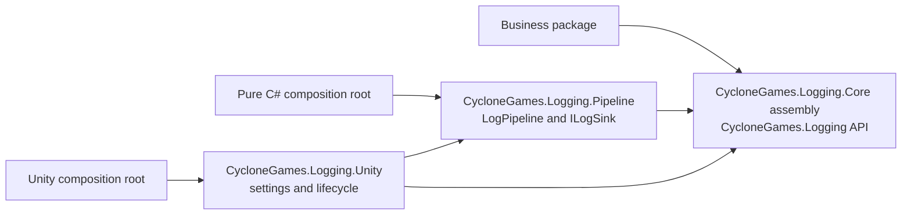
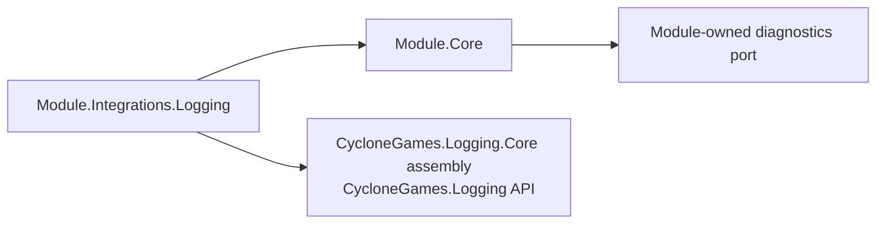

# CycloneGames.Logging

`CycloneGames.Logging` is the Unity-free producer contract shared by CycloneGames packages. It defines how code emits a categorized record without selecting a queue, thread, sink, file format, Unity lifecycle, or concrete backend.

The package version is `1.0.0`. Its Core assembly is `CycloneGames.Logging.Core` with `noEngineReferences: true`; its public producer API remains in the concise `CycloneGames.Logging` namespace. A consuming asmdef declares the assembly dependency explicitly.

## Architecture and naming

The logging family has three package roots with one responsibility each:



The names describe layers rather than competing logging APIs:

| Package | Responsibility | Unity dependency |
| --- | --- | --- |
| `com.cyclone-games.logging` | Producer contract and safe ambient fallback | None |
| `com.cyclone-games.logging.pipeline` | Explicitly owned queue, routing, sinks, monitoring, and shutdown | None |
| `com.cyclone-games.logging.unity` | Unity settings, bootstrap, Console bridge, Editor tooling, and samples | Required |

The family follows the repository's existing package convention: the base package ID stays `com.cyclone-games.logging`, while its Unity-free implementation is physically isolated in `Core/` and compiled as `CycloneGames.Logging.Core`. `CycloneGames.Logging.Pipeline` contains `Runtime/` and `Tests/`; `CycloneGames.Logging.Unity` adds `Editor/`, `Samples/`, and `Documents~/`.

Business packages depend only on this package. They do not reference the pipeline or Unity composition packages. A host chooses and owns the backend. This direction keeps reusable packages usable in Unity, command-line tests, headless processes, and other C# hosts.

There is one ambient writer slot: `LogRuntime.Writer`.

## Producer contract

| Type | Purpose |
| --- | --- |
| `ILogWriter` | Backend-neutral admission and write contract |
| `LogSeverity` | Ordered `Trace`, `Debug`, `Info`, `Warning`, `Error`, and `Fatal`; `None` is a filtering sentinel |
| `LogChannel` | Immutable category bound to an explicit writer or the current ambient writer |
| `LogChannelExtensions` | Uniform severity-specific string, deferred-builder, generic-state, and exception overloads |
| `LogWriterGuard` | Validates producer input and contains non-catastrophic backend failures |
| `LogRuntime` | Atomically installs and identity-safely hands off the non-owning process fallback |
| `NullLogWriter` | Silent default used when no host backend is installed |

`ILogWriter` is producer-only. Sink registration, flush, shutdown, and disposal belong to the concrete owner.

Categories are stable identifiers. Use `CycloneGames.<Package>[.<Area>]`, for example `CycloneGames.AssetManagement.Download`. Do not repeat the category in message text. Preserve exceptions with an exception overload so the backend receives the exception type, stack, and inner exception rather than only `Exception.Message`.

## Uniform package facade

Each non-Core assembly that emits records keeps its category construction in one internal file such as `Diagnostics/AssetManagementLog.cs`:

```csharp
using System;
using CycloneGames.Logging;

internal static class AssetManagementLog
{
    internal const string Category = "CycloneGames.AssetManagement";
    internal static readonly LogChannel Channel = LogChannel.Create(Category);

    internal static LogChannel Create(ILogWriter logWriter)
    {
        return LogChannel.Create(
            Category,
            logWriter ?? throw new ArgumentNullException(nameof(logWriter)));
    }
}
```

This is a small assembly-local facade, not another logging abstraction. It centralizes the category and gives every module the same usage shape:

- static or Unity-owned entry points use `AssetManagementLog.Channel`;
- constructed services receive `ILogWriter` and use `AssetManagementLog.Create(logWriter)`;
- implementation files do not create ad hoc categories;
- Samples, Tests, Runtime, and Editor assemblies use distinct facade type names when they own distinct categories.

### Strict PureCore boundary

A strict PureCore assembly does not reference Unity or this package. If it needs best-effort diagnostics, it owns a minimal module-specific port, for example `IAssetDiagnostics`, plus its own disabled implementation and diagnostic level/category model. The optional adapter is placed in `<Module>.Integrations.Logging` and references both the PureCore assembly and the `CycloneGames.Logging.Core` contract assembly.



The adapter points outward from Core. Core never gains a transitive Unity dependency, and the module-local port does not grow queues, files, sinks, or lifecycle management. Use this pattern only when physical Core independence is required; ordinary runtime assemblies use `LogChannel` directly.

Assembly independence and package-install independence are separate. A Core asmdef can have no Logging reference while another assembly in the same physical UPM package causes that package root to declare `com.cyclone-games.logging`. Installing the package root will still resolve the dependency. Consumers that must install Core without any Logging package need a separate physical Core package root.

## Usage

Prefer explicit injection in plain C# services:

```csharp
public sealed class CacheService
{
    private readonly LogChannel _log;

    public CacheService(ILogWriter logWriter)
    {
        _log = AssetManagementLog.Create(logWriter);
    }

    public void Clear()
    {
        _log.Info("Cache cleared.");
    }
}
```

Pass `NullLogWriter.Instance` when silence is an explicit policy. Do not use `null` to encode that choice.

Static and Unity-owned entry points may follow the ambient writer:

```csharp
private static readonly LogChannel Log = AssetManagementLog.Channel;

Log.Warning("The download queue reached its soft limit.");
```

`LogChannel.Create(category)` resolves `LogRuntime.Writer` on each call, so an owner-controlled replacement is observed. `LogChannel.Create(category, writer)` remains bound to the supplied writer.

For a measured hot path, avoid building a filtered interpolated string. Pass state separately and cache or use a static delegate:

```csharp
Log.Debug(
    itemCount,
    static (value, builder) => builder.Append("Queued items: ").Append(value));
```

A conforming writer invokes the builder only after admission. This avoids the shown closure and preformatted string; it does not guarantee that a concrete backend or sink performs no allocations.

## Ambient ownership and replacement

`LogRuntime` owns only an atomic `ILogWriter` reference:

- `TryInstallWriter` succeeds only while the silent default is installed; the `NullLogWriter` sentinel cannot claim ownership;
- `TryReplaceWriter(expected, replacement)` performs an identity-checked handoff;
- `TryResetWriter(expected)` restores the silent default only for the expected non-sentinel owner.

None of these methods flushes or disposes a writer. The composition root must retain the concrete owner, stop or redirect producers, reset the ambient reference with identity checking, drain the backend, and dispose it according to that backend's contract. Never dispose a returned writer unless ownership is known independently.

## Failure and safety contract

Calls through `LogChannel` and `LogWriterGuard` are observational. A non-`OutOfMemoryException` raised by a writer or deferred formatter is contained; `IsEnabled` returns `false` and writes return without changing business control flow. `OutOfMemoryException` remains visible.

Caller mistakes remain visible before dispatch:

- a blank category or explicit `null` writer is rejected during channel creation;
- a `null` builder or exception is rejected on a valid channel;
- `default(LogChannel)`, `LogSeverity.None`, unknown severity values, and `NullLogWriter.Instance` are silent and do not invoke a builder.

`LogWriterGuard.TryWrite* == true` means the writer call returned normally. It does not prove queue admission, sink delivery, flush, or persistence. Direct `ILogWriter` calls bypass the guard and are intended for controlled adapter/backend code.

## Threading, performance, and AOT

`LogRuntime.Writer` uses `Volatile` and `Interlocked` for atomic publication and replacement. The contract does not add locks or define a backend's thread affinity. An `ILogWriter` implementation must support every producer thread from which it is used.

The silent, disabled, and invalid-severity paths short-circuit before builder execution. Generic-state builders can avoid captured closures. Actual allocation rate, throughput, latency, and contention depend on the selected writer and sinks and must be profiled in representative Player builds.

The runtime uses no Unity API, reflection discovery, dynamic code generation, unsafe code, or implicit lifecycle callbacks. The assembly is suitable for AOT-oriented composition by static analysis, but IL2CPP, stripping, platform, and target-device behavior still require validation in the consuming build.

## Persistence and privacy

This package writes no files, assets, preferences, registry values, or caches. It owns no serialized data and requires no cleanup. Persistence, retention, path policy, redaction, and privacy belong to the selected sink and application owner.

Caller file paths and member names are part of the producer contract. Treat them as potentially sensitive metadata, especially when forwarding records to files or remote systems.

## Package integration

For an ordinary CycloneGames package:

1. Add `"com.cyclone-games.logging": "1.0.0"` to `package.json`.
2. Add `CycloneGames.Logging.Core` to each producer asmdef's `references`.
3. Add one assembly-local `Diagnostics/<FeatureName>Log.cs` facade.
4. Inject `ILogWriter` into constructed services and use the ambient channel only at static or Unity-owned boundaries.
5. Let the application composition root select `CycloneGames.Logging.Pipeline`, `CycloneGames.Logging.Unity`, or another `ILogWriter` implementation.

No PlayerSettings scripting symbol is required. Optional adapters stay in separate integration assemblies instead of spreading conditional compilation through business code.

In an asset-style checkout under `Assets/`, `package.json` does not automatically enable or order local package dependencies. The explicit asmdef reference is the compilation fact. When distributed as real UPM packages, the manifest dependency additionally participates in package resolution.

## Validation

Minimum package validation:

1. Confirm `CycloneGames.Logging.Core.asmdef` has no references and keeps `noEngineReferences: true`.
2. Run `CycloneGames.Logging.Core.Tests.Editor`.
3. Verify an ambient channel observes an identity-safe writer replacement while an explicitly bound channel does not.
4. Verify disabled and invalid-severity paths never invoke deferred builders.
5. Compile a representative business package with only `com.cyclone-games.logging` from this logging family.
6. Compile a strict PureCore assembly without this package and compile its optional integration separately.
7. Run project source/analyzer checks that prohibit direct platform output APIs and ad hoc channel construction.

These checks establish the tested contract. They do not by themselves validate Player performance, IL2CPP, stripping, or target-platform behavior.
